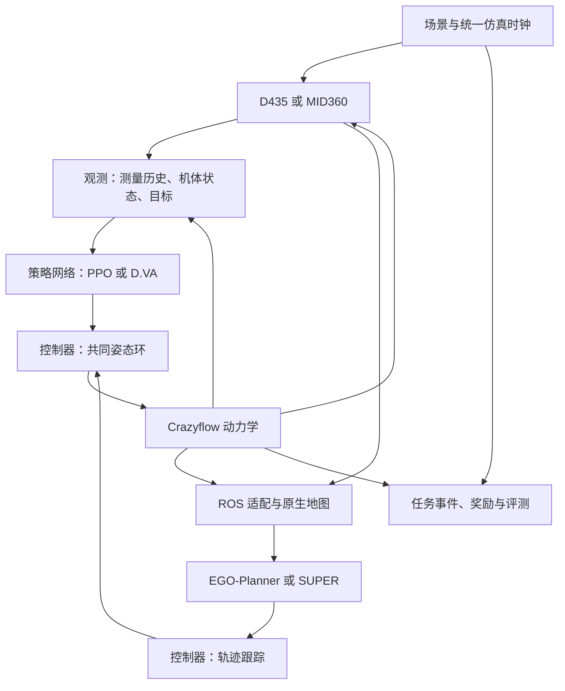

# P5 感知导航平台：设计与开发执行计划

日期：2026-09-27。项目：`/home/tong/tongworkspace/simulation_dev/mujoco/drone_playground`。
设计基线：`implementation/composable-lotf`，提交 `a85585afc43fcf884fbd78dbb54ddc544f19cd80`。
状态：设计交付；实现与正式训练尚未启动。本文是 P5 规格与实施顺序的唯一权威入口，任务状态见同目录 issues。

> **2026-09-28 场景协议修订。** 用户在检查原 v2 场景后取消“按密度随机生成场景”作为后续
> 正式 benchmark 的方案：部分低密度实例退化为几根不挡路的大柱子，部分高密度实例又缺少
> 合理可飞通道。既有 v2 训练/评测保持为历史原始证据，不改写。后续 benchmark 改为人工审阅后
> 冻结的**固定编号场景**。第一版候选目录现保留为 configs/scene/p5_fixed_catalog_v1.json，
> 编号 S01-S06、D01-D06；每个场景显式记录障碍坐标/尺寸/运动以及一条只用于离线可行性
> 验收和 RScope 检查的 inspection_path。该检查路径禁止进入 PPO、D.VA、EGO-Planner
> 或 SUPER 输入。候选场景在用户逐一查看并确认前不视为新的正式 benchmark，也不据此启动重训练。
> 原随机生成器只为历史 v2 结果重建保留，不再作为下一版 benchmark 场景来源。

> **2026-09-28 第二次场景审阅修订。** 100 x 40 m 的第一版固定候选仍显得过稀，且在
> y 方向边缘存在绕开主要 obstacle field 的视觉/规划捷径。新候选 v3 保持 100 x 40 m、
> z=0.5..6 m 和 96 m 名义航程，但把场内障碍数固定提高为 Easy=50、Medium=100、
> Hard=150（不含边界），并给所有场景加入四面**真实可感知的物理边界墙**。边界墙进入和
> 普通障碍相同的 sensor ray casting、碰撞与 RScope 几何；out-of-bounds 继续只作为最后保护。
> v3 位于 `configs/scene/p5_fixed_catalog_v3.json`，审阅回放位于
> `experiments/p5-fixed-scenes-review-v3/`。用户确认前仍不替换历史正式 v2 结果或启动重训练。

> **2026-09-28 第三次场景审阅修订。** 用户指出 v3 虽然不把 `inspection_path` 提供给算法，
> 但场景编排本身曾围绕该 path 保留 route tube，RScope 又让审阅无人机沿该 path 运动，因此
> 视觉上出现了一条近似“参考轨迹”，并且该预留通道本身降低了 benchmark 难度。v4 完全取消
> `inspection_path`、oracle/reference/demonstration trajectory 和 route-tube 预留。
> 场景可行性改成离线 3-D occupancy A*：只保存“是否可达、最短路长度等统计”，A* 路径坐标
> 立即丢弃，不进入 catalog、RScope、policy/planner 或训练数据。RScope v4 审阅中无人机固定
> 在起点，仅动态障碍运动。为避免另一条固定横向 lane 贯穿全图，v4 在不同 x 位置布置三组
> 非实墙式 staggered blocker，并验收 `full_length_straight_lanes == 0`、任一固定 y/z 直线的
> 最大连续无障碍段不超过 35 m。当前候选为 `configs/scene/p5_fixed_catalog_v4.json`，审阅集为
> `experiments/p5-fixed-scenes-review-v4/`。固定场景默认加载与默认审阅导出入口均指向 v4。

> **2026-09-28 第四次场景审阅修订。** v5 将正式基准收敛为 SANDO 对齐的六张场景：
> static/dynamic × easy/medium/hard。静态直接转换 SANDO 固定森林 41/81/162 根圆柱；动态采用
> 50/100/200 总障碍、65% 动态比例，因此有 32/65/130 个动态立方体。S06 与 D06 继续作为
> 额外 3-D extension 保留，D06 四根长横杆改为竖直往复运动。主六场景只做边界、起终点安全和
> 可达性筛选，不增加人工 anti-straight blocker。默认目录为 `configs/scene/p5_fixed_catalog_v5.json`，
> 审阅集为 `experiments/p5-fixed-scenes-review-v5/`。
> 随后按 SANDO 当前 GitHub 动态场景实现补齐长方体：D01-D03 的静态圆柱份额中一半改为静态
> 长方体；长方体内部沿用 SANDO 的 35% 竖直柱 / 65% 横向墙比例，尺寸分别为
> 0.4×0.4×4.0 m 与 0.4×4.0×0.4 m。SANDO 这两类长方体本身不移动；运动仍由 65% 的
> 0.8 m 小立方体承担。S01-S03 保持原始 SANDO 固定圆柱森林，不引入混合形状。

## 1. 目标、已确认选择与交付范围

把现有状态/参考轨迹平台扩展到感知导航，继续使用现有可组合模块：
场景、观测、任务、策略、控制器、动力学，以及算法、网络、目标、运行四类训练配置。

本次对齐结果：
- 用户确认：正式训练为静态/动态 × D435/MID360 × PPO/D.VA，共八个训练单元。
- 用户确认：学习策略输出推力与姿态；具体使用现有 `attitude_thrust` 契约。
- 用户确认：EGO-Planner 和 SUPER 在动态环境中按原生方法测试，记录真实成功与失败。
- 用户确认：每单元一个训练种子、8,388,608 次交互，共 67,108,864 次；多训练种子进入 P6。
- 延续原架构：Crazyflow 负责飞行动力学，MuJoCo 承担场景、传感器查询、几何核验和回放。新增 MuJoCo 飞行动力学由本次设计明确移出范围。
- 延续现有约定：Crazyflie、Brax、Pixi、Hydra、rscope；MID360 和 D435 为虚拟传感器，载荷质量与真实装机另立实验。
- 用户澄清：SANDO/MIGHTY 只提供场景几何与运动参考；P5 建立自己的导航任务和评价。
- 用户确认：统一导航协议为 40 秒上限、进入目标 0.5 米内即到达、机体碰撞判失败。
- 本轮请求授权的是设计与计划落盘；本文中的执行命令为后续 dsh 实现合同。正式训练启动依据用户后续执行指令。

正式交付包含八个训练结果和四个规划器评测单元，传感器/场景/时钟/梯度核验证据，独立开发与留出评测、逐回合结果、初始化/中期/最终回放、恢复入口与结果重建命令。
工程可用、实验完成、策略达标分别记录。预算耗尽的低分方法保留完整结果。

## 2. 本地事实与需要补齐的能力

已直接读取项目规则、架构、状态、模块源码及 P5 旧任务单。当前已有 Hydra 构造入口、姿态控制、四种 Crazyflow 模型、Brax PPO/APG、SHAC、LOTF、独立评测和轨迹记录。

具体扩展点：
- `contracts.py` 已有姿态/推力、推力/角速度、电机转速和轨迹类型；现有轨迹契约只包含位置、速度、时间。
- `learning/networks.py` 目前以状态多层感知机为主；需要图像/点云编码以及独立的策略、价值输入。
- `tasks/scenes/` 目前只有简化场景入口；需要 SANDO 几何和时间函数。
- `controllers/crazyflow.py` 已有可微姿态控制；上游 `crazyflow.sim.functional.state_control` 可作为轨迹跟踪复用候选，须先核对字段、控制模式和控制器状态。
- 锁文件记录 Brax 0.14.2、JAX 0.9.2、MuJoCo/MJX 3.14.0。已观察到本地 MJX 导出 `create_render_context`；批量深度渲染的运行兼容性仍需实测。
- 历史 P1–P4/LOTF 的实验与协议沿各自身份保存。P5 使用独立导航协议。

参考仓库的当前本地身份：
- SANDO：`/home/tong/tongworkspace/research_dev/sando`，`3a4450dcc5a8ed5ca825c9da7966e2642be091de`。
- SUPER：`/home/tong/tongworkspace/reference_repos/SUPER`，`2ad3419c127a617c6d7df6925e81a14175a9c096`。
这些是本次读取时的事实。执行时保存完整提交、相关文件哈希和工作树补丁，场景几何参考保留来源身份，P5 任务协议由本项目独立定义。

## 3. 模块化方案

采用“少量公共接口，复杂行为留在模块内部”的设计。调用者通过同一环境构造与执行入口使用模块，测试通过同一入口验证行为。传感器存在 D435 和 MID360 两种真实实现，规划器存在 EGO 与 SUPER 两种真实实现，因此共享接口有实际用途。

| 模块 | 输入与输出 | 内部职责 | 建议归属 |
|---|---|---|---|
| 场景 | 场景描述、种子、仿真时刻 → 几何及障碍姿态 | SANDO 导入、运动方程、MuJoCo/MJX 场景同步 | tasks/scenes |
| 传感器 | 场景快照、机体姿态、采样时刻 → 测量包 | 深度、射线、视场、遮挡、量程、外参、测量时间 | tasks/sensors，新子模块 |
| 观测 | 测量包、可见机体状态、目标 → 策略输入/价值输入 | 帧历史、点云编码、有效掩码、归一化 | tasks/observations |
| 任务 | 状态与场景 → 目标、事件、终止 | 静态/动态导航、到达/碰撞/超时、重置 | tasks/navigation，新实现 |
| 策略 | 允许的观测和目标 → 姿态推力或轨迹 | 网络推理、EGO、SUPER；规划器各自维护地图 | policies |
| 控制器 | 姿态推力或轨迹 → 动力学命令 | 原生轨迹跟踪、姿态环、混控、命令保持 | controllers |
| 动力学 | 状态与控制 → 下一状态 | 原有 Crazyflow 状态、电机、积分及导数 | dynamics |
| 训练 | 环境与四类训练配置 → 检查点 | PPO、D.VA、编码网络、目标、预算、恢复 | learning |
| 执行与记录 | 任一方法 → 同协议结果 | ROS 进程、仿真调度、独立评测、回放 | evaluation、runs |

传感器配置作为现有 observation 下的可选子组，例如 `observation.sensor`，继续复用现有一级配置体系。场景和传感器均可替换；算法对 D435、MID360 的分支集中在观测/网络构造处。



训练时 D.VA 对控制与动力学链求导，传感器生成的输入在进入策略前停止状态方向的梯度。评测时所有方法只执行前向。

## 4. 共同接口与时序契约

### 4.1 场景与测量

场景描述至少包含源提交/文件哈希、单位、世界坐标、几何形状及尺寸、显示几何与碰撞几何、静态姿态、运动参数、相位起点、种子、地面和边界、起终点。

测量包至少包含：
`episode_id, sequence_id, capture_time, available_time, frame_id, sensor_pose, payload, valid_mask, calibration_id`。
点云增加逐点相对时间；深度增加相机内参和深度单位。所有测量标记采样时刻与进入方法的时刻。

统一使用世界 ENU 和机体 FLU；ROS 相机光学坐标显式转换。MuJoCo 相机朝向与 ROS 光学轴之间的旋转写成固定外参并通过已知目标验证。四元数布局在适配入口显式转换，坐标名称不足以替代数值检查。

接口实现允许使用 JAX 树结构和静态元数据；编译循环中的尺寸固定。场景按几何拓扑/容量分桶，复用已编译模型；重置时只更新允许变化的数值。独立环境各有状态及测量历史。

### 4.2 策略与控制器

学习策略沿现有动作字段顺序：
`(roll, pitch, yaw, thrust)`，单位 `(rad, rad, rad, N)`。
归一化动作通过现有控制模块映射。姿态/推力范围、速率、命令延迟和饱和方式写入协议。

规划器保留原生 B 样条或多项式轨迹，通过一个轨迹求值接口按时刻返回：
位置、速度、加速度、需要时的加加速度、偏航及偏航速率；同时保留开始时间、有效区间、轨迹编号、求解状态和来源。
原生消息保留在日志中。控制模块内部选择已核对的原生跟踪器，再进入共同姿态控制链。

同一前向动力学与姿态环构成主比较平台。论文原飞控链的复现可以作为独立方法预设；结果注明控制链差异。P5 主表称“共同平台导航比较”。

### 4.3 多频率与因果顺序

物理/飞控、传感器、策略、规划器分别拥有频率，统一受仿真时间驱动。
单步顺序为：推进场景到采样时刻 → 同步机体及障碍姿态 → 刷新几何加速结构 →
生成到期测量 → 按可用时刻交付 → 方法决策 → 控制子步与动力学推进 → 任务事件与记录。

观测历史只含当前及过去可用数据；未来障碍轨迹仅供场景生成和独立评价。
动态重置同步清空历史、规划地图、待处理消息、轨迹和扫描相位。ROS 缓冲使用回合编号/序列校验，隔离上个回合的迟到消息。

每条运行声明调度口径：
- 功能核验：同步逐步推进，可等待规划完成；记录其等待时间。
- 正式主表：固定仿真时序，加上锁定的可执行计算期限；过期命令按已冻结的保持/失效规则处理。
若计算超过期限，保存事件和真实状态。同步等待结果只进入功能核验。主表必须有可复现的延迟执行器或经核验的实时闭环，两者选定后冻结。

## 5. SANDO/MIGHTY 风格场景

### 5.1 用户明确的范围与源码核对

复用圆柱森林、立柱、横杆、移动立方体及相关轨迹形状，生成本项目的 MuJoCo 场景。
导航协议、场景随机化、训练分布和评价由 drone_playground 统一管理。

本次直接对比本地 SANDO 与 reference_repos/mighty：
- dynamic_forest.world 的 SHA256 相同：
  `61c2a496569691245228e7b3e08494626f33c1bb0fdf7024dc48d0136a789ec7`。
- easy/medium/hard 三张静态森林均存在；对应 world 中 model 元素数为
  SANDO 42/82/163，MIGHTY 167/317/570。该计数包含 world 内模型，具体障碍数另由几何解析确认。
- 两边静态文件、生成器及动态节点的哈希不同，说明当前版本有各自的规模和实现差异。

因此采用共同的几何/运动元素作为场景模块材料，在本项目生成固定实例和随机实例。
源地图可作为展示样例；训练使用可控随机生成，留出按几何种子隔离。

### 5.2 场景模块

| 场景预设 | 几何及运动 | 正式用途 |
|---|---|---|
| 圆柱森林 | 竖直圆柱，半径、高度、密度可配 | 静态导航主要场景 |
| 混合障碍 | 圆柱、立方体、立柱、横杆 | 静态训练及留出分层 |
| 动态混合森林 | 静态几何＋沿解析轨迹移动的几何体 | 动态导航主要场景 |
| 横穿/迎面/周期遮挡 | 少量障碍，固定相位及运动 | 时序、感知和避障回归 |

场景描述包含形状、尺寸、位姿、运动函数及参数、种子、边界、起终点。
运动函数至少支持静止、往复直线、周期曲线；三叶结轨迹可直接从参考代码提取数学部分。
将障碍视为按轨迹运动的几何实体，其位置由统一仿真时间决定。

建议默认范围 20×10×5 米，固定导航距离 15 米，起终点高度 2 米；
简单/中等/困难主要增加遮挡和密度，动态速度作为独立已记录参数。
这些为初始开发配方，P5-01 在可视化与可达性检查后冻结具体数值。
源场景规模较大时按局部区域取样或生成同风格布局，并记录场景参数。

模块有三个主要操作：按种子生成实例、按时刻获取障碍姿态、导出 MuJoCo/训练查询/回放表示。
每个实例生成一次，全链路共享同一描述。圆柱和盒体以解析几何表达，
动态体在 MuJoCo 中通过可控姿态更新；训练的批量位置使用同一时间函数。

同一场景的显示、传感器与碰撞采用一致形状和尺寸。安全膨胀属于规划器/净空奖励参数，
原始几何保持唯一。场景内的地面、上边界及起终点安全区都有明确配置。
首次生成的静态布局用保守占据搜索检查起终点连通性，并保存被拒绝场景的规则；
动态场景用已知解析运动和固定诊断路线检查极端封锁，保留困难但有效实例。
评测清单在方法运行前冻结。

### 5.3 统一导航协议

用户已确认：回合上限 40 秒，机体参考点距目标欧氏距离不大于 0.5 米时到达，
在到达前及到达当步保持无机体碰撞。碰撞与到达同一步发生时碰撞优先。
数值失效、越界、碰撞、超时分别记录。成功回合在首次到达时结束。

机体碰撞形状从当前 Crazyflie 模型提取，经各方法共同使用。
传感器为虚拟载荷；机体碰撞体与动力学机型对应。
首版可以采用一组保守凸几何表示机体和旋翼范围，记录几何来源和近似量；
该选择在 P5-01 的已知接触试验中固定。
训练连续净空惩罚与正式机体碰撞判定分别保存，二者共享障碍几何。

碰撞检测按控制/物理子步执行，增加快速相对运动穿越检查，
防止两次离散采样之间穿过细杆或动态障碍。机体接触后计失败并进入终止状态。
飞行动力学继续由 Crazyflow 推进，MuJoCo 几何查询作为核验参照。

### 5.4 验收

检查同一描述在 MuJoCo、传感器、训练几何和回放中的障碍数、尺寸、姿态及时间一致性。
覆盖圆柱侧面/顶面、盒体边界、横杆遮挡、起终点安全区、动态交会和回合重置。
建议单精度同步误差不超过 1e-4 米；深度/射线误差另按传感器测试阈值记录。
固定种子复现相同几何和运动；不同环境的随机数、相位和历史相互隔离。

## 6. D435 深度相机

MuJoCo Menagerie 提供官方 D435i 简化 MJCF 外形模型，可用于相机外观与安装参考。
深度测量使用 MuJoCo/MJX 的渲染或射线能力，加上冻结的内参、外参、裁剪和无效像素规则。模型外形本身只能证明资产可用；双目匹配误差、红外散斑、反射材质和真实噪声需要单独传感器建模。

首版使用理想深度，建议参数为 120×90、水平视场 85.2°、量程 0.1–10 米、30 Hz。
这些数值参考已读取的 SANDO 相机配置，作为 P5 自有传感器预设；有效率由统一仿真时钟控制。
RealSense D435i 资产只承担外观和安装参考，机体负载继续采用虚拟传感器约定。

PPO/D.VA 使用同一原始深度帧与预处理；EGO 使用同一测量包转换的深度消息和相机参数。
网络编码前处理量程、无效掩码和归一化，固定历史帧数，首版建议四帧及各自时间戳。
显示彩色相机为调试辅助。

深度定义必须通过平面试验确定：相机轴向深度和射线距离按几何转换。测试画面中心/边缘、近远裁剪、视场外物体、遮挡、相机旋转、水平翻转、无回波和运动障碍。
若输入缩放，内参同步更新。

实现次序：
1. 原生 MuJoCo 单环境生成已知几何深度，作为数值参照。
2. 在当前锁定版本探测 MJX 原生批量深度渲染，使用全批量渲染和顺序传递的上下文。
3. 用同姿态同几何对照深度；记录边缘差异和性能。
4. 若该后端受版本/批量循环限制，优先选现成批量射线后端实现理想针孔深度，
   每像素射线与轴向深度转换经同一参照验收。最终只冻结一个正式训练后端。

官方 MJX 文档说明渲染上下文的环境数固定，并指出 `vmap(lax.scan)` 组合存在限制。
Brax 适配应让时间循环包住整个环境批次；先验证当前包装器和渲染调用顺序。
MuJoCo 渲染数据由 Crazyflow 状态同步，状态推进继续由 Crazyflow 拥有。

## 7. MID360 激光雷达

优先锁定并复用 MuJoCo-LiDAR。上游列出了 Livox MID360、JAX 批量支持、
MuJoCo 原生 CPU 射线及 Warp 动态场景支持，同时提供 ROS1/ROS2 示例。
具体版本、扫描方向生成器、动态几何刷新与批量行为在本地验证后固定。

首版保留 MID360 的方向生成、视场、量程、扫描相位与采样节奏。
每扫描点数和扫描频率从锁定的扫描模型及项目协议读取；对真实设备规格与仿真简化分别标记。
全向均匀射线的调试配置使用独立名称。训练下采样应保留时间覆盖、有效标记并记录采样索引。

一份原始测量包有两个消费者：
- 学习策略：固定大小点集，使用点式编码器和汇聚，或经验证的角度栅格编码。首版选一种并对 PPO/D.VA 共用。
- SUPER：转换为世界系 PointCloud2；保留源时间、距离有效性和必要字段，遵守锁定版本 ROG-Map 的输入契约。

建议首版学习编码选点式编码器，处理稀疏非重复扫描及有效掩码；固定抽样数由吞吐测试决定。
历史扫描按时间对齐，补偿机体自身运动时只使用已允许的机体位姿。
动态障碍的扫描畸变按真实逐点采样或明确的瞬时扫描简化表达；正式动态实验要求记录并固定该选择。

验收：平面/盒体/圆柱距离、遮挡、自机排除、边缘、量程、非重复扫描相位、
动态障碍跨越、逐点时间、批量环境隔离、重置清空、JAX/参照后端一致性。
SUPER 官方说明其 ROG-Map 默认直接使用世界系点云，frame_id 或 TF 标注本身不会自动完成变换。

## 8. PPO 与 D.VA

### 8.1 共同观测、网络与任务

Depth-PPO 指“深度帧历史编码器＋机体/目标编码器＋PPO”；LiDAR-PPO 对应点云历史编码。
同一传感器的 PPO/D.VA 使用相同策略编码器、输入字段、动作范围和部署方式。
机体可见状态、目标相对位置、历史动作和传感器时间信息由观测协议枚举。

训练价值网络可用当前仿真特权状态；PPO 与 D.VA 使用相同的信息权限与输入编码。
动态障碍当前位置和速度、当前场景几何可以进入训练价值网络和奖励；部署策略只消费允许的感知信息。
八个训练单元共用同一个任务奖励函数，算法损失按各自方法定义。

VisFly 的可借鉴部分是感知与动力学解耦、视觉任务/网络构造和吞吐评测。
它基于 Habitat-Sim；本项目把这些设计用在现有 Brax 与 MuJoCo 模块中。迁入具体代码时保留许可证和来源。

### 8.2 D.VA 的准确实现

原作者仓库为 HaoxiangYou/D.VA，主要基于 PyTorch、DiffRL/SHAC；本项目按论文及锁定源码
在已有 Brax/JAX 训练框架中实现 D.VA 算法适配，方法名称注明 JAX 移植。
D.VA 的核心为观测解耦的短窗口解析策略梯度，以及补足长时域的价值估计。

计算规则：
- 生成当前传感器/机体观测，在策略输入处对状态来源停止梯度。
- 编码网络与策略参数继续求导。
- 动作经过可微控制器及 Crazyflow 动力学，传播到未来状态、奖励和窗口末端价值。
- 价值参数在策略更新中固定，但末端价值对状态的导数保留。
- 价值更新使用锁定的目标构造、终止掩码及目标网络规则；重置与吸收状态隔离跨回合梯度。

概念式：
`o_t = stop_gradient(observe(x_t, scene_t))`
`a_t = actor(theta, o_t)`
`x_{t+1} = dynamics(controller(x_t, a_t))`
`L_actor = -(sum_t gamma^t r_t + gamma^H V_target(x_H))`

公式表达单窗口且省略终止掩码；实际实现必须按论文/原代码处理终止、截断和价值目标。
由于本项目输入包含机体状态，首版对整个策略观测停止状态方向梯度，以保持统一的解耦定义。
后续只截断感知分支的变体另给方法名。

LiDAR-D.VA 使用相同梯度规则替换观测编码器，是本项目的点云扩展。
支持理由来自解耦观测的计算机制；无人机导航效果由本轮实验给出。
保留 D.VA 对原文的算法对照表：采样、奖励缩放、窗口、TD-lambda、目标网络、梯度裁剪、
动作分布、归一化、终止、优化器及恢复状态逐项对应。

### 8.3 导航奖励与梯度验收

导航目标优先安全抵达，并报告完成时间。奖励包含目标进度、每步时间成本、净空、动作平滑、
到达和碰撞终止项。距离函数直接来自同一障碍几何，对机体位置可微；感知遮挡只影响策略观测。
PPO 和 D.VA 获得同一奖励值，D.VA 额外使用该函数的解析导数。

碰撞事件属于离散任务判定，训练净空项提供接近障碍时的连续信号。
冻结失败/超时/数值失效处理及失败代价，防止提早撞毁减少负奖励成为高回报捷径。
对到达、离开再返回、碰撞、超时等固定轨迹手工复算奖励与事件。

梯度检查包括：
- 渲染输入对状态的反向路径被截断，策略编码器梯度和参数更新仍有效。
- 控制/动力学/连续奖励的动作方向导数与有限差分一致。
- 用固定观测序列的解耦代理目标做有限差分；端到端重渲染后的闭环有限差分对应另一目标。
- 非终止窗口末端价值梯度有效；真实终止、时间截断和批量重置的掩码正确。
- 深度、点云分别执行真实更新、检查点加载和小规模恢复。
阈值按精度预设，建议无接触光滑点相对误差 1e-3、绝对误差 1e-5，并保留步长扫描结果。

## 9. EGO-Planner 与 SUPER 的接入

### 9.1 复用原生 ROS 包

MuJoCo/Crazyflow 主进程和 ROS 规划进程通过小型通信适配连接。ROS 拥有地图与规划器，
主进程拥有世界状态、传感器、控制、动力学和任务。
复用原规划器的目标处理、地图更新、轨迹优化、重规划状态机和轨迹服务器。

建议 P5 统一采用独立 ROS1 Noetic 容器：原 EGO-Planner 为 ROS1，SUPER 文档把 ROS1
列为主要支持路径。容器与 Pixi Python/JAX 环境通过明确的数据协议通信。
主进程一侧使用一个已有可用的进程通信机制；优先复用本地已有桥接，缺少时用共享内存或本地套接字，
只实现实际需要的测量/状态/目标/轨迹字段。禁止把两个 Python 运行时的依赖混装。

ROS2 现有参考 `ros-controls/mujoco_ros2_control` 提供 MuJoCo 控制与相机/雷达插件，
可用于消息转换及生命周期参考。它的控制管理器会扩大本项目的执行范围，
因此 P5 首选直接连接原规划器所需的话题。

本次检索确认了通用桥接与传感器项目，尚未取得“EGO/SUPER＋本项目 Crazyflow 架构”
可直接使用的完整集成证据。dsh 应复用已找到模块，补齐有限的进程与数据适配。

### 9.2 输入/输出映射

| 项目输出 | EGO-Planner | SUPER |
|---|---|---|
| 仿真时钟 | /clock 和 use_sim_time | /clock 和 use_sim_time |
| 机体位姿/速度 | 原生里程计、相机位姿输入 | 原生里程计输入 |
| D435 | 深度图及匹配内参/相机位姿 | 首版使用 MID360 |
| MID360 | 首版使用 D435 | 已数值变换到世界系的点云 |
| 导航目标 | 原生目标消息 | 原生目标消息 |
| 规划结果 | 原生 B 样条/轨迹服务器输出 | 原生分段轨迹/轨迹服务器输出 |
| 执行 | 轨迹求值 → 跟踪控制 → Crazyflow | 轨迹求值 → 跟踪控制 → Crazyflow |

表中的话题用途已确定；准确名称、类型、队列和版本相关参数在锁定源码后导出。
EGO 相机内参可能由参数文件提供，须核对该版本是否实际订阅 CameraInfo，
并确保深度编码的 16UC1/32FC1 与缩放因子一致。
正式 EGO 配置显式选用深度建图路径；原仓库还提供点云模式，需记录实际订阅证据。

SUPER 使用 ROG-Map 原生清理/占据更新规则。两者在动态场景中的过时占据、
规划失败、停止和重规划行为作为原生方法结果保存。
本轮保留用户确认的原生规划器身份。

### 9.3 状态估计与公平性

首版共同采用仿真真值里程计作为机体状态估计，传感器提供环境观测。
该假设对学习和规划方法一致，并写入结果说明。定位误差及 FAST-LIO/VIO 属于后续研究变量。
地图从每个回合的传感器逐步构建；源全局地图及障碍未来轨迹由评价器独占。

保持两种比较口径：
- 同一传感器下 PPO 与 D.VA：策略输入、编码器、任务、动作、预算和动力学对齐。
- 完整方法比较：同传感器下学习方法与对应规划器，共用外部任务与传感器，保留原生地图及规划逻辑。
EGO 对 SUPER 的结果同时包含传感器差异，应按完整方法解释。

### 9.4 规划失败与时限

原生停止/重规划策略优先保留。适配器记录输入测量编号、求解起止、结果接受时刻、
轨迹开始与过期、命令保持、看门狗事件、回合终止。
返回轨迹只在有效时段求值；失效轨迹触发已声明的原生行为或执行器失效规则。
任何额外安全控制都作为控制器预设公开记录，其介入次数进入报告。

进程隔离使用运行级 ROS master/命名空间、端口、日志和容器标识；清理只针对本运行拥有的进程。
复用 ROS 进程时必须证明地图、计时器和消息队列可重置，否则每回合重启规划器并单列启动开销。

## 10. 正式实验矩阵

### 10.1 八个训练单元

| 任务 | 传感器 | PPO | D.VA |
|---|---|---|---|
| 静态导航 | D435 | Depth-PPO | Depth-D.VA |
| 静态导航 | MID360 | LiDAR-PPO | LiDAR-D.VA |
| 动态导航 | D435 | Depth-PPO | Depth-D.VA |
| 动态导航 | MID360 | LiDAR-PPO | LiDAR-D.VA |

每个单元跨简单/中等/困难的训练场景分布训练一个策略，按难度分别评测。
难度作为数据分层，八个单元身份保持固定。
静态/动态分别训练；交叉泛化评测可用已有检查点作为附表，新增训练另记预算。

### 10.2 四个规划器评测单元

| 任务 | D435 | MID360 |
|---|---|---|
| 静态导航 | EGO-Planner | SUPER |
| 动态导航 | EGO-Planner | SUPER |

规划器无需策略训练。开发集调参后冻结，记录所有尝试和参数差异。
三档难度展开后，共有 24 个学习评测格与 12 个规划器评测格，共 36 格。
同一训练单元覆盖对应任务的几何类型与难度混合，场景子类型在结果中另作分层。

### 10.3 推荐的训练与评测规格

已确认的硬预算：每单元 8,388,608 个环境交互，八单元总计 67,108,864。
一个候选实现是 128 环境 × 64 步 × 1024 个采样窗口；算法的更新次数和 PPO 小批量轮数
独立记录，以实际环境步数守恒。相同交互数下同时报告墙钟时间、传感器帧数和物理子步数。
并行数可按显存调整，单元交互总预算保持一致。

建议共同前向模型选现有 `first_principles` 与原 Crazyflie 参数，
共同策略频率 50 Hz，内部控制和物理频率沿原生配置核对后固定。
本轮四动力学的全排列移入后续消融，P5 集中验收新增感知与算法。

开发集每难度 32 回合，留出集每难度 128 回合，36 格共 4,608 个留出评测回合，
最终独立开发集另有 1,152 回合。训练中选模评测另计。
场景、初态、目标、动态相位和传感器随机数使用独立种子字段；八个训练单元统一训练种子 0。
留出清单必须排除开发和训练的场景实例/参数组合，同种子编号不足以证明隔离。

训练、开发、留出使用互斥的几何种子集合；留出场景在训练开始前生成并冻结。
直接导入的源固定地图只进入展示/额外测试，结果标记其是否在训练中使用。

选模顺序建议固定为：开发集宏平均成功率 → 碰撞率 → 受限完成时间。
受限完成时间把失败回合赋予协议时限，成功回合使用真实到达时间；
成功回合条件下的时间另报，并同时给出样本数。
传感器校准、归一化、地图参数、选中检查点和控制器参数在留出评测前冻结。

### 10.4 质量与计算预算需要冻结的内容

以下属于执行前的研究参数，本文提供建议，P5-00/P5-03 取得实测后一次性提交用户确认：
- 机体碰撞几何的具体近似、连续净空阈值及场景密度/速度参数；导航终止规则已经确认。
- 传感器外参、有效发布率、MID360 点数/时间模型、共同动作与速度限制。
- 策略质量门槛。建议把“八单元预算完成”与“代表策略可用”分开；质量表逐难度给出成功率和置信区间。
- 吞吐测量后的总墙钟上限及每单元上限。当前已确认交互数，墙钟预算仍待硬件实测。

协议冻结前可完成场景、传感器、梯度和桥接工程验证；正式长训练依赖冻结结果。
不得通过反复查看留出结果调整策略或参数。
单训练种子的留出置信区间描述场景采样误差，训练方差由 P6 多种子实验评估。

## 11. 验收矩阵

| 层次 | 最小必要证据 | 通过规则 |
|---|---|---|
| 来源与配置 | 上游提交、补丁、资产清单、解析后配置 | 每项能追溯；未确认研究参数显式标记 |
| 场景 | 圆柱/盒体/横杆、静态/动态、三级难度 | 同源几何与运动一致；固定种子复现 |
| 传感器 | 两传感器 × 静态/动态 × 单/批量 | 已知几何、遮挡、时间、重置及环境隔离通过 |
| 可微链 | 固定观测代理梯度、动作导数、终止与价值掩码 | 数值对照通过，真实参数发生有限更新 |
| ROS 桥接 | 两规划器闭环、重置、过期轨迹、超时反例 | 真正订阅测量、实际求解、实际控制与事件可追溯 |
| 训练工程 | 八配方真实短训练、保存、加载、恢复 | 实际更新与预算记账正确；恢复语义明确 |
| 正式实验 | 八次完整预算＋四规划器单元 | 每单元有退出状态、逐回合结果及冻结参数 |
| 策略质量 | 36 格难度分层结果及置信区间 | 按预先确认门槛独立记录达标/低分 |
| 观察与交付 | 同运行场景、机体、测量、轨迹、事件回放 | 新进程读回；动态测量可按记录时刻重建 |

工程测试优先通过 build_environment、run_experiment 和 evaluate 的公开使用接口完成。
仅为坐标变换、射线、梯度、异步时钟等真实风险添加必要的模块测试。
共享契约修改需要相关旧任务回归；普通文档或局部数据改动采用最小检查。

每个正式单元保存全部回合的结构化轨迹和事件；高容量原始深度/点云可按固定代表回合、
失败回合及抽样规则保存，其他回合保留可重建的场景/状态/采样索引。
rscope 显示三维障碍、轨迹、点云/深度视锥；原始深度帧展示通过现有扩展能力验证后提供。
训练标量继续使用 TensorBoard。

## 12. dsh 开发顺序与任务单

| 任务 | 完整可见交付 | 真实依赖 |
|---|---|---|
| P5-00 来源与协议清单 | 锁定必要参考；记录已确认导航协议与待冻结参数 | 现有项目 |
| P5-01 几何场景与导航任务 | 圆柱/盒体/横杆及动态生成、一条闭环与回放 | 00 的场景来源 |
| P5-02 D435 完整观测链 | 场景→深度→观测→动作→回放 | 01 |
| P5-03 MID360 与吞吐冻结 | 场景→点云→观测→动作；两传感器预算测量 | 01；吞吐总表依赖 02 |
| P5-04 感知 PPO | 两传感器真实 PPO 更新及独立加载 | 02、03 |
| P5-05 D.VA 移植与点云扩展 | 两传感器真实解析梯度训练及对照 | 02、03，复用 04 网络接口 |
| P5-06 原生规划器闭环 | EGO+D435、SUPER+MID360 静动态实飞及失效记录 | 01、02、03 |
| P5-07 八单元正式训练 | 八次预算完成、开发选模、独立留出 | 04、05；协议/墙钟冻结 |
| P5-08 完整矩阵与交付 | 四规划器评测、36格表、证据与文档收尾 | 06、07 |

任务按工程依赖推进；算法得分只影响自身质量状态。
GPU 重训练按已冻结资源预算顺序排队；单个方法低分时，其余方法照常执行。
当前会话恢复优先，后续 dsh 先读取 status、任务单和实际进程，继续原 Session/Run。
独立复核重点是梯度、坐标/时间、留出隔离和结果分母。

### P5-00 执行要点

读取当前工作树、锁文件、相关 AGENTS；查找已有 dsh 会话。
只读核对本地 SANDO、SUPER 及已有 EGO 源码。输出：
`docs/verification/p5-source-inventory.json` 和协议草案。
记录 SANDO/MIGHTY 可复用的几何和运动数学部分；采用用户确认的 40 秒/0.5 米/机体碰撞协议。
锁定 D.VA、MuJoCo-LiDAR、D435i 资产版本与许可。

### P5-01 至 P5-03 执行要点

建立同源几何场景描述及有限数量的查询/同步函数；复用已有状态和回放转换。
实现导航环境及传感器子模块，通过解析检查后覆盖静态/动态及三档难度。
批量测量先测 1、16、128 环境，固定几何与观测尺寸，分别记录编译、渲染/射线、
状态同步、控制/物理、数据传输、梯度内存和整步吞吐。
由吞吐估算完整八单元耗时并提出墙钟上限；传感器简化改变需要写入协议。

### P5-04 至 P5-05 执行要点

网络编码器与策略/价值观测字段只实现一次；PPO 保持原生算法，
D.VA 对照原论文及源码移植到现有训练框架。
每种传感器完成真实短窗口训练、保存/加载及恢复检查。
八个正式配置解析成功并给出明确预算。对已知困难的 SHAC 历史问题进行针对性梯度检查，
以当前 D.VA 实测作为结论。

### P5-06 执行要点

先用最小空场目标飞行验证时钟、坐标、轨迹与跟踪；
再加入一个遮挡障碍、一个横穿障碍、失效轨迹和回合重置。
随后运行本项目简单/中等/困难场景，并保存消息记录与轨迹来源。
EGO 和 SUPER 分别冻结适配差异及原生参数；以同传感器同外部任务输出结果。

### P5-07 至 P5-08 执行要点

正式运行前检查冻结清单完整、GPU 资源、磁盘、时钟与后端。
每个单元保存初始化、按固定预算间隔的中间检查点、最终检查点、开发集最优检查点。
将“最终”与“最优”分别记录，选中初始化也如实保留。
独立进程重评，核对检查点哈希与归一化冻结；汇总 36 格和全部失败原因。
用真实结果重建表格，并读回代表成功/失败动态轨迹。

## 13. 预期命令与记录合同

以下启动形式沿现有 Pixi/Hydra 入口。P5 配方名尚待实现；任务完成后将已验证的完整命令写入
`docs/runbook.md`，附退出码和运行目录。

```bash
cd /home/tong/tongworkspace/simulation_dev/mujoco/drone_playground

# 当前已有入口：解析既有配置，核查工程基线
/home/tong/.pixi/bin/pixi run experiment --cfg job experiment=figure8_ppo

# P5 待实现配方的使用合同
/home/tong/.pixi/bin/pixi run experiment --cfg job experiment=p5_static_depth_ppo
/home/tong/.pixi/bin/pixi run train experiment=p5_static_depth_ppo run_id=p5-static-depth-ppo-seed0-v1
/home/tong/.pixi/bin/pixi run train experiment=p5_static_depth_dva run_id=p5-static-depth-dva-seed0-v1
/home/tong/.pixi/bin/pixi run train experiment=p5_static_lidar_ppo run_id=p5-static-lidar-ppo-seed0-v1
/home/tong/.pixi/bin/pixi run train experiment=p5_static_lidar_dva run_id=p5-static-lidar-dva-seed0-v1
/home/tong/.pixi/bin/pixi run train experiment=p5_dynamic_depth_ppo run_id=p5-dynamic-depth-ppo-seed0-v1
/home/tong/.pixi/bin/pixi run train experiment=p5_dynamic_depth_dva run_id=p5-dynamic-depth-dva-seed0-v1
/home/tong/.pixi/bin/pixi run train experiment=p5_dynamic_lidar_ppo run_id=p5-dynamic-lidar-ppo-seed0-v1
/home/tong/.pixi/bin/pixi run train experiment=p5_dynamic_lidar_dva run_id=p5-dynamic-lidar-dva-seed0-v1
/home/tong/.pixi/bin/pixi run simulate experiment=p5_static_ego run_id=p5-static-ego-v1
/home/tong/.pixi/bin/pixi run simulate experiment=p5_static_super run_id=p5-static-super-v1
/home/tong/.pixi/bin/pixi run simulate experiment=p5_dynamic_ego run_id=p5-dynamic-ego-v1
/home/tong/.pixi/bin/pixi run simulate experiment=p5_dynamic_super run_id=p5-dynamic-super-v1
```

所有正式命令由运行记录器保存：解析配置、代码/补丁、依赖锁、场景与传感器校准哈希、
源规划器提交/容器身份、实际交互数、种子、时间口径、终止定义、结果和恢复来源。
训练进度区分编译中、实际交互数、评测中、已结束；超出约定预算须提出新决定。

恢复时优先读取现有运行状态与检查点。PPO 当前工程的原生恢复口径为参数暖启动，
完整恢复需要额外实现优化器、随机数、环境、观测历史和选模状态，并验证。
D.VA 保存这些完整状态。禁止把暖启动结果称作逐步精确续训。
失败尝试写入同单元运行账本，新增尝试有独立标识和累计预算；正式预算扩张需要明确记录与确认。

## 14. 尚需用户决定的内容及询问时点

本次已经对齐几何场景范围、40 秒/0.5 米/机体碰撞协议、动作接口、原生动态规划器和单种子交互预算，后续沿用。
真正尚需对齐的内容集中在一次“协议冻结”审阅：
场景密度/运动速度和机体几何的具体参数、代表策略质量门槛，以及实测吞吐对应的墙钟上限。
dsh 先交付可审阅的具体参数表和测量证据，再请求用户决定；工程任务继续推进。

P5 成功交付应使研究者可以从任一方法结果打开其观测、轨迹和失效原因，
替换传感器或策略时复用相同场景、控制、动力学及评价接口。

## 15. 已核查参考资料

访问日期：2026-09-27。网页内容用于确定方案依据；运行版本由任务单锁定。

| 资料 | 可直接支持的设计事实 |
|---|---|
| [MuJoCo Menagerie D435i](https://github.com/google-deepmind/mujoco_menagerie/tree/main/realsense_d435i) | 官方提供简化 D435i MJCF 资产；传感器效果需另核验 |
| [MuJoCo Python](https://mujoco.readthedocs.io/en/stable/python.html) | 原生状态、场景、渲染与查看接口 |
| [MJX 文档](https://mujoco.readthedocs.io/en/stable/mjx.html) | 批量渲染、固定环境数、渲染时序依赖及批量循环限制 |
| [MuJoCo-LiDAR](https://github.com/discoverse-dev/MuJoCo-LiDAR) | MID360 扫描、多个射线后端、批量能力及 ROS 示例 |
| [MuJoCo ROS2 Control](https://github.com/ros-controls/mujoco_ros2_control) | MuJoCo 与 ROS 通信及传感器插件参考 |
| [EGO-Planner](https://github.com/ZJU-FAST-Lab/ego-planner) | 原生 ROS 规划链、深度/点云建图选择及 RealSense 相关配置 |
| [SUPER](https://github.com/hku-mars/SUPER) | ROS1/ROS2 支持、ROG-Map、轨迹规划与世界系点云要求 |
| [D.VA 官方仓库](https://github.com/HaoxiangYou/D.VA) | 原作者算法与训练实现、SHAC 来源和视觉输入处理 |
| [D.VA 论文](https://arxiv.org/html/2505.10646v2) | 观测解耦梯度、短窗口价值、算法及终止相关实现依据 |
| [D.VA 项目页](https://haoxiangyou.github.io/Dva_website/) | 方法概念与实验背景 |
| [VisFly](https://github.com/SJTU-ViSYS-team/VisFly) | Habitat-Sim 视觉渲染与可微动力学解耦、视觉飞行任务 |
| [SANDO](https://github.com/mit-acl/sando)、[MIGHTY](https://github.com/mit-acl/mighty) | 几何和运动参考；本地 dynamic_forest.world 哈希相同，三级静态地图有各自规模 |

本次并未运行 P5 传感器、导航训练或规划器闭环；“已核查来源”与“运行验收通过”分开记录。
