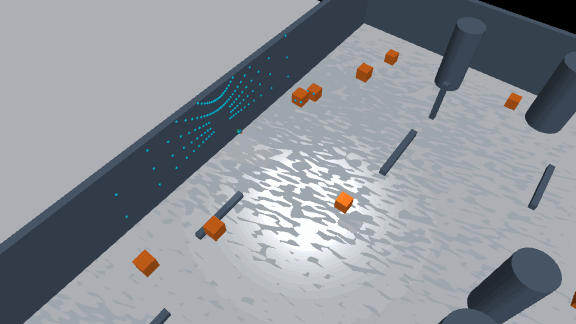
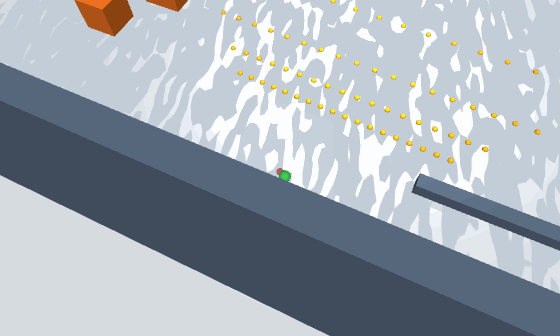
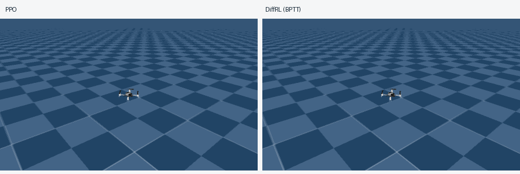
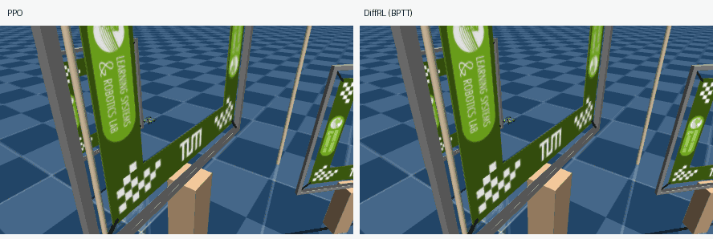

# Drone Playground

**A modular quadrotor testbed for algorithm integration and differentiable policy learning.**

Drone Playground brings learned policies, motion planners, and controllers into a shared task and evaluation workflow. Methods can use different sensors and control pipelines through explicit interfaces. SUPER and EGO-Planner are already integrated through ROS adapters.

Drone Playground builds on Crazyflow's differentiable simulation to support gradient-based training of quadrotor policies.

## Demos

**Planning and perception**


| [SUPER](https://doi.org/10.1126/scirobotics.ado6187) (MID360 LiDAR)                               | [EGO-Planner](https://doi.org/10.1109/LRA.2020.3047728) (D435 depth)                                  |
| ------------------------------------------------------------------------------------------------- | ----------------------------------------------------------------------------------------------------- |
|  |  |


**Task demonstrations**


| Hovering                                                                                   | Racing                                                                                 | Static navigation                                                                                                | Dynamic navigation                                                                                                          |
| ------------------------------------------------------------------------------------------ | -------------------------------------------------------------------------------------- | ---------------------------------------------------------------------------------------------------------------- | --------------------------------------------------------------------------------------------------------------------------- |
|  |  |  |  |
| PPO / DiffRL (BPTT)                                                                        | PPO / DiffRL (BPTT)                                                                    | [Depth policy](https://doi.org/10.1038/s42256-025-01048-0) · D435i                                               | [Point-cloud policy](https://rasevents.org/uploads/documents/pdfviewer/a9/f4/233762-1123.pdf)                               |


## Design

The environment composes six explicit components:

```python
DroneEnvironment(
    dynamics=...,
    controller=...,
    reference=...,
    scene=...,
    sensor=...,
    task=...,
)
```

A runtime method can be a learned policy, a planner, or a controller. Planners produce waypoints or trajectories; policies can produce control setpoints. The matching controllers turn these outputs into physical commands. Hydra selects the components for each experiment.

## Quick start

On Linux, install [Pixi](https://pixi.sh/) and prepare the pinned dependencies:

```bash
git clone https://github.com/sycamore-yu/drone_playground.git
cd drone_playground
python3 scripts/tools/setup.py sources
pixi install --locked
```

Inspect the resolved PPO configuration:

```bash
pixi run train experiment=control/ppo env=hovering --cfg job
```

Train a PPO hovering policy on a CUDA-capable machine:

```bash
pixi run train experiment=control/ppo env=hovering runtime.device=gpu run_id=ppo-hover-demo
```

## License and upstream work

The repository is licensed under [GPL-3.0-only](LICENSE). It builds on [Crazyflow](https://github.com/learnsyslab/crazyflow), [Brax](https://github.com/google/brax), and [MuJoCo](https://github.com/google-deepmind/mujoco).
