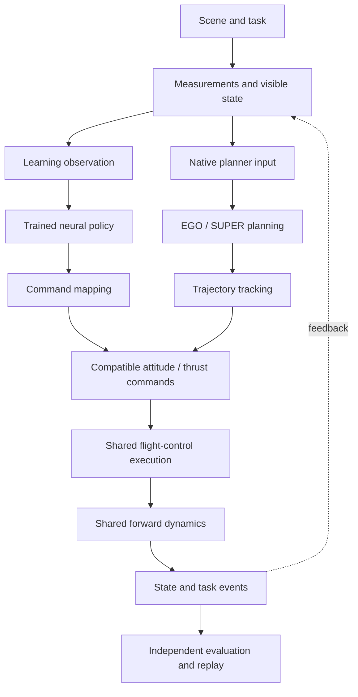
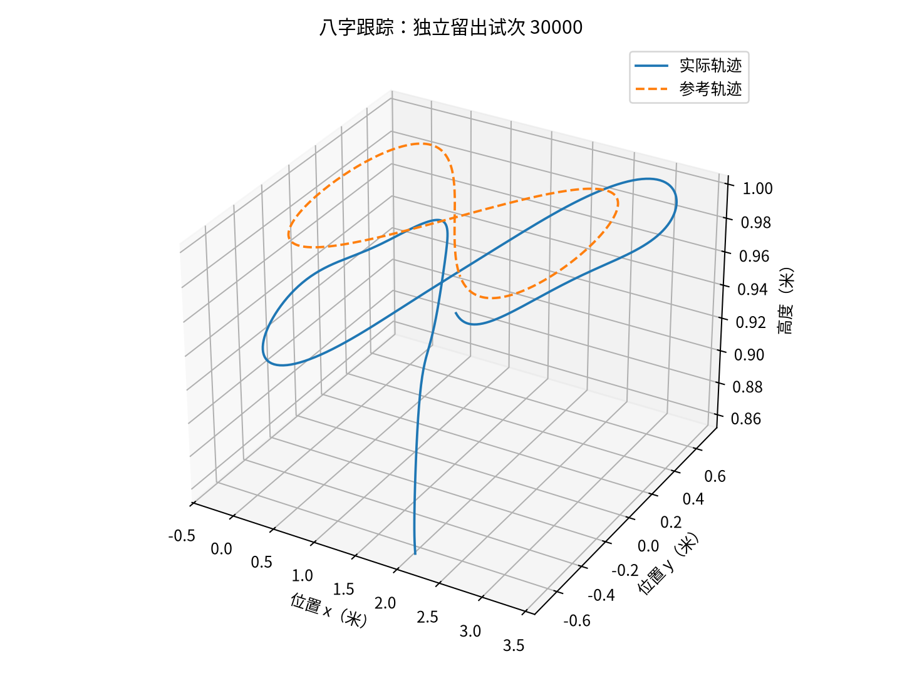
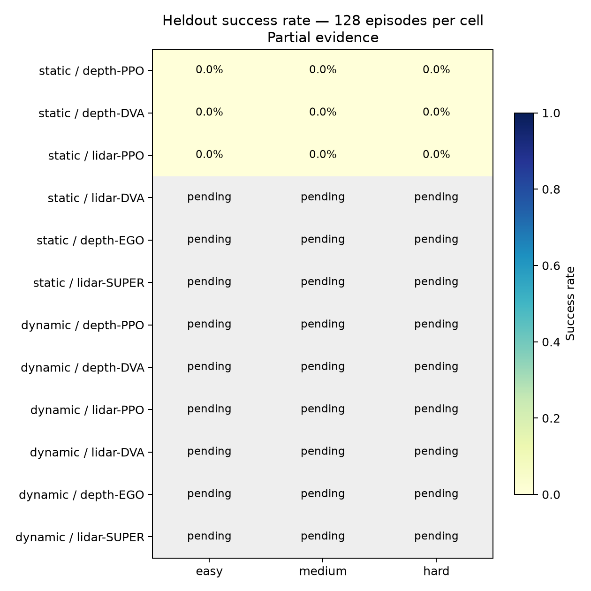

# Drone Playground

**A LEGO-like, composable UAV research platform for differentiable learning, planning, and control.**

Drone Playground is built on top of [Crazyflow](https://github.com/learnsyslab/crazyflow) and uses a configuration-driven, composable component architecture. An experiment selects compatible implementations of policies/planners, controllers, dynamics, scenes, observations, tasks, and training components. The composition layer validates supported combinations and records the executed configuration.

**配置驱动的可组合组件架构**：通过实验配置选择职责明确、契约兼容的模块实现，由装配层形成可执行闭环，并记录实际生效的组合。详见[架构与槽位](docs/architecture.md)。

The main research goal is to make **learning-based** and **optimization-based** methods comparable without forcing every method into the same implementation. Experiments can deliberately share the same controller, dynamics, scene, observations, and evaluator for controlled comparisons, or preserve a method's native controller/planner stack when that is part of the method being studied.

> Research preview. The platform is under active development; completed experiments, negative results, protocol changes, and known limitations are retained as reproducible evidence rather than hidden behind a polished benchmark score.

## Build experiments like LEGO



Archify interactive views: [two execution lanes](docs/diagrams/composable-runtime.html) · [training and derivative rules](docs/diagrams/composable-learning.html). Open the HTML files in a browser for zoom, search, node focus, relationship tracing, and guided views; see [viewer instructions](docs/diagrams/README.md). The diagram shows the current P5 merge point. Other combinations follow their own command contracts.

The same method can therefore be studied under different physical models or controllers, while different methods can be evaluated under the same external task protocol. The platform also supports a second mode in which a complete native method stack is kept intact and only the external task, scene, and evaluation rules are shared.

| Module slot | Current examples |
| --- | --- |
| Policy / planner | Trained neural policies, fixed/random references, EGO-Planner, SUPER |
| Training algorithm | PPO, APG, SHAC, D.VA, LOTF BPTT |
| Controller | Crazyflow attitude/control chain, trajectory tracking, sampling MPC, LSY AttitudeMPC, LOTF native controller |
| Forward dynamics | Four Crazyflow dynamics models, LOTF high-fidelity/native dynamics |
| Backward model | Direct JAX gradients, LOTF analytical surrogate gradients |
| Perception | State/reference observations, D435-style depth, MID-360 LiDAR |
| Scene / task | Figure-eight tracking, random splines, racing, Navigation8 fixed static/dynamic navigation |
| Evaluation | Frozen checkpoints, independent development/held-out trials, full-denominator failure accounting, RScope replay |

## What this project adds

### 1. Composable research architecture

Hydra configurations select real implementation modules rather than only changing scalar hyperparameters. Policies/planners, controllers, dynamics, observations, scenes, tasks, learning algorithms, networks, objectives, and training/evaluation settings are assembled through a common composition layer with explicit command, state, unit, and coordinate-frame contracts.

This makes questions such as the following directly testable:

- Does a learning policy still work when only the forward dynamics model changes?
- What changes when two methods share the same low-level controller?
- How does a differentiable training model transfer to a higher-fidelity evaluation model?
- How do a learned policy and an optimization planner behave under the same scene, collision rules, timing, and held-out trials?

### 2. Differentiable learning with explicit forward/backward choices

The JAX/Brax training path supports direct differentiable dynamics and short-/full-horizon policy optimization. The LOTF integration additionally separates the **forward model used to generate states** from the **backward model used to propagate gradients**, enabling high-fidelity forward simulation with analytical surrogate gradients. D.VA is integrated as a perception-policy training path while keeping the current depth/LiDAR sampling operation outside the gradient path.

The platform records which forward, backward, prediction, and evaluation models are actually used in each run so that a differentiable experiment is defined by its executed model chain rather than by an algorithm label alone.

### 3. One evaluation layer for learning and optimization

Learning policies and optimization-based planners use the same task events, collision semantics, timing, run recorder, independent evaluation, and replay format whenever the comparison is intended to be controlled. Native planners can also run through isolated ROS workers while consuming the same simulated sensors and odometry, which keeps their original mapping/planning logic outside the training process.

The project distinguishes three claims: an implementation can be connected correctly, an experimental budget can be completed reproducibly, and a policy can achieve useful task performance. Failed or low-performing policies remain in the result set.

## Representative results

The platform already has complete closed-loop results for tracking, racing, differentiable training, and optimization control. The current perception-navigation study is still active.

| Experiment | Held-out result |
| --- | ---: |
| LOTF hybrid-gradient hovering | 128/128 complete; last-second position RMSE 0.077 m |
| LOTF hybrid-gradient figure-eight tracking | 128/128 complete; full-trajectory position RMSE 0.185 m |
| Racing PPO / APG | 128/128 complete for each trained policy |
| Racing sampling MPC | 128/128 complete |
| Racing LSY AttitudeMPC | 117/128 complete; 11 collisions retained |
| Static navigation with SUPER | 377/384 reached the goal |
| Dynamic navigation with SUPER | 379/384 reached the goal |

<p align="center">
  
  
</p>

Full evidence is kept in [P3/P4 results](docs/verification/p3-p4-results.md), [LOTF delivery](docs/verification/composable-lotf-delivery.md), and the current [P5 perception-navigation matrix](docs/verification/p5-results-v2/report.md).

## 30-second smoke test

After the environment is installed, this CPU-only command runs one second of real Crazyflow flight, records 50 simulation frames, and writes an RScope replay:

```bash
env -u PYTHONPATH JAX_PLATFORMS=cpu pixi run demo \
  --run-id quick-demo --duration 1 --device cpu
```

On the current development machine the command completes successfully in about 5 seconds after startup/compilation and reports finite states plus a trajectory RMSE. To inspect a full experiment composition without training:

```bash
pixi run experiment --cfg job experiment=p5_static_lidar_ppo
```

### Environment setup

The current development layout keeps Crazyflow as a sibling repository and pins LOTF as a Git submodule:

```bash
git clone https://github.com/learnsyslab/crazyflow.git ../crazyflow
git -C ../crazyflow checkout 36f584d114d9d331f0cee0fe4b9066f821c0fbfd
git submodule update --init --recursive
pixi install
```

The public release will keep this dependency relationship explicit rather than presenting Crazyflow as code authored in this repository.

## Current research scope

Current implemented paths include four Crazyflow dynamics models; PPO, APG/BPTT, SHAC, D.VA; sampling MPC and LSY AttitudeMPC; LOTF high-fidelity-forward/surrogate-backward training; idealized D435 depth and MID-360 LiDAR; and isolated native EGO-Planner/SUPER workers for static and dynamic navigation.

The perception-navigation learning baselines are an active research problem. In the current single-seed P5 matrix, PPO/D.VA navigation performance is substantially below the native planning baselines. These runs are retained because the platform is intended to expose failure modes and model/training differences as well as successful policies. Multi-seed navigation results, real-sensor noise/state estimation, online adaptation, and real-UAV deployment remain future work.

## Relationship to Crazyflow and other upstream projects

Drone Playground has its own Git history. It **uses and extends Crazyflow as a dependency** for UAV simulation, dynamics, and control rather than claiming Crazyflow as original work. Additional task/controller components are adapted from LSY Drone Racing, LOTF is pinned as a GPLv3 submodule, D.VA is independently adapted to the JAX/Brax stack, and EGO-Planner/SUPER are executed as external native planner processes.

Exact upstream commits, reused files, modifications, and license notices are recorded in [THIRD_PARTY_NOTICES.md](THIRD_PARTY_NOTICES.md).

## Reproducibility and documentation

- [Architecture](docs/architecture.md) — module contracts, composition, forward/backward models, P5 perception-navigation execution chain.
- [Evaluation protocol](docs/evaluation.md) — engineering validation, experiment completion, policy quality, held-out evaluation, and failure accounting.
- [Runbook](docs/runbook.md) — train, evaluate, simulate, replay, inspect metrics, and reproduce verification steps.
- [Current development status](docs/status.md) — active work, completed stages, blockers, and exact evidence locations.
- [Research/source inventory](docs/research/references.md) — external projects and what is reused from each one.

Every formal run records the resolved configuration, code/dependency identity, process identity, budget, scalar metrics, checkpoints, per-episode outcomes, and replay data required by its evaluation stage.

## License

Drone Playground is released under **GPL-3.0-only**. This choice keeps the current LOTF-derived integration and the rest of the distributed platform under one clear project license. Third-party components retain their original copyright and license terms; see [THIRD_PARTY_NOTICES.md](THIRD_PARTY_NOTICES.md) for exact provenance and boundaries.
