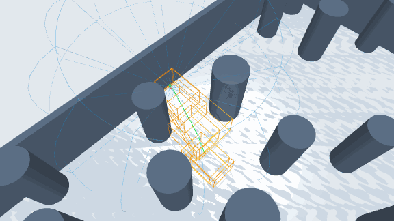
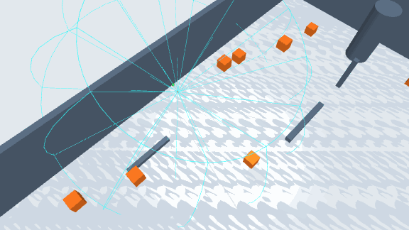

# Drone Playground

**A composable research platform for quadrotor learning, planning, and control.**

Drone Playground provides a shared simulation and evaluation workflow for reinforcement learning, differentiable simulation, motion planning, and model-based control. The goal is to study and compare algorithms under explicit task, sensor, dynamics, and execution conditions, without rebuilding the environment for each method.

The research direction includes learning policies that act directly, as well as learning waypoints, trajectories, or structured inputs for downstream optimization and control. The latter is a direction for new methods, not a claim that every such combination is already implemented.

## RScope demos

| SUPER navigation | LiDAR observations |
| --- | --- |
|  |  |

## Research scope

The platform has three main task families:

- **Tracking:** follow time-parameterized references, including figure-eight and random spline trajectories.
- **Racing:** fly through an ordered sequence of gates.
- **Navigation:** reach a goal in static or dynamic obstacle scenes, using state or onboard perception as configured.

Hovering is available as a basic control task and integration check.

| Area | Current implementations |
| --- | --- |
| Learning | PPO, BPTT/APG, SHAC, and D.VA-based training and method adaptations |
| Planning and control | Attitude MPC, sampling MPC, and integrations for SUPER and EGO-Planner |
| Observations and sensors | State observations, depth sensing, and LiDAR/point clouds |
| Dynamics | Crazyflow backends, LOTF high-fidelity/simplified models, and PointMass |
| Experiment workflow | Training, frozen evaluation, versioned benchmarks, checkpoints, and RScope/MuJoCo replay |

Methods retain their declared observation inputs, output semantics, and execution requirements. A comparison of complete methods therefore records differences in sensors, dynamics, and control pipelines. A controlled component comparison holds those conditions fixed.

## Design

The environment composes six explicit components:

```python
DroneEnvironment(
    dynamics=...,
    controller=...,
    reference=...,
    scene=...,
    sensor=...,
    task=...,
)
```

A runtime **method** can be a policy, planner, controller, or configured combination. Methods exchange physical references (waypoints or trajectories), control setpoints, or actuator commands through compatible downstream components. Training algorithms such as PPO and SHAC update policies; they are not themselves runtime methods.

The implementation reuses Crazyflow's native dynamics interfaces, Brax's environment state conventions, and JAX for differentiable and batched computation. Hydra composes experiment configurations; Pixi manages the development environment. Fixed scene geometry uses MuJoCo MJCF/XML, while dynamic object poses are part of runtime state. External C++/ROS algorithms run through explicit integration adapters.

A new algorithm should be integrated through its actual inputs, outputs, and runtime requirements, rather than requiring a new task or simulation loop. Supported combinations and their verification status are documented separately.

## Quick start

The development environment targets Linux. Install [Pixi](https://pixi.sh/) and prepare the pinned sources:

```bash
git clone https://github.com/sycamore-yu/drone_playground.git
cd drone_playground
python3 scripts/tools/setup.py sources
pixi install --locked
```

Inspect a resolved experiment configuration:

```bash
pixi run train experiment=control/ppo env=hovering --cfg job
```

Run a PPO hovering baseline on a CUDA-capable machine:

```bash
pixi run train experiment=control/ppo env=hovering runtime.device=gpu run_id=ppo-hover-demo
```

Python users can construct an environment independently with `drone_playground.load("hovering")`; loading an environment does not select a learning algorithm. For frozen evaluation, replay, MPC setup, and ROS-based methods, see the [runbook](docs/runbook.md).

## License and upstream work

The repository is licensed under [GPL-3.0-only](LICENSE). It builds on research and software including [Crazyflow](https://github.com/learnsyslab/crazyflow), [Brax](https://github.com/google/brax), [MuJoCo](https://github.com/google-deepmind/mujoco), and [FlightBench](https://arxiv.org/abs/2406.05687). Method-specific source attribution, licenses, and local patches are recorded in [third-party notices](docs/licenses/third_party.md) and `third_party/sources.json`.
