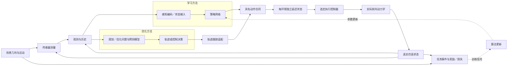

# 配置驱动的可组合架构

公开装配入口为 `method` 和 `env`。方法配方选择决策方式、网络或优化问题以及更新规则；环境预设选择任务、物理场景、传感器、观测、控制器和实际动力学。`composition.py` 校验组件合同并分派执行，`app.py` 提供 Hydra 命令入口。

## 配置归属

| 配置 | 职责 | 主要实现 |
|---|---|---|
| `method` | 神经策略、原生规划器或模型预测控制的决策接口 | `methods/`、`integrations/` |
| `env.scene` | 场景几何、运动规律、起终点和具名实例 | `environments/scenes/` |
| `env.task` | 成功、失败、时限及任务状态 | `environments/tasks/` |
| `env.sensor` | 在当前物理状态和场景时刻生成测量 | `environments/sensors/` |
| `env.observation` | 组织本体状态、目标及传感历史 | `environments/observations/` |
| `env.execution` | 命令合同、跟踪器、内环控制器和实际动力学 | `execution/`、`models/` |
| `network` | 感知编码、策略和价值网络 | `networks/` |
| `objective` | 任务奖励或可微损失 | `learning/objectives/` |
| `algorithm` | 参数更新、时域和导数规则 | `learning/algorithms/` |
| `training` | 并行数、预算、种子、恢复及开发评测 | `learning/train.py` |
| `runtime` | 设备、后端、执行时序和传输延迟 | `runtime/` |
| `evaluation` | 冻结参数、评测实例、协议与输出 | `evaluation/`、`benchmarks/` |

场景提供物理事实；完整环境把这些事实与具体任务及执行方式组合。学习方法和优化方法均使用完整环境。优化器内部预测模型归属于该方法，实际推进飞行状态的前向模型归属于 `env.execution.dynamics`；两者通过显式配置分别描述。

## 闭环数据流

状态、延迟队列、传感器扫描相位和循环网络记忆属于各自环境或方法实例。每次重置只清理结束的实例。共享运行层分别实现 JAX 批量闭环和外部进程闭环；物理执行顺序由执行层拥有。

## 方法与模型边界

PPO 使用 Brax 更新接口；BPTT 通过有限时域轨迹求导；SHAC 保留真实策略、价值网络和目标价值更新。D.VA、LOTF 和点云方法使用自己的具名训练器。参数热启动重用策略参数，完整恢复同时恢复优化器、随机数、计数和必要环境状态。

Crazyflow 提供 `so_rpy`、`so_rpy_rotor`、`so_rpy_rotor_drag` 与 `first_principles`。点云论文重建使用一阶滞后的 `PointMassLag`，LOTF 使用自己的执行与反向模型。各方法的动力学、时间尺度和导数边界由配置及结果元数据共同记录。

SUPER 与 EGO-Planner 在独立 ROS 容器内运行，通过显式适配器接收观测和目标。轨迹跟踪器把轨迹转为执行命令；其控制任务使用滚动参考目标适配，导航任务使用目标点。`optimization/attitude_mpc` 和 `optimization/sampling_mpc` 对应当前真实优化实现。LOONG、AC-MPC、AERO-MPPI 作为待实现方向记录在来源清单与待办中。

## 传感、几何和时序

深度相机与两种 MID-360 配方共用解析图元求交及场景运动。通用 MID-360 使用固定 MuJoCo-LiDAR 扫描模式和四帧历史；论文点云方法使用180×30条规则角度射线。射线、碰撞和净空查询由同一场景库提供；传感器校准包含坐标系、频率、量程、采样和导数规则。

Navigation 的权威几何在 `assets/scenes/navigation/catalog.json`，协议与校验摘要在 `benchmarks/navigation/`。八张场景固定命名为 S01/S02/S03/S06、D01/D02/D03/D06。图元、移动规律和任务边界以目录事实为准；传感输入独立于训练时使用的几何损失。

`runtime.action_delay_ms` 在每个回合采样传输延迟，并按物理子步交付命令；`action_delay_steps` 是独立的整数控制步延迟。500Hz物理时钟把25–50毫秒请求量化到26–50毫秒。执行器一阶响应、传输队列、规划器计算时间分别记录。具体配方的策略、传感、积分和事件检测频率以冻结配置为准。

## 产物与版本

公开配置版本为3。旧产物通过 `scripts/tools/migrate_artifact.py` 显式复制迁入。检查点冻结方法、网络、动作单位和输入含义；评测可以显式选择允许的执行条件，同时保存变化来源。

运行记录保存解析配置、依赖、源提交和差异、参数摘要、原始终止事件及回放。正式矩阵的权威选择在 `docs/verification/final-acceptance/selection.json`；所有报告从所选运行取得。源码和运行状态的维护规则见[开发约定](development.md)。
