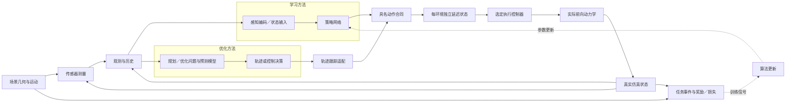

# 配置驱动的可组合架构

本文描述现役实现。以 Traj.／Waypoint／Motion Cmd 为公共边界、允许网络／优化规划／MPC 覆盖不同区段的目标设计见[第一版交付规格](notes/archive/release-plan.md)。现役宿主链支持按合同组合这三类接口；输入语义、时钟、坐标或有效期不兼容的组合会被拒绝。

公开装配入口为 `method` 和 `env`。方法配方选择决策方式、网络或优化问题以及更新规则；环境预设选择任务、物理场景、传感器、观测、控制器和实际动力学。`composition.py` 校验组件合同并分派执行，`app.py` 提供 Hydra 命令入口。

## 配置归属

| 配置 | 职责 | 主要实现 |
|---|---|---|
| `experiment` | 完整实验配方：决策方式、网络/优化器、环境与训练/评测设置 | `configs/experiment/`、`composition.py` |
| `env.scene` | 场景几何、运动规律、起终点和具名实例 | `environments/scenes/` |
| `env.task` | 成功、失败、时限及任务状态 | `environments/tasks/` |
| `env.sensor` | 在当前物理状态和场景时刻生成测量 | `environments/sensors/` |
| `env.observation` | 组织本体状态、目标及传感历史 | `environments/observations/` |
| `env.action` | 策略／规划器输出的命令合同、跟踪器与控制器 | `actions/` |
| `env.dynamics` | 实际推进环境状态的前向动力学 | `dynamics/` |
| `network` | 感知编码、策略和价值网络 | `networks/` |
| `objective` | 任务奖励或可微损失 | `learning/objectives/` |
| `algorithm` | 参数更新、时域和导数规则 | `learning/algorithms/` |
| `training` | 并行数、预算、种子、恢复及 checkpoint_eval 选模 | `learning/train.py` |
| `runtime` | 设备、后端、执行时序和传输延迟 | `runtime/` |
| `evaluation` | 冻结参数、评测实例、协议与输出 | `evaluation/`、`benchmarks/` |

场景提供物理事实；完整环境把这些事实与具体任务及执行方式组合。学习方法和优化方法均使用完整环境。优化器内部预测模型归属于该方法，实际推进飞行状态的前向模型归属于 `env.dynamics`；两者通过显式配置分别描述。

## 闭环数据流

状态、延迟队列、传感器扫描相位和循环网络记忆属于各自环境或方法实例。每次重置只清理结束的实例。共享运行层分别实现 JAX 批量闭环和外部进程闭环；物理执行顺序由执行层拥有。

## 方法与模型边界

PPO 使用 Brax 更新接口；BPTT 通过有限时域轨迹求导；SHAC 保留真实策略、价值网络和目标价值更新。D.VA 和循环点云方法保留实际更新规则对应的训练器。LOTF 使用通用 PPO／BPTT／SHAC 等训练入口。参数热启动重用策略参数，完整恢复同时恢复优化器、随机数、计数和必要环境状态。

Crazyflow 提供 `so_rpy`、`so_rpy_rotor`、`so_rpy_rotor_drag` 与 `first_principles`。点云论文重建使用一阶滞后的 `PointMassLag`，LOTF 只提供 `lotf_high_fidelity` 与 `lotf_simplified` 动力学，复用 Hovering／Tracking／Racing／Navigation Task、通用训练和冻结评测。其 native Betaflight 内环及1000Hz物理推进来自固定源码，动作是总推力 N 与机体系角速度 rad/s；`analytical_surrogate` 是显式的替代导数选择。各方法的动力学、时间尺度和导数边界由配置及结果元数据共同记录。

SUPER 与 EGO-Planner 在独立 ROS 容器内运行，通过显式适配器接收观测和目标。轨迹跟踪器把轨迹转为执行命令；其控制任务使用滚动参考目标适配，导航任务使用目标点。`optimization/attitude_mpc` 和 `optimization/sampling_mpc` 对应当前真实优化实现。LOONG、AC-MPC、AERO-MPPI 作为待实现方向记录在来源清单与待办中。

原生宿主现在使用共用Protobuf/gRPC协议；Python客户端可启动本地可执行程序或容器进程，也能连接现有服务。C++ SDK提供相同的初始化、重置、一步请求和关闭合同。SUPER／EGO适配器保留原ROS1节点，分别把B样条和多项式转换为完整时标Trajectory；原跟踪器的当前样本另作复现依据，不冒充未来轨迹。下游可配置原轨迹跟踪器、AttitudeMPC或SamplingMPC，MPC读取真实未来时域。参见[SDK](../ros_integrations/ros1/README.md)。

`experiment=navigation/native`现可执行三类物理输出；`experiment=navigation/pipeline`通过`method.stages`配置宿主模块链。各模块声明实际输入、输出和导数边界；gRPC Step的上游oneof可携带完整Trajectory、Waypoint或具名MotionCommand，服务能力表声明可接受的上游类型。类型不兼容、过期输出和缺少输入会被拒绝，无解不会继续调用下游模块。各宿主模块可在执行频率的整数分频上运行，传感测量保留自己的采样时间。

现有宿主模块包含目标航点、解析最小jerk轨迹生成、通用原生服务、已冻结神经Waypoint／Trajectory／MotionCmd策略和显式Python适配器。最小jerk模块在给定时长及端点位置／速度／加速度下求五次曲线，时间分配为启发式；它没有碰撞避障，也不保证任意初速度下的速度／加速度界。冻结策略核对观测语义、模型动作解码和时钟，记录权重摘要。

仿真与未来实机部署共用上述具名命令合同；当前仓库只实现仿真和原生算法宿主，没有声明未接线的 PX4 后端。后续接入实机时应直接实现同一命令／时钟／生命周期合同，并以真实飞行验证作为能力成立条件。

真实C++的Waypoint／MotionCmd／Trajectory均已通过宿主闭环；Waypoint→最小jerk轨迹→PD与冻结BPTT→MotionCmd→执行均有公开入口运行记录。多模块**宿主执行**已有基础，网络→Waypoint／Trajectory的专用解码、检查点语义和混合频率已实现，已有显式几何头→JAX PD→延迟→物理的训练路径，任意宿主模块链的JAX化仍未完成；宿主模块已支持各自的整数分频调度。当前`pipeline`拒绝训练，不能把numpy或RPC链声称为可微链。网络→Waypoint→真实规划器→Trajectory→MPC已有短程工程实测；网络作为下游也可显式接收Trajectory，并按检查点观测时域采样完整未来参考。真实C++轨迹服务→已训练BPTT跟踪器完成1秒闭环，调用分别为10次与50次，无缺失命令。当前证据证明接口执行，组合质量仍需独立评测；含C++段的组合不要求端到端训练。凭据见[物理组件](notes/research/physical-components.md)，剩余范围见[实现计划](notes/archive/implementation-plan.md#三类物理接口的组合验收)。

## 传感、几何和时序

深度相机与两种 MID-360 配方共用解析图元求交及场景运动。通用 MID-360 使用固定 MuJoCo-LiDAR 扫描模式和四帧历史；论文点云方法使用180×30条规则角度射线。射线、碰撞和净空查询由同一场景库提供；传感器校准包含坐标系、频率、量程、采样和导数规则。

Navigation 的权威几何在 `assets/scenes/navigation/catalog.json`，协议与校验摘要在 `benchmarks/navigation/`。八张场景固定命名为 S01/S02/S03/S06、D01/D02/D03/D06。图元、移动规律和任务边界以目录事实为准；传感输入独立于训练时使用的几何损失。

系统采用显式多频率时间合同。任务频率表示策略、规划或控制决策时间步；物理频率表示动力学积分、碰撞检测和接触事件时间步。默认导航配置为50Hz执行决策和500Hz物理推进，二者必须满足整数分频关系。`runtime.action_delay_ms` 在每个回合采样传输延迟，并按物理子步交付命令；`action_delay_steps` 是独立的整数控制步延迟。500Hz物理时钟把25–50毫秒请求量化到26–50毫秒。执行器一阶响应、传输队列、规划器计算时间分别记录。具体配方的策略、传感、积分和事件检测频率以冻结配置为准。

规划、策略、控制和物理模块可以声明各自频率。低频模块输出带时间语义的目标，执行层在更高频物理循环中保持有效命令并检查真实碰撞。碰撞属于物理事件，任务层只消费碰撞结果决定终止和奖励。传感器同样拥有独立采样频率和捕获时间，观测模块负责按照时间戳组织历史测量。

轨迹和航点共用一份显式时间合同，字段位于 `actions/commands.py` 与 `rpc/proto/algorithm.proto`，由 `rpc/wire.py` 双向转换。统一输出信封是 `Decision.generated_at`／`Decision.valid_until`：前者表示模块真实生成该决策的仿真时刻，后者表示该输出最晚可执行到何时。轨迹另外以 `start_time` 加各段时长定义自身参数化区间，`Decision.valid_until` 不得超过轨迹终点；轨迹只允许在自身区间内采样，`frame` 当前只接受世界系。航点本身没有“必须何时到达”的轨迹时标；当航点脱离外层 `Decision` 作为下一原生模块的 `upstream` 传输时，会镜像相同的 `generated_at`／`valid_until`，避免跨进程后丢失新鲜度。

该合同使低频上游能被高频执行安全复用。10Hz模块真实调用一次后，50Hz执行层可以在该输出声明的有效期内缓存复用；缓存命中不会刷新 `generated_at`。一旦当前仿真时间超过 `valid_until`，pipeline 在调用下游前把该输出转成 `no_plan`，执行器也会拒绝未来生成、已过期或轨迹时域不覆盖当前时刻的结果。Python 服务、C++ 服务和客户端使用同一仿真时钟校验规则；每回合重置同时清空缓存、调度时钟和模块调用计数。

`training.domain_randomization` 属于训练阶段的环境变化配置。Crazyflow 在训练 reset 时按随机键实际采样质量和电机能力倍率；`crazyflow_first_principles` 还可随机化惯量，带阻力参数的动力学可显式启用阻力倍率。拟合 RPY 模型的正常姿态响应由识别系数决定，因此拒绝惯量 DR，默认惯量范围为 null。配置项必须由选定动力学真实支持。`eval` 运行角色关闭训练随机化、训练噪声和运行时扰动；正式 Benchmark 的 cases、种子和预算由 specification 提供。`lotf_high_fidelity` 支持质量、惯量和电机能力；`lotf_simplified` 不支持惯量。加速度驱动 PointMassLag 支持电机能力与滞后倍率，没有质量／惯量参数，启用这些字段会报错。

## 运行角色与命名

Environment 运行角色只有 `train`／`eval`。`train` 允许训练分布、DR、噪声和扰动；`eval` 冻结这些训练条件并执行可复现环境。训练器使用 `eval` 环境做 checkpoint selection；正式 Benchmark 同样使用 `eval` 环境，但由独立 specification 决定 cases、种子、预算和判定规则。历史证据中的旧 split/role 字段保持原文。

Task 只表达机器人“做什么”：核心为 Hovering、Tracking、Racing、Navigation，点云原论文的 Obstacle Avoidance 是独立论文任务。Figure-8 与 random spline 是 Tracking reference preset，不是 Task。Method 表达算法身份；点云原始重建使用 `experiment=papers/differentiable_pointcloud`，导航适配使用 `experiment=navigation/differentiable_pointcloud`，控制迁移位于 `experiment=control/differentiable_pointcloud_*`，它们共享同一 `method.name=differentiable_pointcloud`。任务差异由各 experiment 组合已有 Environment、Algorithm、Network 和组件配置表达，不再通过独立 training/evaluation preset 组拼接。LOTF 仅是 dynamics source，不拥有独立 Task 或 Method。

## 产物与版本

公开配置版本为3，只接受当前字段和路径。检查点冻结方法、网络、动作单位和输入含义；评测使用声明的 Environment 与 Benchmark specification，并保存真实执行条件。

运行记录保存解析配置、依赖、源提交和差异、参数摘要、原始终止事件及回放。正式矩阵的权威选择在 `artifacts/verification/final-acceptance/selection.json`；所有报告从所选运行取得。源码和运行状态的维护规则见[开发约定](development.md)。

用户补充确认（2026-09-29）：C++模块不要求可微训练链。其首版验收为类型／时钟／生命周期兼容及实际组合控制效果；只对声明可求导的JAX组件要求相应梯度验证，含不透明C++服务的链不要求端到端BPTT／SHAC。

宿主链的每个stage可设置`frequency_hz`，默认与执行频率相同；当前要求它能整除执行频率。两个调用时刻之间只缓存有效物理输出，过期后返回无计划，由执行器处理缺失；不会把失效命令继续交给下游。场景重置同时清空缓存、时钟和调用计数，报告的`module_calls`可验证实际频率。冻结神经模块仍须保持检查点声明的策略频率，不能用这一设置静默降频。

神经几何输出由显式物理解码器定义。Waypoint预测相对当前位置、目标或世界原点的有序位置偏移；Trajectory预测终点位置／速度／加速度，解码为固定时长五次曲线，起点位置／速度取当前状态、起点参考加速度为零。检查点保存尺度、锚点、时长和输出维度；没有隐式把网络隐层解释为轨迹。数值解码支持JAX JIT／批量／梯度，宿主转换与外部MPC仍是明确的导数边界。公开`learning/geometric`已接入PPO／SHAC／BPTT，可训练单航点或五次轨迹几何头并保存解码合同；同频JAX PD和目标来源均显式配置，见[组件训练](notes/research/physical-components.md#jax组件训练入口)。小型更新与工程夹具不代表已收敛策略。

回放的规划检查数据与可执行物理输出分开。`PlannerGeometry`通过可选gRPC字段携带凸多面体走廊和轨迹预览；实际Trajectory及模块链中间输出也进入决策归档。统一`ReplayLayers`把传感标定和因果计划转换为标准mj_unroll的辅助几何，细节见[回放可视化](notes/research/replay-visualization.md)。显示数据不参与传感、控制器、动力学和求导链。

## 实验条件与评测职责

通用训练入口按 `algorithm.trainer` 调用实际训练器，必要的任务适配可声明对应 trainer。Task 的 `_target_` 与内部 evaluation entrypoint 构造真实运行实现；这些 runner 是实现细节，不作为新的领域层级，也不在公开入口按论文名分派。

冻结评测执行代码只运行 cases 并产生逐回合原始指标；benchmark specification 决定正式 cases、种子、预算和判定规则。Tracking、Racing、Navigation 分别拥有版本化 benchmark 规格；Navigation 的 Static／Dynamic 是同一 Benchmark 下的 case suites。内部 runner 不拥有 benchmark 语义。

`env.task.freq` 是执行时钟来源。`env.task.time_limit_kind` 明确任务截止或人工截断：导航和竞速截止属于 termination，悬停／跟踪采样时限属于 truncation。PPO 的固定 Brax 补丁采集 `terminal_observation` 并在 GAE 中保留截断步奖励、使用重置前末态价值；SHAC／D.VA 同样按环境终止事实屏蔽真正末态价值。BPTT／APG 无 critic，其展开步数仍由算法声明。

`study.type` 分为 `method_reproduction` 和 `controlled_comparison`。后者要求明确的 `conditions_id`；运行 manifest 和 result 记录场景、模型、传感、观测、动作单位、控制器、真实时钟、延迟、安全余量及固定条件摘要。完整方法主表继续使用 Navigation8。

决策耗时统一从可用观测到可执行命令，等待设备完成，排除物理推进、传感捕获和证据文件写入。预热一次；原生方法每回合首决策不进入稳态耗时统计，但仍进入正式任务分母。报告 p50、p95、样本数、截止和超期比例。传感记录请求源频率、名义捕获频率、实际捕获频率及仿真捕获时间；50Hz 决策下30Hz请求通过两步刷新实际执行25Hz。

## 训练分布与冻结测试条件

Task 的成功、失败、观测与物理推进只有一套实现。Training 创建 `train_env` 并更新策略／优化器／归一化统计；训练内创建同一 Task 的 `eval_env` 用于选模。Evaluation 加载冻结 checkpoint，创建同一 Task 的 `eval` 环境；正式比较再由 Benchmark specification 固定 cases、种子、预算和指标。策略和归一化参数保持冻结。

| 配置 | 实际职责 |
|---|---|
| `training.reset_randomization` | 初始位置、姿态、速度和场景／参考相位；导航位置采样检查碰撞 |
| `training.command_distribution` | 覆盖训练 position goal／velocity command／reference 分布；默认来自 task |
| `training.scene_distribution` | fixed 固定库、generated 生成后固定、procedural 逐次采样；选择实现须实际支持 |
| `training.observation_noise` | 状态估计的米／弧度误差、深度或点云的米制误差和丢测；保留真实状态供奖励和物理使用 |
| `training.action_noise` | 控制命令偏差；归一化或声明的 SI 单位，在含延迟的执行路径也生效 |
| `training.disturbance` | 世界系外力 N、机体系力矩 Nm、按物理时钟采样的阵风；加速度模型使用 m/s² 扰动 |
| `training.domain_randomization` | reset 采样真实动力学参数，保持一回合内参数固定 |
Evaluation 不复制这些训练配置：`role=eval` 统一关闭训练 DR、训练噪声、动作误差和运行时扰动；正式 Benchmark 的固定测试条件来自对应 specification。

探索采样由学习算法拥有，不属于 `observation_noise`。LSY 赛道配置不再自动注入噪声；原训练扰动声明在 racing preset 的 `training.action_noise` 和 `training.disturbance`，名义评测关闭它们。静态场景库、固定指令范围和固定初态混合都称为训练分布；当前没有自适应 curriculum，不保留无消费者的课程占位配置。

NavigationTask 共用到达／碰撞／越界裁决；不同后端只保留真实的状态容器、积分与循环观测能力差异。基准目录中的 goal 是默认任务指令，训练可显式采样 goal 而不修改几何。旧 `free_course_v1` 核心语义被 `reset_randomization` 的位置混合、姿态、速度和相位字段取代，具名 YAML 只是这些字段的 preset。

# Methods 与 Evaluation 参考

## Task 与方法族

项目通过 Task、Environment 和可组合模块表达无人机学习、规划与控制能力。核心任务包括悬停、轨迹跟踪、竞速和导航；导航内部包含静态与动态 case suites。专项任务和组件评测仅在存在独立职责时保留。

任务回答“做什么”；Environment 组合 Task、Scene、Dynamics、Sensor、Observation 和 Execution，回答“在什么系统中执行”。学习方法、规划方法和控制方法均通过同一环境接口运行。

## 方法覆盖

当前方法按真实输出边界分类：

- Learning：PPO、BPTT、SHAC、D.VA、深度可微飞行、点云可微飞行。
- Planning：EGO-Planner、SUPER、SANDO、MIGHTY 等轨迹规划方法。
- Control：AttitudeMPC、SamplingMPC、MPCC、AC-MPC 等控制方法。

方法表、论文依据和扩展范围保留在本节，不单独维护 methods.md。没有真实实现和验证的能力不进入现役支持范围。

## Evaluation 与 Benchmark

Evaluation 是冻结策略后的性能测量过程。训练期间的 eval_env 用于 checkpoint selection；正式 Benchmark 用于固定、版本化、可复现的比较。两者共享 Task 与 Environment，不产生额外 split。

正式 benchmark 定义：

- Tracking：固定轨迹、种子和指标，测量完成率、误差和控制质量。
- Racing：固定赛道和规则，测量完成率、时间和过门进度。
- Navigation：固定场景和协议；Static 与 Dynamic 是 Navigation 内部 suites。

训练和评测边界：

- Training 更新 policy / optimizer，从训练分布采样，可启用 randomization、noise、disturbance 和 curriculum。
- Evaluation 冻结 policy、optimizer 和 normalization statistics，使用固定 cases，输出 metrics。

Robustness 通过显式参数扰动或条件 sweep 实现，不增加新的 split 或运行角色。
