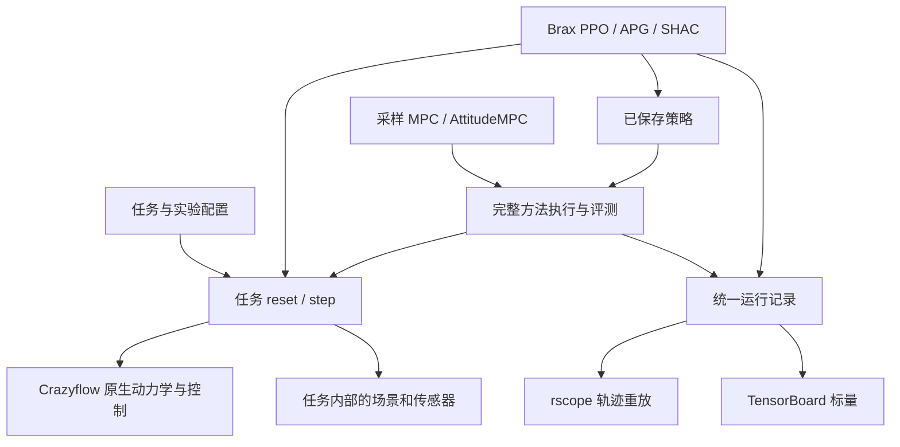

# 模块设计

状态：已接受范围的架构提案。目录建立完成，运行实现按任务单逐步交付。

## 工程归属

`drone_playground/` 与 `crazyflow/` 并列。本项目用一个 Python 包组织研究代码。
采用五个有真实调用者的模块，复用 Crazyflow 的仿真与控制；每个模块隐藏自己拥有的复杂度。

| 模块 | 调用者需要知道的接口 | 内部负责 | 已有来源 |
|---|---|---|---|
| `tasks` | 创建任务，`reset(key)`、`step(state, action)`，读取观测/回报/事件 | 目标进度、任务时间、动态场景、传感器缓存、终止与重置 | Crazyflow、LSY 竞速核心 |
| `learning` | 任务＋算法配置→训练结果与策略参数 | Brax 调用、APG 观测编码、SHAC 更新、检查点及回调 | Brax PPO/APG、DiffRL/jax_shac |
| `controllers` | 沿用 `compute_control(obs, info)` 及作者回调 | 采样预测、acados 状态参考和求解、作者执行语义 | sampling.py、LSY AttitudeMPC |
| `evaluation` | 方法＋任务＋试次清单→逐回合记录及汇总 | 加载策略、冻结统计、完整试次分母、质量判定 | LSY sim.py、Brax Evaluator、safe-control-gym |
| `runs` | 开始运行、记录更新、保存证据、完成运行 | 运行身份、指标写入、rscope 导出和可恢复状态 | rscope、TensorBoardX、标准库 |

`tasks` 内的 `sensors`、`scenes` 属于任务实现；静态和动态导航复用同一几何与观测路径。
五个目录是维护位置，阶段交付沿完整使用流程推进。目录内暂只放职责说明，实际函数在所属阶段实现。

## 公共调用关系

训练路径和 CPU 求解器执行路径在任务语义及记录处汇合。acados 保留自身求解方式；
轨迹重放和文件写入位于梯度计算之外。相同的任务事件既供训练消费，也供评测验证。

## 接口要隐藏什么

**任务接口**隐藏 Crazyflow 内部世界轴、无人机轴、MJX 同步和传感器刷新。
Brax 批量化的归属只在该适配处决定；调用者收到一套观测、回报、终止、截断和重置前末状态。
同一控制器测试和真实执行跨越同一个任务接口，适配器测试用作者函数的已知输入输出作对照。

**控制器接口**复用已经存在的作者入口。采样 MPC 与 AttitudeMPC 是两个真实适配对象，
因此在这里共享调用有收益。配置明确动作类型，状态参考控制和姿态控制分别检查单位及频率。
首版不会把所有轨迹优化、ROS 节点和未来算法抽象成一个万能基类。

**运行记录接口**隐藏检查点目录、TensorBoard 事件和 rscope 文件布局。学习和优化控制
共享记录，后续增加一个指标只改一处。rscope 导出采用原生写入器，模型资源的兼容处理局部封装。

**评价接口**只使用任务事件和执行记录。各方法内部目标函数可以不同，外部任务定义保持一致。
归一化统计冻结、回合边界、失败分母、模型与任务版本都属于调用契约。

## 状态与时间

任务状态包含 Crazyflow 状态、独立随机数、参考轨迹/过门进度、障碍状态、传感器缓存与时间、
上一动作和回合标记。每个状态树的形状在一次编译中固定；编译、热身、训练、评测、写盘分别计时。
场景在任务仿真时间推进，传感器按自身频率刷新并带时间戳。任务步长改变会产生新协议配置。

训练和评测首轮使用同一模型；采样控制保留作者原生的预测/执行模型组合。清单记录各用途，
同一动力学实现通过参数重复使用。虚拟 MID-360 当前只改变测量模型，Crazyflie 参数保持所选预置值。

## 数据归属

- `configs/`：可版本化的任务、模型、算法、感知及实验配方。采用已有配置工具，集中解析后保存。
- `experiments/<run_id>/`：一次实际运行的配置、命令、日志、模型、指标、逐回合结果和重放。
- `docs/verification/`：小型验证报告与证据摘要；大型日志、资源及轨迹保存在运行目录。
- `.scratch/drone-platform/issues/`：工作项及验收记录；`docs/status.md` 提供人类入口。

每次运行的最小清单包含：`run_id`、任务编号、阶段、执行会话、PID 与进程启动标识、
代码提交/工作树补丁、依赖、解析后配置、随机种子、协议版本、预算、最近更新时间、结果位置。
配置与轨迹使用同一 `run_id`；模型和评测清单增加内容校验值。

## 必须保留的已知问题

历史可执行组合为 Python 3.14、Brax 0.14.2、JAX 0.9.2、Flax 0.12.6、MuJoCo/MJX 3.14。
MuJoCo-LiDAR 的已核查约束为 Python <3.14，因此任务 01 优先验证共同支持的 Python 3.13，
并在项目自己的 Pixi 中锁定。Python 3.13 当前属于待验证的兼容选择，历史结果保留原版本。

LSY 当前旧导入 `crazyflow.drones.load_params` 与本地 Crazyflow 不兼容；适配需明确来源和最小修改。
竞速文档名义门洞 0.4 米、源码过门框 0.45 米的差异保留在上游协议中。
Brax 默认缓存初始状态的自动重置与作者每回合随机化分别核对。
rscope 上游默认活动目录和模型导出限制在运行记录模块处理；Windows/SSH 实测作为首阶段证据。

## 接口审查方法

每次新增模块检查：删除它后复杂度是否会散落到多个调用者；两个真实使用方是否共享同一接口；
调用者和测试能否通过相同接口验证完整行为。当前五个模块满足实际任务/算法/记录的变化需求。
只有 Brax 一种训练框架、只有 rscope 一种轨迹查看器，因此相应位置直接调用现有依赖。

依据：Matt `codebase-design`；其目录布局以本项目需要为准，接口深度、职责归属和测试表面为复用原则。
