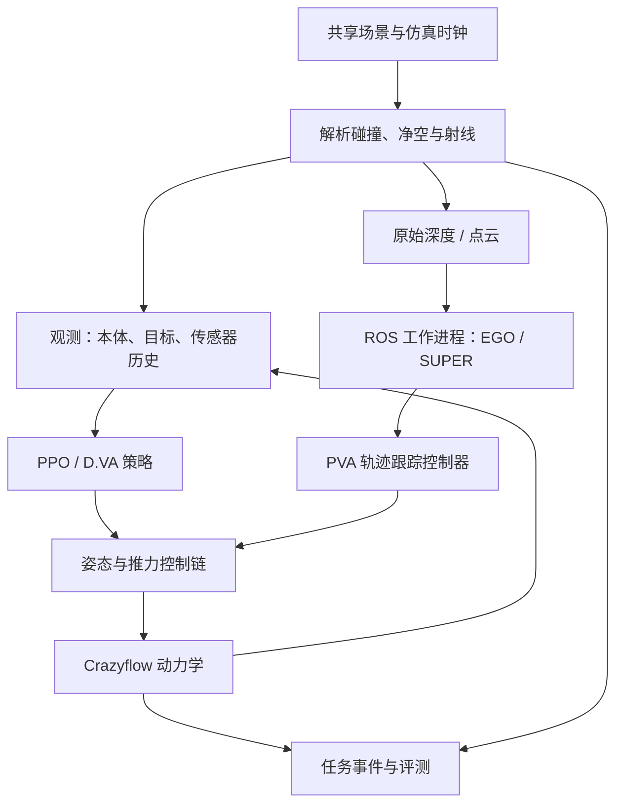

# 可组合模块架构

2026-09-26：已实现Hydra组合入口、现有任务/控制/训练迁移和LOTF混合梯度训练。研究范围见[规格](../.scratch/composable-flight/spec.md)，事实证据见[共同交付](verification/composable-lotf-delivery.md)。

## 配置对应真实模块

| 配置组 | 实现位置 | 真实职责 |
|---|---|---|
| policy | policies/planning.py、neural.py | 固定/随机轨迹生成，冻结网络推理；轨迹与直接命令有不同输出契约 |
| controller | controllers/ | Crazyflow姿态链、AttitudeMPC、采样MPC、LOTF原生飞控；内层频率和混控由预设拥有 |
| dynamics | dynamics/ | Crazyflow四模型、LOTF原生物理和直接/代理导数，保留各自状态布局 |
| scene | tasks/scenes/、LOTF原生任务 | 空场、LSY赛道、LOTF世界及对应原生随机化 |
| observation | tasks/observations.py、tasks/lotf.py | 状态/未来参考、LOTF状态与延迟动作历史、归一化 |
| task | tasks/tracking.py、racing.py、lotf.py | 目标、时间、参考进度、成功/失败/截断和重置 |
| algorithm | learning/train.py、shac.py、lotf_bptt.py | 原生Brax PPO/APG、SHAC、LOTF BPTT和各自优化参数 |
| network | learning/networks.py | 网络、动作分布、初始化、记忆/归一化设置 |
| objective | learning/objectives.py、LOTF原任务奖励 | 唯一奖励计算与明确的算法损失 |
| training | 共同训练入口及RunRecorder | 环境数、种子、预算、评测/保存、恢复和设备 |

`composition.py`集中解析和构造，`contracts.py`记录命令顺序、单位、坐标系。公开使用面是实验配置与`build_environment`、`run_experiment`；任务保留原生状态，避免为不同电机状态强造一种数组布局。

```text
策略（轨迹或命令） → 控制器 → 动力学 → 状态
       ↑                            │
       └────── 任务 / 观测 / 场景 ──┘

训练：算法 + 网络 + 目标 + 运行，消费相同组件及声明的导数规则。
评测/仿真：固定策略或在线优化器，消费同一任务事件。
重放：读取真实状态，MuJoCo只还原显示。
```

## 已验证组合和拓展位置

Crazyflow三个任务×四模型使用同一注入接口，固定命令的12格迁移对照通过。PPO/APG/SHAC通过相同Hydra入口执行真实参数更新；两种MPC经同一优化执行模块实际求解并过门。LOTF保留作者的控制/模型组合预设，控制器每子步执行一次。

组合检查在启动时拒绝姿态/推力与推力/角速度错接、非原生的MPC预测参数、未声明的跨状态代理导数和不兼容任务/观测。当前外部acados求解器用于前向评测；直接对其BPTT反传需要另有明确导数实现。增加新的模型或任务时实现相应构造和状态/观测契约；现有配置只列真实支持的组合。

已有控制器、任务和动力学实现已迁移到共同调用处。旧JSON配方经一次性迁移后从当前源码树删除；已经保存的P1–P4检查点由`runs/legacy.py`只读解释，最终仍进入同一环境构造和推理路径。

## 前向与反向

Crazyflow当前四模型采用原生直接求导。LOTF的`forward`可选高保真和简化，`backward`可选解析代理或直接。高保真中保留作者1000Hz飞控、电机响应和固定气动项；策略50Hz，任务命令延迟40ms。

代理梯度在完整控制/物理步处替换：前向仍调用原始子步，p/R/v的切向量取自`simplified_dyn`。电机/角速度等浮点状态切向量按作者定义传递；随机键切向量采用当前JAX要求的float0。前向对照与代理雅可比对照分别测试。

模型选择具有用途：运行清单记录训练/执行前向、反向规则和MPC内部预测模型。新记录旁的`components.json`保存实际配置；早期本轮记录可从其父运行清单读取相同身份。

## 评测与恢复

`evaluation/execution.py`统一冻结网络和优化控制执行。`evaluation.environment=checkpoint`沿用检查点环境；显式选择`experiment`时使用本次任务/模型/控制器，并保留已加载网络和训练算法身份，检查命令和观测维度。

完整续训与暖启动分别配置：LOTF/SHAC完整状态含优化器、随机数及环境；PPO沿原生参数暖启动。
LOTF恢复时重建截至该快照的开发选模历史，`resume-selection.json`独立保存来源，未来更新的评测排除。
CPU同进程保存恢复与连续更新逐元素一致；归档GPU快照跨进程继续25次更新，实测最大参数差4.59e-6，
该路径按数值近似复现记录。历史持久化配置可按相同算法语义读取，影响行为的变化会拒绝恢复。

训练预算在组合处校验；原生LOTF CSV跟踪频率固定50Hz，改变频率需要显式重采样预设。
评测按执行模式检查检查点配置，训练专用的旧预算字段保持历史身份。
LOTF非有限状态反例计为失败并保留最后有限姿态，数值失效回合继续计入完整分母。

每次运行保存解析配置、代码补丁/依赖、进程身份、预算、标量、检查点、逐回合表和回放。TensorBoard与RScope沿原路径工作，原历史实验不改写。

## 当前范围

LOTF交付采用作者example_quad（0.192kg）与原生任务，Crazyflow保持原Crazyflie模型。
P5 增加下述感知导航链；在线残差适应和实机部署仍不在当前范围。

## P5 感知导航



| 模块 | 接口与拥有的状态 | 不承担的职责 |
|---|---|---|
| `tasks/scenes/navigation.py` | 不变 SceneBank、解析障碍姿态、距离、地面碰撞 | 不持有策略或 ROS 状态 |
| `tasks/sensors/` | D435/MID360 校准、射线和输出编码；环境保存四帧历史与采样序号 | 不生成规划器占据地图 |
| `tasks/navigation.py` | 50 Hz 任务步、500 Hz 物理子步、共同事件与奖励 | 不选择学习算法 |
| `learning/dva.py` | actor/critic/target、优化器、随机键、窗口状态与保存恢复 | 不反传感知射线 |
| `policies/native_planner.py` | 有界 JSON RPC、时间戳校验、每回合隔离工作进程 | 不替换原生规划算法 |
| `scripts/p5_ros_bridge.py` | ROS 话题/坐标适配、时钟、原生启动参数与轨迹抽样 | 不推进无人机物理 |
| `controllers/trajectory.py` | PVA/yaw→姿态/推力，再复用 Crazyflow 内环 | 不接收场景真值地图 |
| `evaluation/` | 固定场景清单、冻结参数、全分母统计和回放 | 不按留出结果调参 |

MuJoCo 不需要内置 ROS。训练进程始终无 ROS；原生规划器运行于现有 Noetic 容器，
通过隔离的 ROS master 和 JSON 行协议交换传感器/里程计/目标及轨迹。
每个回合新建工作进程并清空原生地图；关闭只作用于该回合拥有的进程。
桥脚本按 SHA256 冻结到运行目录，实际 launch 和 SUPER 参数同目录归档。
轨迹过期、未来时间戳或非有限输出被拒绝并计数；没有新有效轨迹时进入已记录的保持参考。
原生求解次数来自实际 Bspline/PolynomialTrajectory 发布，不能用接口连通代替求解验收。

D.VA 在 Brax 环境接口上用 JAX 展开与 Optax 更新，不引入第二套训练环境。
观测向量整体 stop_gradient；编码器参数仍训练。窗口末端 critic 的参数冻结，
对物理状态的梯度保留；真实终止与超时分开，bootstrap 取自动重置前的本体状态。
保存完整训练状态，恢复重建截止快照的开发选模历史，拒绝未来快照泄漏。
CPU 小例子续训一致；GPU 跨进程实测仅近似复现，环境轨迹可能分歧，见恢复证据。

当前 D435 是几何理想深度模型；MID360 使用固定图案与窗口相位。
解析射线通过 MuJoCo 查询/上游 LiDAR 实现核验，不宣称是厂商完整传感器数字孪生。
学习组使用压缩历史；原生规划器使用完整深度/点云并自行建图，属于完整方法比较。
原始深度和点云不经过策略编码器，同一传感器模型仍是唯一几何来源。

v2 将地面加入机体净空和碰撞；侧面和上方保留飞行范围越界语义。
碰撞在 500 Hz 子步检查，覆盖已测 40 m/s 穿杆；未宣称任意速度连续碰撞检测。
修复前的 v1 中止记录保留，不计入 v2 正式矩阵。

依据：Matt的深模块、同一接口测试和持久任务单原则；配置分组参考DiffAero，训练/环境分工参考Brax与MuJoCo Playground。来源见[研究资料](research/composable-platform-references.md)。
