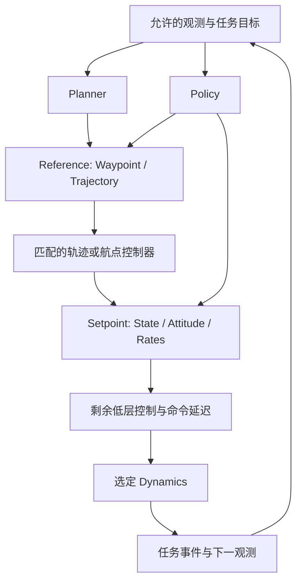

# drone_playground：解耦功能规格

版本：1.0

整理日期：2026-10-08（UTC+8）

代码基线：`main`，`69b1c392dcd52fdf7d85025797141b397e100010` **及读取时的未提交工作树**。

项目位置：`/home/tong/tongworkspace/simulation_dev/drone_playground`。

## 阅读范围

本文定义平台要完成什么、组件交换什么、哪些行为必须保持，以及怎样判断功能完成。正文按功能组织。附录提供当前源码与测试的定位。后续重写可以改变文件和内部类，但必须保留对应的数据语义、物理行为和实验身份。

整理依据包括当前源码、67 份 YAML 配置、3 份 benchmark 配置、场景资产、110 个测试文件的职责分布，以及此前的 P5 计划、MuJoCo 对齐清单和已确认设计决定。对 168 个 Python 模块完成了结构索引，并读取关键执行链、物理接口、模型、配置和现役文档。生成的 Protobuf 模块不计入该数量。本次没有重新训练或重新认证历史实验质量。

整理期间检测到其他工作树文件继续变化。本文的现状描述以本次逐项读取的源码为准；写入后重新核对了引用路径。代码证据按文件与功能定位，不把易变行号作为稳定引用。

文中使用三个状态：**既有能力**表示当前源码中存在对应实现；**已确认要求**表示用户已经明确要求保留或完成的行为；**后续目标**表示尚需实现或验证的能力。存在配置、代码或一次工程测试，不直接表示策略达到 benchmark 标准。

本规格与[架构说明](architecture.md)、[操作手册](runbook.md)、[当前状态](status.md)分工如下：本文维护功能与验收要求；架构说明维护当前实现机制；操作手册维护可执行命令；状态页维护最新进展。配置中的数值是具体实验条件，不自动成为所有方法的全局常量。

## 1. 研究目标与范围

### 1.1 平台必须支持的研究

平台面向四旋翼的学习、规划与控制。主要研究问题是：在可解释的实验条件下，比较强化学习、可微仿真训练和优化控制；替换其中一个组件，观察它对任务结果、计算量和训练效率的影响。

应支持两种明确的研究口径：

| 研究口径 | 固定内容 | 允许变化的内容 | 结果说明 |
|---|---|---|---|
| 原方法复现或具名适配 | 方法来源、输入、网络、损失、模型与执行链的身份 | 有记录的移植、重建假设或任务适配 | 写明原作保留部分与改动部分 |
| 受控组件对照 | 任务、实际场景、信息权限、前向动力学、时钟、延迟、预算及下游执行 | 被研究的算法、网络、参考生成器、控制器或导数规则 | 明确哪些变量真正保持一致 |

完整方法比较允许保留不同方法的传感器、地图和控制链，但必须同时报告这些差异。例如，EGO 使用深度、SUPER 使用点云时，结果反映完整系统差异。只有同一传感器和执行链下的 PPO/D.VA 对照，才适合单独讨论训练算法差异。[S2][S3]

此前的长期研究意图还包括“学习结构化决策，再通过优化器或 MPC 执行”。现有航点、轨迹和控制目标接口应为这类研究提供基础。代价参数、约束参数或优化变量暂时属于具体方法内部；在真实算法需要交换它们之前，不增加新的顶层公共接口。

### 1.2 当前功能范围

核心任务为轨迹跟踪、竞速、静态导航和动态导航。悬停作为独立可运行任务及基础检查。Figure-eight（八字轨迹）和随机样条是跟踪参考预设；静态与动态是导航场景集合。

平台包含状态观测、理想深度与点云感知、前馈与循环策略、PPO/APG/BPTT/SHAC/D.VA、两种 MPC、原生 EGO/SUPER 接入、多种可微动力学、冻结评测、检查点、实验记录和回放。

当前研究以单机四旋翼为主要对象。批量环境表示多个独立试验，不表示已实现多机协同任务。当前硬件模型与回放资产以 Crazyflie 为主要来源；LOTF 的 `example_quad` 保留其自身物理参数。不能用相同显示模型推断相同机体质量、执行器或动力学。

真实载荷、系统辨识、实机部署和新规划器接入属于独立扩展。当前规格不把照片级渲染、纹理随机化、群体任务或课程学习列为必要前提。

## 2. 主要使用流程

| 使用流程 | 输入 | 必须完成的操作 | 输出 |
|---|---|---|---|
| 创建环境 | 环境及六组件配置、种子、设备 | 构造、reset、step、close | 状态、观测、奖励、事件 |
| 训练一个策略 | 环境、网络、训练算法、预算、选模条件 | 批量采样、更新、选模、保存状态 | 参数、训练状态、曲线、选模证据 |
| 评测冻结方法 | 检查点或在线方法配置、固定 cases | 独立重置并运行每个完整试验 | 逐回合数据、聚合指标、质量判定 |
| 对照一个组件 | 两份仅在指定变量上不同的配置 | 检查条件身份，执行相同协议 | 可比较的结果及差异声明 |
| 接入外部算法 | 可执行服务、能力声明、消息适配 | 初始化、传感输入、求解、物理输出、关闭 | 原生决策记录与闭环结果 |
| 查看或导出回放 | 已记录轨迹、资产与标定 | 重建显示、叠加命中点与规划结果 | 自包含 XML/mesh 与 `.mj_unroll` |
| 恢复或迁移 | 完整训练状态，或历史检查点与已审查配置 | 校验身份，恢复或建立新副本 | 可追溯的新运行或显式迁移产物 |

普通环境使用不应加载训练器。训练、评测和回放执行不得各自维护一套环境构造逻辑。加载冻结策略时，以保存的物理与观测合同为基础，只应用明确指定的执行条件覆盖。

## 3. 功能边界与状态归属

### 3.1 六组件环境

以下六组件是本项目已确认的组合方式。它们采用已有机器人术语，不宣称是其他框架规定的统一架构。

| 组件 | 输入 | 输出 | 拥有的职责 | 不应拥有的职责 |
|---|---|---|---|---|
| Dynamics，动力学 | 原生物理状态、物理控制、时间间隔 | 下一物理状态 | 模型、积分、有效物理参数、选定导数规则 | 任务奖励、训练分派、评测通过标准 |
| Controller，控制器 | Reference 或具体 Setpoint、所需机体状态 | 下一级物理控制 | 输入尺度、跟踪、低层控制及自身记忆 | 场景生成、训练预算 |
| Reference，参考 | 参考配置、任务进度或规划结果 | 航点或带时标轨迹 | 参考运动及其时间语义 | 真实运动状态、碰撞结果 |
| Scene，场景 | 资产或生成参数、运行时间与状态 | 几何、物体位姿、空间锚点 | 物体与规定运动 | 算法选择、任务质量阈值 |
| Sensor，传感器 | 场景、机体位姿、采样时刻、标定 | 物理测量及有效信息 | 射线、视场、量程、采样及坐标转换 | 策略输入排列、任务奖励 |
| Task，任务 | 状态、测量、目标与任务参数 | 观测、奖励、进度、结束事件 | 初态规则、任务语义、允许的信息 | 公共物理时钟、训练器、外部进程部署 |

Environment 组合这些组件，推进一次控制周期，再执行任务观测与事件处理。当前公共签名为 `DroneEnvironment(dynamics, controller, reference, scene, sensor, task, ...)`。[C1]

Observation（观测编码）由 Task 持有配置，可独立实现。它把测量与允许的状态转换成网络输入。Network（网络）负责编码、记忆与输出。Algorithm（训练算法）负责参数更新。Method（运行方法）表示实际执行的策略、规划器、控制器或其组合。

### 3.2 公共状态与生命周期

环境继续使用 Brax `State`。`pipeline_state` 保存后端及任务运行数据；`obs`、`reward`、`done`、`metrics`、`info` 保存环境输出。物理后端可保留原生状态结构。无需新增通用 `DroneState` 或 `EnvironmentState`。[S1][C1]

`reset(rng)` 必须产生一个合法独立回合。`step(state, action)` 必须推进声明的控制时间。`close()` 必须释放该实例拥有的资源。构造失败时，也必须关闭已经创建的资源。

公共执行初始化负责模拟资源、控制器绑定、时钟和传感器调度。任务可以提供特定的资源构造与初态规则，例如原生竞速环境。公共初始化不依赖 `Task.bind(env)` 隐式填充环境字段；任务专属初始化也不全部集中到 Environment 中。

| 状态 | 归属与重置要求 |
|---|---|
| 位置、姿态、速度、执行器状态 | Dynamics 的物理状态；按实际模型重置 |
| 任务目标、门序号、到达与失败事件 | Task；按回合重置 |
| 测量历史、扫描相位、动作延迟队列 | 对应环境实例；与新回合同时重置 |
| GRU 隐状态 | 策略执行状态；按该回合的结束掩码重置 |
| MPC 热启动、积分项与命令预测历史 | 控制器实例；不能泄漏到另一回合 |
| 地图、规划状态、消息序列 | 外部方法实例；Reset 或重建 worker 时清空 |
| 优化器、目标价值网络、训练 RNG | 训练器状态；完整恢复时一起恢复 |

## 4. 公共物理数据与执行链

### 4.1 坐标和单位

公共物理接口使用米、秒、弧度、牛顿和牛顿米。世界坐标为右手、z 向上；需要 ENU/FLU 或相机光学坐标时，在适配边界明确映射。机体姿态四元数使用 body-to-world 的 `xyzw`。MuJoCo 或上游不同排列只在转换入口处理。

速度与净加速度的公共状态目标使用世界系。角速度控制使用机体系。净加速度已经补偿重力；把它转为推力时，由具名控制器处理重力。数组宽度相同不能替代类型、字段顺序和单位检查。

### 4.2 可交换数据

| 类型 | 必须表达的内容 | 执行含义 |
|---|---|---|
| `Waypoint` | 有序世界位置 `[N,3]`、容差、生成时间、有效期 | 空间目标；需要下游明确处理时间或跟踪 |
| `Trajectory` | 起始时间、分段时长、世界系多项式系数、偏航是否提供 | 可在有效时域内求取未来参考 |
| `StateSetpoint` | 可选位置、速度、净加速度、偏航及偏航角速度 | 仅控制明确给出的字段 |
| `AttitudeSetpoint` | 世界 RPY 弧度、总推力 N | 姿态/推力控制输入 |
| `RateSetpoint` | 总推力 N、机体系角速度 rad/s | 角速度控制输入 |
| `ForceTorque` | 总推力 N、机体系力矩 Nm | 力/力矩执行输入 |
| `MotorRPM` | 按原生电机顺序的转速 | 电机级执行输入 |

Reference 包含 Waypoint 与 Trajectory；Setpoint 包含状态、姿态和角速度目标；Actuation 包含执行器输入。此前的平铺 `MotionCommand`/`COMMANDS` 不再作为公共模型。[C2]

当前 Trajectory 的系数形状为 `[segments,4,degree+1]`，四个通道为 x、y、z、yaw，采用段内秒数的升幂。B-spline 可转换为等价分段多项式。MPC 的未来参考必须来自真实轨迹，不能重复当前单点来填满预测窗口。超出有效时域的采样必须被拒绝或产生可检测的无效结果。[C2]

### 4.3 允许的组合



Policy 输出几何参考时，在该组合中承担参考生成职责。网络隐藏特征不属于可执行轨迹。新增组合必须声明所需观测、输出类型、下游控制、状态、时钟和导数能力。

当前已有神经航点/轨迹解码与 JAX 跟踪链，以及宿主规划器到跟踪器/MPC 的组合入口。完整组合范围以已存在的适配和验证为界，不能由类型表推导所有笛卡尔积组合都能运行。

## 5. 场景、资产与规定运动

### 5.1 单一几何来源

固定场景以 MJCF/XML 为几何定义源。XML 保存 body、geom、尺寸、默认变换及空间锚点。编译后的模型可以转换为固定形状 JAX 数组，供解析碰撞、距离和射线查询使用。该数组是计算表示，不是另一份手工维护的几何资产。[S1][C3]

静态物体使用固定 body/geom。规定轨迹的动态物体使用对应运行位姿；当前 MJCF 资产使用适合的 mocap body。运动公式、相位及时间更新由场景运行逻辑执行。只有确实需要受力交互时，才引入自由关节物体。[R5]

当前支持的主要解析图元包括球、盒体、直立圆柱及平面。规定运动包括静止、往复运动和 SANDO 来源的周期曲线。旋转图元的表示与查询能力必须以实际适配为准；不能因 MuJoCo 可以渲染某个 mesh，就默认 JAX 查询已经支持其任意形状。

### 5.2 现行场景集合

| 场景集合 | 固定实例 | 用途 |
|---|---|---|
| 空场景 | `EmptyScene` 配置 | 悬停与参考跟踪 |
| 竞速 | `lsy_level0.xml`，配套 `lsy_native.yaml` | LSY 原生赛道与按序过门 |
| 静态导航 | S01、S02、S03、S06 | 三个主要场景与一个扩展场景 |
| 动态导航 | D01、D02、D03、D06 | 三个主要场景与一个扩展场景 |
| 独立生成训练场景 | generated / procedural / primitive 配方 | 训练采样和具名方法重建 |

现行固定导航集合称为 Navigation8。早期“S01–S06 与 D01–D06”的构想不是当前 12 个固定实例的实现证明。当前只存在上表 8 个正式实例。

场景数量、每个场景的评测回合数、并行 `num_envs` 必须独立。增加评测次数不能复制出新的场景身份。固定拓扑训练可以采样位置、尺寸、活动掩码与运动参数；XML 创建及模型编译应在初始化或离线执行，不进入 JIT 物理循环。

### 5.3 几何一致性与离线诊断

传感器、碰撞、连续净空奖励与回放必须读取同一几何和同一时刻的位姿。规划安全膨胀属于规划器或任务参数，不修改原始障碍物尺寸。碰撞球偏移属于机体/碰撞几何，相机外参属于相机。

固定场景加载执行结构检查。可达性、直线遮挡、占据搜索和候选场景审查由离线工具执行。当前离线 A* 只保留连通性或路径长度诊断，不把诊断路径传给感知策略或原生规划器。环境启动不以旧审查文件或固定场景 SHA 清单作为必要条件。

新候选场景写入新目录。改变正式场景几何或难度时，应建立新的实验条件记录；已有报告继续引用原来的场景内容。

## 6. 传感器与观测

### 6.1 当前可选传感器

下表是仓库中的虚拟传感预设，不是硬件精度声明。[C4]

| 配置 | 当前模型 | 主要参数 | 必须保留的区别 |
|---|---|---|---|
| `none` | 无环境测距传感器 | 状态任务使用 | 不构造虚假测量 |
| `d435` | `DepthCamera` 理想轴向深度 | 120×90，水平 85.2°，0.1–10 m，名义 30 Hz，stride 6，4 帧历史 | 保留 SANDO 来源配方 |
| `pinhole_depth` | `PinholeDepthCamera` | 64×48，87°×58°，0.2–10 m，上倾 20°，名义采集 30 Hz、消费 10 Hz | 深度可微飞行的具名适配 |
| `mid360` | 固定来源的非重复扫描方向 | 名义 10 Hz，downsample 200，4 帧历史；虚拟量程 0.1–200 m，归一化远端 40 m | 非重复方向与扫描相位 |
| `uniform_lidar` | 均匀射线点云 | 180×30，水平全向，竖直跨度 60°，0.1–100 m，10 Hz | 点云论文公开信息重建，不能称为同一 MID360 扫描模型 |

深度相机输出光学 z 深度。LiDAR 输出射线距离及点坐标。二者的数值不可直接互换。内参、外参、量程、下采样、有效掩码和实际刷新率必须随运行记录。

当前 MID360 复用了固定 MuJoCo-LiDAR 扫描模式；几何求交由本项目解析 JAX 路径执行。虚拟传感器不自动增加载荷质量或惯量。深度模型不包含完整双目匹配、红外材料响应或硬件噪声。

### 6.2 测量与信息权限

**已确认要求：** 测量必须能识别回合、采样时刻、坐标系、传感器姿态和数据有效性。涉及延迟消费时，必须区分采样与可用时刻；涉及逐点扫描时，必须说明逐点时间或瞬时扫描近似。[S2]

当前本地传感帧与标定保存了多项相关信息，但通用 RPC 的 `Measurement` 仅显式定义时间、frame 和深度/点云数据。它没有完整统一的 `available_time`、逐点时间、独立有效掩码与 calibration ID 字段。需要这些信息的后续跨进程实验，必须补齐消息及验证，不能把 P5 目标字段表写成已经全部实现的协议。

默认感知导航允许使用声明的机体状态和目标。全局障碍真值、未来障碍运动及离线搜索路径不得隐式传给部署策略。原生地图由每回合实际传感器输入逐步建立。训练价值网络或连续损失使用额外状态时，需在实验条件中登记。

### 6.3 观测与网络接口

观测规格必须记录字段顺序、尺寸、单位、坐标、历史长度、有效位及归一化。状态观测与感知观测可分别实现。策略输入与价值输入可以不同，但同一受控比较组的信息权限必须一致。

传感器的最终标定应决定实际输入尺寸。配置中的初始 `points_per_frame` 不能掩盖构造后不同的射线数。失效点、未命中点和近远裁剪必须有固定编码；点云池化不能让填充值成为真实障碍点。

更换输入排列、传感器几何或物理解码后，即使网络权重形状仍可加载，也应拒绝不匹配的冻结检查点。

## 7. 任务行为、奖励与结束事件

### 7.1 悬停与轨迹跟踪

悬停提供固定目标。跟踪支持八字轨迹、随机样条和相应参考预设。任务负责初态、参考采样、进度、观测和奖励。

当前通用预设为：悬停 3 s，跟踪 10 s，控制 50 Hz。这些是配置默认值；较长历史实验和其他方法配方保留自己的时限。参考必须覆盖实际执行所需的时域。

现有 `TrackingObjective` 在非失败时返回 `scale × exp(-distance_scale × position_error)`，失败时返回 `-scale`。默认两参数为 1 与 2。迁移时保留该奖励值与时间采样，新增目标函数使用独立配方身份。

### 7.2 竞速

竞速保留 LSY 原生场景、门方向、过门判断和终止事件。正式完成顺序为 `[1,2,3,4,2]`，必须合法依次通过并完成赛道。当前通用竞速预设为 30 s、控制 50 Hz。

主要结果是完成率、碰撞率、完成时间和通过的门数。参考轨迹误差可以辅助分析，但不能替代真实过门事件。原生循环末端的接触/过门语义必须保持；不能因为统一了执行器，就宣称它已变成与导航相同的逐物理子步判定。

### 7.3 导航

导航以首次安全到达为成功：机体参考点距目标不超过 0.5 m，并满足该步的失败优先规则。当前基准机体碰撞球半径为 0.07 m，回合上限为 300 s。

当前基准记录的同一时刻事件优先级为：碰撞、数值失败、越界、到达、超时。物理运行和指标统计必须使用同一首事件结果。主要事件应保留发生时间、最小净空、初态和实际执行轨迹。

20 m/s 是现行导航协议的名义速度上限。当前深度/点云导航配方还显式给出例如 4 m/s 的评测指令速度。声明上限不能作为在该速度成功飞行的证据。

### 7.4 奖励与训练损失

当前至少保留三种有实际用途的目标形式：

| 形式 | 主要内容 | 使用要求 |
|---|---|---|
| `NavigationObjective` | 目标距离进度、每步时间成本、截断净空惩罚、动作差分、到达/失败项 | 保留历史数值；新长航程训练需核查实际奖励排序 |
| `MotionNavigationReward` | 进度、速度/高度/净空/超速/动作变化率成本及终止项 | 成本按 `dt` 积分；使用具名配方 |
| 点云/深度可微飞行损失 | 速度、进度、净空、加速度、jerk，以及深度速度预测辅助项 | 由方法配方声明，保留论文来源与适配身份 |

PPO 与 D.VA 的匹配实验应共享同一任务奖励。论文原配方与导航迁移不要求强行共享全部损失。任务奖励进入环境输出；网络辅助损失及算法目标留在训练侧。

当前旧导航奖励的 `failure_penalty=-150` 来自较短走廊标定。源码已说明它不足以证明长航程上的安全回报排序。因此“不会通过提前碰撞获利”仍需针对实际配方验证，不能从有碰撞惩罚这一项直接推定。

### 7.5 终止、截断和吸收行为

Termination（任务终止）表示到达、失败或任务截止。Truncation（采样截断）表示训练采样窗口被人为切断。价值目标必须按训练算法区分处理，并使用 reset 前的末状态。

训练通过 fresh auto-reset 开始新回合，保存 `terminal_observation`。只有结束的批量实例重置；跨回合梯度必须断开。冻结评测不把自动重置后的新回合拼进上一回合结果。

首事件后冻结状态是具体执行路径的显式行为。当前 PointMass checked rollout 可冻结首事件；刚体导航保存子步事件但可能返回控制周期末状态。回放和统计必须保存这一差异，不把两者误写成完全相同的终端状态语义。[C1]

## 8. 动力学、预测模型与导数规则

### 8.1 统一外部推进

所有后端以 `step(state, control, dt)` 表达一次物理转移。统一的是接口和物理数据含义。模型内部继续使用其原生方程、积分器、低层控制与状态。

Crazyflow 使用其公开 `build_step_fn()` 推进；LOTF 使用固定来源的简化或高保真方程；PointMassLag 使用当前具名重建的离散转移。实际飞行动力学只有一个选定前向后端。MJCF 场景共享不要求把它们替换成 `mjx.step`。[S1][C5]

### 8.2 当前模型和兼容性

| 模型 | 当前能力 | 当前导数规则 | 关键限制 |
|---|---|---|---|
| Crazyflow `so_rpy` | 拟合姿态动力学 | `direct` | 当前项目按姿态/推力链执行 |
| Crazyflow `so_rpy_rotor` | 增加执行响应模型 | `direct` | 保留该模型的内部状态含义 |
| Crazyflow `so_rpy_rotor_drag` | 再增加阻力项 | `direct` | 参数必须对实际方程有效 |
| Crazyflow `first_principles` | 刚体与电机级物理链 | `direct` | 当前项目的角速度、力矩、电机输入要求此模型 |
| LOTF `lotf_high_fidelity` | 原生高保真方程及低层控制 | `direct` 或 `simplified_dynamics_jacobian` | `RateSetpoint`，实际低层时钟 1000 Hz；当前禁用 learned residual |
| LOTF `lotf_simplified` | 原生简化方程 | 同上 | `RateSetpoint`；不能对缺少的惯量项进行有效随机化 |
| `PointMassLag` | 世界净加速度、一阶滞后、质点运动 | `direct` 或 `exponential` | 只执行加速度字段；不直接接受姿态或角速度 |

同一 RateSetpoint 在 Crazyflow 边界转换为 `[wx,wy,wz,T]`，在 LOTF 边界转换为 `[T,wx,wy,wz]`。转换由后端拥有，不能在调用方根据四维数组猜测。

LOTF 是动力学来源。它不建立独立的任务、训练算法、评测层或数据划分。点云论文方法和深度可微飞行是独立方法来源，不能统一改名为 LOTF。

### 8.3 前向与反向的已实现范围

**已确认要求：** Crazyflow 四种、LOTF 两种和 PointMass 应能作为可选择的前向/反向研究组件；PointMass 保持单一模型实现，不拆出两套同义模型。

**当前差距：** 当前实现允许“选定前向模型，并在该后端支持的规则中选导数”。它尚未实现任意 Crazyflow 前向搭配任意 LOTF/PointMass 反向的通用跨后端组合。

跨后端反向扩展必须明确状态映射、控制单位、时间间隔、执行器记忆，以及保留哪些雅可比块。目标是让这些组合可测、可追溯；不能用一个相同 `step` 名字掩盖状态空间不同。

`simplified_dynamics_jacobian` 是本项目为 LOTF 简化模型雅可比采用的明确名称。它保留实际前向结果，对指定的 p/R/v 使用简化模型导数。`exponential` 是 PointMass 的状态雅可比衰减规则，不改变前向轨迹。替代导数应对照其声明的反向模型检查，不能要求它等于不同前向模型的有限差分。

### 8.4 PointMass 离散行为

名义无扰动时，当前重建使用下列离散方程，`u` 为世界净加速度：

```text
lambda = exp(-dt / tau)
a_next = lambda * a + (1 - lambda) * u
p_next = p + v * dt + 0.5 * a * dt^2
v_next = v + 0.5 * (a + a_next) * dt
```

当前 `tau=1/12 s`。电机强度和滞后倍率由有效随机化参数修正。姿态由加速度与飞行方向构造，其状态导数按该方法约定截断。`exponential` 对 `(p,v,a)` 状态导数乘 `exp(-alpha × dt)`，当前相关配方 `alpha=-ln(0.4)`。[C5]

原论文式整周期转移与导航适配的连续子步转移具有不同离散语义。增加高频观测不能偷偷改变原整周期映射。当前保留从周期起点取样的专用路径，也保留真正逐子步推进的适配路径。

### 8.5 MPC 预测模型

控制器内部预测模型与环境实际前向模型分别声明。MPC 可使用简化预测，但其输出必须在选定的真实执行后端上运行。报告应保存两者的型号、参数和时间步。

当前延迟补偿基于已发命令和明确的延迟估计。它不能直接读取该回合随机采样的真实未来延迟作为免费信息。

## 9. 控制器与规划组件

| 组件 | 输入与输出 | 当前职责 |
|---|---|---|
| 姿态控制 | AttitudeSetpoint → 原生姿态链 | 解码尺度、约束与控制模式 |
| 角速度控制 | RateSetpoint → 原生低层控制 | 推力与机体系角速度 |
| 速度控制 | 世界速度/航向 → 姿态/推力 | 明确的速度外环 |
| 加速度控制 | 世界净加速度 → PointMass 输入 | 保留重力约定与物理单位 |
| 轨迹/航点跟踪 | Reference → Setpoint | PD/JAX 跟踪及显式 lookahead |
| AttitudeMPC | 参考与机体状态 → 姿态/推力 | 固定 LSY/acados 优化问题、热启动与生命周期 |
| SamplingMPC | 参考与机体状态 → 物理控制 | Crazyflow 来源的采样、精英均值更新 |
| MinimumJerkPlanner | 航点与边界条件 → 轨迹 | 最小 jerk 插值；启发式时间分配需保留身份 |
| GoalWaypoints / OrderedWaypointGoals | 任务目标 → 当前或有序航点 | 通用目标适配与进度 |

AttitudeMPC 与 SamplingMPC 的现有优化问题是参考跟踪控制。只有真正加入避障决策与约束后，才能把某个新配方称为避障 MPC。SamplingMPC 也不等同于尚未接入的 AERO-MPPI。

同一 Reference 在实际控制路径中由明确的消费者求值一次。上游原生服务器返回的瞬时执行参考单独记录；选择原生 sample 还是完整 Trajectory 必须显式，避免重复采样和不同时间基准。

## 10. 网络与训练算法

### 10.1 网络能力

现有网络覆盖状态 MLP、深度帧编码、点云逐点编码、传感融合 actor/critic、PointNet/GRU 和 CNN/GRU。

网络构造与冻结推理共用明确入口。Encoder（编码器）、Memory（时序记忆）和输出解码有独立职责，但无需为没有独立用途的小模块增加层级。当前实现仍可放在 `networks/perception.py` 与 `networks/recurrent.py`；此前提出的 `models/encoders` 等目录名称不构成功能约束。

点云循环策略保留逐点编码、有效点聚合、状态融合和循环记忆。深度循环策略保留逆深度处理、空间卷积、循环状态以及加速度/速度预测双头。不同初始化、框架或权重格式的移植必须记录来源，不能以网络宽度相同认定数值等价。

PhysicalActionDecoder（物理动作解码器）把网络数值变为具名参考或控制。动作尺度、参考锚点、时域和坐标必须写入检查点合同。

### 10.2 当前训练规则

| 算法 | 当前入口与机制 | 需要保留的行为 |
|---|---|---|
| PPO | Brax 训练路径 | rollout、优势估计、裁剪、分批更新及末状态处理 |
| APG | Brax 解析策略梯度路径 | 有限展开、可微执行与既有配置 |
| BPTT | 本地有限时域反传路径 | 明确窗口、更新预算、状态保存与恢复 |
| SHAC | 本地短时域 actor-critic | 短窗口策略梯度、目标 critic、lambda returns、终止/截断 |
| D.VA | JAX 移植 | 观测解耦、短窗口梯度、价值估计及对应网络 |
| 循环 BPTT | 点云原始重建与导航/控制适配 | GRU 状态、重计算、专属 rollout/loss、共享持久化 |

这些算法不决定 Policy 输出是姿态、航点还是轨迹。一个组合是否可训练，取决于所选执行链和算法所需的导数路径。外部黑盒在原则上可用于无模型采样，但当前通用宿主 RPC 链没有因此自动获得 PPO 训练入口。

### 10.3 D.VA 梯度合同

当前移植对策略观测的状态来源停止梯度，网络参数继续求导；动作经控制与动力学传播到未来状态、奖励和末端价值。策略更新期间价值网络参数固定，但需要的状态导数保留。[S2][R9]

```text
o_t = stop_gradient(observe(x_t))
a_t = policy(theta, o_t)
x_next = dynamics(controller(x_t, a_t))
```

有限差分验证必须对应这个解耦目标。重新渲染、让观测随扰动状态变化的闭环差分，是另一种目标。不能用后者直接判定已截断的感知导数错误。

点云 D.VA 是在同一机制下扩展点云观测的项目组合。其效果仍由对应训练与评测证据决定。

### 10.4 训练运行

训练配置必须明确种子、并行数、交互步数或更新次数、窗口、优化器、梯度规则、评估频率和预算。交互数与优化器更新数分别记录。状态保存点、完成预算和最佳检查点所在步数也分别记录。

算法拥有 rollout、损失、更新及恢复条件。公共训练基础设施可以共享配置准备、记录、检查点调度和存储，但不把各算法的数学规则合并成隐藏分支。

## 11. 多频率执行、延迟和因果关系

### 11.1 时间推进

Environment 拥有控制频率与物理频率。控制周期必须由整数个有效物理步组成；不允许通过四舍五入丢弃一个物理 tick。任务不再保存第二份 `freq/physics_freq`。

当前 Navigation8 的声明条件为：Crazyflow 导航控制 50 Hz、物理 500 Hz；PointMass 导航控制 10 Hz、物理 500 Hz。LOTF 实际低层时钟为 1000 Hz，使用它时必须声明兼容实验条件，不能沿用不匹配的标准条件标签。

一个控制周期中的功能顺序如下：

1. 读取当前物理状态与对应时刻场景；生成到期测量，保留未刷新的历史帧。
2. 方法消费当前可用观测，生成带身份和有效期的输出。
3. 执行控制器解码或跟踪，把命令加入实际延迟调度。
4. 在物理 tick 上交付到期命令、推进动力学并执行该任务要求的事件检查。
5. 完成任务奖励、结束事件、下一观测和记录。

“10 Hz 决策、500 Hz 碰撞检查”是两个不同职责。降低网络频率不能同时降低导航的碰撞检查频率。当前导航具有物理子步检测；对任意速度、任意细障碍的连续时间无穿透保证仍需要独立的 swept/continuous collision 验证。

### 11.2 延迟与传感器刷新

当前支持固定步数延迟和按回合采样的毫秒延迟，二者不能同时重复施加。相关导航/几何输出配方使用 25–50 ms。命令在物理时钟上零阶保持；保存请求延迟与实际 tick 对应的有效延迟。

延迟队列必须属于当前环境状态，并保留训练所需的动作梯度。初始队列和 reset 行为应有明确控制值。

名义传感器刷新率不等于实际消费率。当前调度会按可执行控制周期安排采样；运行记录保存 requested、nominal 与 effective 频率。当前公共传感调度记录的可用延迟为 0；非零测量流水线延迟是需要另行接入的能力。

### 11.3 方法频率与输出有效期

宿主 Pipeline 中的每一级声明频率、输入、输出、导数能力和来源。当前实现要求模块频率不高于执行频率，并且整除执行频率。未到调用时刻时可以缓存旧输出，但缓存不能延长生成时间或有效期。

Decision 保存状态、plan ID、生成时刻、有效期、真实物理输出与诊断信息。过期、未来时间、错误类型或不覆盖执行时域的轨迹不能继续传给下游。无有效输出时，具名执行配方决定保持、停止或报错，并保留真实结果。

### 11.4 计算耗时

必须区分仿真时间、墙钟求解时间、通信时间和物理执行时间。当前神经决策计时会同步 JAX 完成，并记录 p50、p95 和超时比例；物理推进不计入该决策区间。[C6]

同步等待规划返回、RPC deadline、随机命令延迟和真实闭环计算期限是不同机制。当前存在前几项基础能力，尚不能概括为所有方法都按实测墙钟延迟进行同一实时闭环。正式实时性比较需要固定统一口径，并记录实际超时后的执行行为。[S2]

## 12. 外部算法、ROS 与通用服务

### 12.1 当前集成能力

通用服务使用 Protobuf/gRPC，当前包名 `drone.native.v2`，提供 `Initialize`、`Reset`、`Step`、`Close`。Header 包含协议版本、会话、回合、序号与仿真时刻。能力声明包含真实输入、输出、上游可接受类型及导数能力。[C7]

原生服务只做算法决策。宿主拥有物理世界、传感器事实、控制执行和任务评价。服务可以是本地可执行程序、外部地址或容器中的进程。部署方式不改变物理接口。

当前 EGO 与 SUPER 使用项目自己的 ROS1 部署环境。适配器转换仿真时钟、里程计、目标和深度/点云，并把真实 B-spline/多项式结果转换成公共 Trajectory。SUPER 所需世界系点云必须进行实际数值变换，不能仅修改 frame 标签。

### 12.2 错误和状态

协议区分有效计划、没有计划、不可行和求解预算耗尽；进程退出、通信失败、过期结果等由运行层保留诊断。Reset 必须隔离上一回合地图、轨迹、缓存消息和序列。

输出记录应能追踪“方法返回了什么”“控制器产生了什么”“哪个物理 tick 执行了什么”。记录了一个非空控制命令，只证明控制器产生该命令；还需要对应物理转移，才能证明已经执行。

原生规划器可以保持非确定的异步行为。保存决策轨迹可以重放下游执行，但不能据此承诺再次调用异步规划器会得到相同路径。

### 12.3 新方法接入目标

SANDO、MIGHTY 等应复用同一服务合同、环境和下游执行。它们仍需要真实消息、轨迹、状态与部署适配。当前没有完成的 SANDO/MIGHTY 运行配方。相关 solver 依赖及配置也需独立处理。

`tests/native/interop_server.cc` 只验证通信与生命周期，不是第三个规划算法，也不作为需要长期维护的额外 SDK 基类。新服务直接实现由 `.proto` 生成的接口。

当前状态化 RPC、ROS 与 acados 宿主链按前向运行能力处理。需要穿过它们进行 BPTT/SHAC 反传时，必须另有正确导数或具名替代模型。进程绑定本身不提供梯度。

## 13. 随机化、扰动与数据划分

### 13.1 独立条件

| 条件 | 改变的对象 | 当前要求 |
|---|---|---|
| 初态随机化 | 位置、速度、姿态、场景相位等 | 产生合法初态并记录种子 |
| 物理参数随机化 | 实际前向模型参数 | 参数必须进入真正执行的方程 |
| 观测噪声 | 状态估计或测量视图 | 不改变碰撞真值与物理位置 |
| 动作误差 | 实际送入执行链的控制 | 记录物理单位和分布 |
| 运行扰动 | 外力、力矩或质点加速度 | 在实际物理时刻生效 |
| 场景分布 | 固定库、生成实例或程序化采样 | 保留实例身份及采样规则 |

当前 PointMass 只支持有物理作用的电机强度与滞后倍率随机化；其净加速度方程没有可直接随机化的机体质量/惯量项。LOTF simplified 与拟合模型也不能默认接受对自身方程无作用的参数。

名义评测不自动继承训练噪声。扰动评测显式选择条件，且仍使用 `eval` 角色。固定分布不称为 curriculum。

### 13.2 角色与评测阶段

环境角色只有 `train` 与 `eval`。训练分布、`checkpoint_eval` 和正式 `benchmark` 是数据用途与评测阶段，不建立第三种“开发环境”角色。[S1][C8]

训练内只使用指定 checkpoint_eval 条件选择检查点。正式 benchmark 不用于选模或超参数调节。历史文档中的 development/dev 表述按其原始含义保留，当前流程统一使用上述名称。

固定 Navigation8 场景上的新初态、随机延迟或独立种子属于固定几何扰动测试。证明未见场景泛化，需要真正独立的几何实例或生成种子及其记录。

当前导航 benchmark 初态扰动为位置半宽 `(0.25,0.25,0.10) m`、速度各轴半宽 `0.1 m/s`、航向半宽 `5°`，要求初态净空至少 `0.15 m`。实际抽样与拒绝次数应保存；无法生成合法初态时应报错。

## 14. 独立评测、指标与交付范围

### 14.1 评测行为

评测冻结策略参数、归一化状态和执行条件。每个 case 独立 reset，运行到首次终止或完整任务截止，保存成功与所有失败。结束后的 padding、reset 后帧和无效轨迹不得进入时间、误差或成功率统计。

评价器产生测量结果；benchmark 规则根据这些结果决定质量。批量评测、分片或降低 batch size 只能改变计算方式，不能改变 cases、分母、种子、任务时限或采样分布。

| 任务 | 必报指标 |
|---|---|
| 跟踪 | 全回合完成率、成功回合 RMSE、失败类别及有效轨迹误差 |
| 竞速 | 完成率、碰撞率、合法过门数、成功完成时间及失败试验 |
| 导航 | 逐场景成功率、碰撞/越界/数值失败/超时、到达时间、净空与轨迹 |
| 所有方法 | 实际条件、初态/种子、决策耗时、完成预算与运行状态 |

宏平均、按回合加权平均与逐场景阈值需要分别解释。不能用总体平均掩盖主要场景未通过，也不能把失败从分母移除。

### 14.2 现行 benchmark 默认条件

| 协议 | 默认 cases | 质量规则 |
|---|---|---|
| Tracking v1 | 100 回合，起始种子 30000 | 完成率 ≥95%，完成回合 RMSE ≤0.25 m |
| Racing v1 | 100 回合，起始种子 30000 | 完成率 ≥90%，合法顺序完成且无失败 |
| Navigation v2 | 正式每场景 25 回合；静态 100、动态 100 | S01/S02/S03、D01/D02/D03 各自 ≥90%；S06/D06 为完整报告的扩展场景 |

导航 checkpoint_eval 默认每场景 8 回合；当前协议种子区间入口为训练 10000、checkpoint_eval 50000、benchmark 80000。具体冻结历史运行可能使用不同种子，保留原条件，不改标为当前协议。

每场景 25 回合时，90% 门槛要求至少 23 次成功。学习方法的首版交付要求 3 个独立训练种子，并逐种子验证。协议提供评测默认值；一个只运行 2 回合的工程检查不能称为完成正式 100 回合验收。

### 14.3 首版 18 格与早期 P5 八单元

| 方法 | 跟踪 | 竞速 | 静态导航 | 动态导航 | 格数 |
|---|---|---|---|---|---:|
| PPO、SHAC、BPTT，各自独立 | 首版 | 首版 | 非首版要求 | 非首版要求 | 6 |
| AttitudeMPC、SamplingMPC，各自独立 | 首版 | 首版 | — | — | 4 |
| 深度可微飞行、点云可微飞行，各自独立 | 非首版要求 | 非首版要求 | 首版 | 首版 | 4 |
| SUPER、EGO，各自独立 | 非首版要求 | 非首版要求 | 首版 | 首版 | 4 |
| 合计 | | | | | 18 |

早期 P5 另有“静态/动态 × D435/MID360 × PPO/D.VA”的 8 个感知训练单元，每单元原计划 8,388,608 次交互、一个训练种子。它是独立历史计划，不替代上表，也不应因未列入 18 格而删除 D.VA 和匹配感知对照能力。[S2][S3]

用户在后续确认中调整了非学习方法的交付要求：MPC、SUPER、EGO 需要证明真实算法输出经控制器到达动力学并运行，保留真实成败；不再把学习方法的收敛门槛强加给它们。Benchmark 仍可计算质量阈值。**功能接入完成、质量通过和用户接受交付必须分开记录。**

### 14.4 当前实验状态的使用方式

读取时的 `docs/status.md` 仍记录学习方法的质量缺口，包含深度动态导航部分种子未通过、点云动态导航未通过及确认种子不足。不能把历史“18 格已组织”或旧结果汇总解释为全部质量通过。

本文不重新认证这些分数，也不把某次短程工程运行升级为正式结果。最新质量结论必须同时定位到冻结检查点、逐回合报告和对应评测条件。状态变动更新状态页及结果引用，功能合同保持稳定。

## 15. 检查点、恢复与实验记录

### 15.1 检查点身份

冻结策略需要同时保存参数和重建合同：网络、观测规格、传感器标定、动作/参考解码、控制器、物理执行条件、归一化状态、格式版本和内容摘要。[C9]

Warm start（参数热启动）创建新试验，加载经过匹配检查的参数。Resume（完整恢复）继续原训练，恢复优化器、模型、环境/循环状态、随机数和选模记录，并满足该训练器的预算与配置约束。只有推理权重时，不能宣称完成完整续训。

当前检查点配置格式为 v4。历史检查点通过显式、只写新副本的迁移工具转换。核心构造路径不保留长期静默兼容分支。历史原文件、来源配置和参数摘要保持不变。当前 pickle 类产物只用于可信本地来源；摘要用于完整性校验，不等同于来源认证。

### 15.2 运行证据

一次运行至少能定位以下内容：解析配置、命令、源码提交与工作树差异、依赖版本、种子、实际物理条件、阶段与退出状态、指标、检查点和报告。完整训练状态与最佳推理参数分别保存。

当前稳定结果位置为：

```text
results/
  runs/<task>/<method>/<run_id>/    真实运行、参数、报告及可选回放
  selected/                      选定结果的引用
  scratch/                       预览、诊断及迁移历史
```

`selected` 引用真实运行，不复制另一套权重和回放。训练结束、预算完成、选模成功和策略达标分别记录。停止或失败的运行保留失败原因和最后可恢复状态。

此前被用户停止的点云长训练保留已落盘状态，不因新的文档或重构自动续跑。未落盘日志步数不计作可恢复状态。

### 15.3 源码与发布

运行使用的代码身份必须包含未提交差异，不能只写 HEAD。当前来源导出工具支持从指定提交创建可追溯源码包；导出提交不包含其后的未提交工作树修改。

固定第三方代码、补丁、许可证和必要部署依赖必须可追溯。组织位置可以变化，但不能删除来源和许可信息。公开发布是独立操作；生成文档、创建源码包或整理结果均不自动触发提交、推送或发布。

## 16. 回放与可视化

### 16.1 回放数据

回放包含实际初始帧、执行轨迹和终止帧。动态物体使用对应时刻的运行位姿。必须按实际模型名称解析 body/mocap ID，不能假设无人机永远位于索引 0。

模型包携带 XML、mesh 和相关资源，可脱离原工作目录编译。Crazyflie 2.x 外观来自机器人资产。回放外观与实际物理后端身份分别记录。

### 16.2 显示层

D435 与 MID360 默认显示表面命中点，不显示原先的 D435 视场包络。显示用点云密度可以降低，但不能修改训练测量或评测结果。重建命中点时使用保存的场景、姿态与标定；显示重建不等同于保存了每个原始传感数据包。

规划轨迹、Safe Flight Corridor（SFC，安全飞行走廊）和 TrajectoryPreview（候选轨迹预览）来自实际决策记录。各自保留生成时间与有效期。纯显示几何不得参与物理碰撞，预览不能冒充已执行轨迹。

### 16.3 导出与发布

文件导出负责打包与安全写入；发布负责把完成的回放提供给查看器。二者职责分离，共享必要的锁与原子写入工具。发布不修改源 run，不删除查看器正在使用的目录。

普通 train/eval 默认不写完整回放。`evaluation.record_replays=true` 显式启用；`play checkpoint=...` 记录本次执行；已有轨迹通过 `play replay=...` 查看。训练曲线、数值报告与选模记录仍按训练流程保存。

实时显示是可选观察通道。显示失败不应把已保存的训练或评测结果改判为物理失败。Windows/SSH 查看使用独立客户端，不要求修改已安装 RScope 的内部入口。[C10]

## 17. 配置、安装与公共入口

Hydra/OmegaConf 与 YAML 是唯一参数组合体系。`_target_` 指定组件构造。当前不保留 registry；早期“薄名称映射”的讨论不能覆盖后续已经移除 registry 的实现决定。

配置区分 `env`、`controller`、`dynamics`、`sensor`、`network`、`algorithm`、`experiment` 与 `runtime`。`experiment` 表达完整实验配方；新增具体方法优先复用已有组件，不为每个训练算法创建同名环境类。

配置、资产和 benchmark 实体位于安装包内。资源通过 package resource 定位，不依赖从源码文件向上猜仓库根目录，也不维护根目录镜像。结果根目录由运行参数显式选择。

公共运行入口为 train、eval、play，以及环境 `load()` 和运行状态查询。当前开发脚本为 `scripts/train.py`、`scripts/eval.py`、`scripts/play.py`。安装、场景生成、源码导出、结果组织和回放工具保留在 `scripts/tools/`。

典型参数位置如下；它们是调用示例，不在文档生成时执行：

```bash
# 查看完整解析配置，不开始训练。
pixi run train experiment=control/ppo env=hovering --cfg job

# 从已核对的参数建立独立评测，并保存回放。
pixi run eval checkpoint=/path/to/current-checkpoint.pkl \
  runtime.device=gpu evaluation.episodes=100 \
  evaluation.record_replays=true run_id=frozen-check

# LOTF 是动力学选择，任务与训练算法仍独立。
pixi run train experiment=control/bptt env=tracking \
  dynamics@env.dynamics=lotf_high_fidelity \
  controller@env.controller=rates \
  algorithm.gradient.transition=simplified_dynamics_jacobian \
  runtime.device=gpu run_id=lotf-tracking-new
```

CPU 用于适合的短检查和宿主执行，GPU 用于相应批量训练/评测。设备选择、物理后端与求解器后端分别记录。复现依赖以仓库锁文件和来源声明为准，不在功能规格中另设版本默认值。

## 18. 已确认设计的取舍与后续差距

### 18.1 历史表述如何继承

| 历史表述或方案 | 当前保留的含义 |
|---|---|
| Navigation 40 s | 保存为历史实验条件；现行标准导航为 300 s |
| 12 张静态/动态场景设想 | 当前正式集合为 8 张；未实现的编号不计入能力 |
| JSON/TOML 场景几何 | 固定几何已转 MJCF；JSON 仍可用于结果和来源记录 |
| `MotionCommand` 与平铺命令表 | Reference、Setpoint、Actuation 的具名物理类型 |
| development set / 特殊环境角色 | 环境 train/eval；选模与 benchmark 分阶段 |
| LOTF 独立训练/评测体系 | 只保留动力学来源，复用任务和算法 |
| 统一推进 | 统一 `Dynamics.step`，保留原生积分与低层控制 |
| 另建通用 State/Manager/组件大框架 | 继续 Brax State，直接组合已有组件 |
| `composition.py` 聚合装配 | 配置准备与环境构造回归已有边界 |
| 场景 SHA 作为运行门槛 | 结构校验在加载；来源摘要用于记录；审查离线执行 |
| 三种接口的自定义 SDK | 直接实现生成的 gRPC 服务；测试 worker 仅作协议测试 |
| 所有 18 格统一成功率门槛 | 学习质量与非学习真实接入分别验收 |
| `models/encoders` 等建议目录 | 保留编码、记忆、输出职责；不强制冻结建议文件树 |

用户此前提出过简化或删除 `third_party/` 的要求。当前工作树又存在 `third_party/sources.json` 及补丁，操作手册也依赖它。本文保留这一未统一的组织差异；功能要求是可追溯依赖与许可，不把某个旧完成声明当作当前文件事实。

### 18.2 后续目标与真实缺口

| 目标 | 当前基础 | 尚需完成的行为 |
|---|---|---|
| 前向与反向模型自由组合 | 统一 step 与后端内导数选择 | 跨后端状态/控制映射及组合导数验证 |
| 网络与优化控制进一步结合 | 航点/轨迹神经头、PD、MPC | 针对真实研究方法实现结构化输出与求解器训练链 |
| SANDO/MIGHTY 等原生算法 | 通用 gRPC 与 EGO/SUPER 适配 | 真实算法消息、轨迹、部署及闭环验证 |
| 新优化/学习方法 | 现有模块边界 | MPCC、AC-MPC、AllocNet，以及候选 AERO-MPPI/LOONG 等逐项接入；名称出现在资料中不算实现 |
| 严格统一实时性比较 | 物理时钟、延迟、计时、RPC deadline | 明确墙钟计算如何影响仿真执行及超时行为 |
| 完整测量时间合同 | 本地标定与带时刻传感帧 | 跨进程可用时刻、有效位、逐点时间等所需字段 |
| 连续碰撞保证 | 高频子步检测与净空 | 对高速穿越和极细障碍进行专门验证或增加连续检测 |
| 原论文完整复现 | 点云公开信息重建、深度导航适配 | 原作未披露条件或未移植模块的逐项验证 |
| 首版学习质量交付 | 已有训练器、冻结评测和历史结果 | 补齐未通过任务及独立训练种子，不改写旧结果 |
| 实机与模型校准 | 物理单位、模型参数、显式执行接口 | 真实硬件适配、标定、载荷与安全验证；当前没有完成证明 |

这些缺口用于约束后续工作范围。本次只形成规格，不自动启动相关实现、训练或发布。

## 19. 功能验收清单

下表的 F 编号仅用于需求追踪。存在对应测试文件表示已有验证位置，不表示本次重新执行了这些测试。

| 编号 | 功能完成条件 | 代表性当前验证入口 |
|---|---|---|
| F01 | 不选择训练算法也能创建、reset、step、关闭环境 | `tests/integration/environments/test_direct_composition.py` |
| F02 | 公共初始化不依赖任务隐式写入时钟/控制资源 | `tests/integration/environments/test_execution_initialization.py` |
| F03 | CLI 与 Python 使用同一配置和显式覆盖语义 | `tests/integration/configuration/test_direct_hydra_environment.py`、`test_overrides.py` |
| F04 | 所有后端执行正确类型、单位与有效时间步；非法组合被拒绝 | `tests/unit/dynamics/test_step_contract.py`、`test_lotf.py` |
| F05 | Reference 的坐标、系数、未来时域与偏航缺省规则正确 | `tests/unit/test_trajectory_contracts.py`、`test_reference_arrays.py` |
| F06 | 神经物理输出通过已选跟踪器进入实际物理链，训练梯度有效 | `tests/integration/training/test_geometric_control.py` |
| F07 | 固定 MJCF、派生几何和回放的物体/位姿一致 | `tests/integration/environments/test_mjcf_scene_source.py` |
| F08 | 场景加载不要求旧离线审查或固定 SHA；新回合数不生成新几何身份 | `tests/unit/environments/scenes/test_scene_loading_without_audit.py`、`test_navigation_catalog.py` |
| F09 | 已知平面/盒体/圆柱的深度、射线、有效位和坐标转换正确 | `tests/unit/environments/sensors/` |
| F10 | 实际传感尺寸与刷新频率进入观测与运行记录 | `tests/integration/environments/test_sensor_runtime.py` |
| F11 | 导航子步接触、首事件优先级和结束状态符合声明路径 | `tests/integration/environments/test_navigation_collision.py`、`tests/unit/runtime/test_checked_transition.py` |
| F12 | 竞速按原生门序与方向判定，不能用轨迹误差替代完成 | `tests/integration/environments/test_racing.py` |
| F13 | 单个并行环境结束只重置该实例，保留 reset 前末状态 | `tests/integration/environments/test_wrapper_reset_state.py` |
| F14 | 测量噪声与物理真值隔离；随机化参数实际影响所选后端 | `tests/integration/test_robot_learning_contracts.py`、`tests/unit/environments/tasks/test_measurement_boundary.py` |
| F15 | 延迟在物理 tick 生效；缓存输出不延长有效期 | `tests/unit/runtime/test_timing_contract.py`、`tests/integration/runtime/test_pipeline.py` |
| F16 | 冻结策略不能静默更换观测或物理解码；加载后参数不变 | `tests/integration/configuration/test_checkpoint_contract.py` |
| F17 | BPTT/SHAC/D.VA 与循环训练保持自己的更新及终止梯度合同 | `tests/unit/learning/`、`tests/integration/training/` |
| F18 | 完整恢复保留优化器、随机数和选模状态；热启动另立身份 | `tests/integration/training/test_composed_resume.py`、`tests/unit/learning/test_recurrent_checkpoints.py` |
| F19 | RPC 身份、单位、类型、有效时域、Reset 和真实输出链有效 | `tests/integration/runtime/test_native_typed_service.py`、`test_unified_decision.py` |
| F20 | 外部算法有真实求解输出与物理转移证据 | 原生运行 decision-trace 与对应物理 trace；协议测试不能代替 |
| F21 | 评测包含全部失败，分片和 batch size 不改 cases 与分母 | `tests/integration/evaluation/test_navigation_benchmark.py`、`tests/unit/evaluation/test_recurrent_batching.py` |
| F22 | 选模只消费 checkpoint_eval；benchmark 条件与质量规则可追踪 | `tests/unit/evaluation/test_checkpoint_selection.py`、`tests/integration/configuration/test_navigation_protocol.py` |
| F23 | 检查点、运行状态、日志、来源和退出结果一致保存 | `tests/integration/artifacts/`、`tests/unit/artifacts/` |
| F24 | 历史迁移只写新副本，原检查点和结果不变 | `tests/integration/artifacts/test_explicit_migration.py` |
| F25 | 回放含初始及终止帧、动态几何和自包含资源，显示层不改物理 | `tests/integration/visualization/test_mjcf_replay.py`、`test_live_replay.py` |
| F26 | 选定结果只引用真实 run；发布回放不修改源产物 | `tests/unit/artifacts/test_organization.py`、`tests/integration/visualization/test_replay.py` |
| F27 | 安装资源脱离源码当前目录可加载；源码导出身份可检查 | `tests/integration/test_cli.py`、`tests/integration/artifacts/test_source_snapshot.py` |
| F28 | 重构保留现行物理转移与神经参考的冻结数值 | `tests/regression/test_environment_transition.py`、`test_neural_reference.py` |

验收顺序为：相关组件合同、最小实际闭环、必要数值/梯度检查、对应实验质量。文档修改只运行文档检查。修改单一功能时先运行相关测试，不以全部长期训练作为每次维护的前提。

## 20. 当前源码覆盖与追踪

### 20.1 功能到实现的映射

下表用于定位当前实现，不限制未来目录。包内路径均相对于 `src/drone_playground/`。

| 功能范围 | 当前主要入口 | 对应正文 |
|---|---|---|
| 配置、应用、命令、资源 | `configuration.py`、`app.py`、`cli.py`、`resources.py`、`__init__.py` | 2、17 |
| 环境构造、公共生命周期 | `environments/base.py`、`factory.py`、`initialization.py` | 3 |
| 初态、噪声、命令分布 | `environments/randomization.py` | 13 |
| 固定/生成场景与几何查询 | `environments/scenes/` 的 mjcf、catalog、geometry、racing、generated/procedural、primitive sampling 与离线 validation | 5 |
| 感知与观测 | `environments/sensors/`、`environments/observations/` | 6 |
| 跟踪、竞速、导航及 PointMass 任务 | `environments/tasks/`、任务 events、rewards 与 LSY 固定来源实现 | 7 |
| 参考、控制目标、神经解码 | `references.py`、`control/setpoints.py`、`decoders.py`、`wrappers.py` | 4、10 |
| 低层控制、轨迹跟踪与 MPC | `control/controllers/`，含 mpc/factory、sampling、lsy_mpc、trajectory、delay_prediction | 8、9 |
| 目标、航点、最小 jerk 与走廊 | `planning/goal.py`、`waypoints.py`、`minimum_jerk.py`、`corridors.py` | 4、9、16 |
| 物理转移与延迟 | `control/transition.py`、`delay.py` | 7、11 |
| 三类动力学与参数/扰动 | `dynamics/` | 8、13 |
| 网络构造与编码/循环策略 | `networks/factory.py`、`perception.py`、`recurrent.py` | 10 |
| 训练、算法、损失与冻结推理 | `learning/train.py`、`algorithms/`、`objectives/`、`wrappers.py`、`checkpointing.py`、`inference.py`、`brax_configuration.py` | 10、15 |
| 运行调度 | `runtime/` 的 decision、pipeline、tracking、host_runner、jax_runner、timing、devices、demo | 4、11 |
| 外部算法与传感消息 | `integrations/` 的 service、sensors、ros1、rpc | 12 |
| 任务评测 | `evaluation/run.py`、`mpc.py`、`tracking/`、`racing.py`、`navigation/` | 14 |
| 协议及质量判定 | `benchmarks.py`、`benchmarks/*.yaml` | 13、14 |
| 运行、参数、trace、来源、显式迁移 | `artifacts/` 的 record、layout、checkpoints、training_state、decisions、traces、provenance、source_snapshot、schema、migration、reporting、conditions、console | 15 |
| 回放、显示与发布 | `visualization/`，含 rscope_io、rscope_publish、sensor_hits、layers、navigation_scene/replay、rscope_client、viewer | 16 |
| 共用数学 | `numerics.py` 的 norm、xyzw 旋转与 pseudo-Huber | 4、7、10 |
| 安装与部署 | 根目录锁文件、`scripts/tools/`、`docker/ros1/`、来源与许可文件 | 12、15、17 |

168 个模块的结构计数：Environment 43、Control 22、Evaluation 16、Learning 16、Artifacts 14、Integrations 14、Visualization 10、Runtime 9、Dynamics 7、Planning 5、Networks 4，加 8 个包根模块。结构索引用于覆盖检查，不代替逐项功能运行证据。

### 20.2 关键代码证据

- **[C1]** `environments/base.py`、`initialization.py`、`control/transition.py`：六组件、公共初始化、物理子步及 checked 路径。
- **[C2]** `references.py`、`control/setpoints.py`、`runtime/decision.py`：物理类型、真实未来时域与有效期。
- **[C3]** `environments/scenes/mjcf.py`、`catalog.py`、`catalog_validation.py`、`assets/scenes/`：资产、派生几何、离线诊断。
- **[C4]** `configs/sensor/*.yaml`、`environments/sensors/depth.py`、`lidar.py`、`rays.py`：当前传感器预设及查询实现。
- **[C5]** `dynamics/crazyflow.py`、`lotf.py`、`point_mass.py`：实际支持的前向模型、输入与导数规则。
- **[C6]** `runtime/pipeline.py`、`runtime/timing.py`：模块调度、缓存、实际计时和传感可用延迟。
- **[C7]** `integrations/rpc/proto/algorithm.proto:6–202`、`integrations/README.md`：RPC v2、消息范围与真实适配状态。
- **[C8]** `benchmarks/navigation.yaml`、`tracking.yaml`、`racing.yaml`、`learning/wrappers.py`：协议、数据用途和终止/截断。
- **[C9]** `configuration.py`、`artifacts/`、`learning/checkpointing.py`、`learning/inference.py`：冻结合同、恢复与持久化。
- **[C10]** `visualization/rscope_io.py`、`rscope_publish.py`、`sensor_hits.py`、`layers.py`，以及[操作手册](runbook.md)：回放与发布。

## 21. 先前设想与参考来源

### 21.1 用户资料与已确认决定

**[S1]《drone_playground_统一修改清单_MuJoCo对齐.md》，2026-10-02。** 来自用户资料库。保留 MJCF 源头、原生物理后端、Brax 状态、单一资源加载、状态/模型分离、完整 fresh reset 和历史产物保护。本文结合后续工作树修订其中已经过时的文件名和未完成描述。

**[S2]《P5-感知导航设计与开发计划.md》，2026-09-27。** 来自用户资料库。保留感知导航目标、8 单元 PPO/D.VA 对照、传感器与观测边界、原生规划器地图、信息权限和梯度验证。40 s 时限、早期目录与单种子预算作为历史条件保存。

**[S3][第一版交付与组合设计](notes/archive/release-plan.md)。** 保留 18 格范围、组件对照、完整方法比较、原生 C++ 接入和具名适配身份。质量规则结合后续用户对非学习方法的修订使用。

**[S4] 2026-10-01 至 2026-10-04 的已确认讨论。** 保留自由选择前向/反向模型的目标、PointMass 单一实现、Hydra 单一配置、Brax State、Reference/Setpoint、统一环境时钟、物理子步检测、结果迁至 `results/`、hit 点显示、共享初始化外移及发布职责分离。当前依据同时见[术语](../CONTEXT.md)和[架构](architecture.md)。此前助手单独提出但未被确认的中间方案不升级为强制要求。

**[S5][点云方法说明](notes/research/pointcloud.md)与[深度方法说明](notes/research/depth-flight.md)。** 用于区分公开信息重建、原配方与导航/控制适配；保留未披露参数、停止状态及来源差异。

### 21.2 外部原始资料的用途

外部资料用于核对已有实践与来源，不要求复制完整框架。2026-10-08 核对了主要平台、配置和方法的公开入口；当前项目真正执行的源码仍以本地固定 revision/补丁为准。下表中的“参考用途”是本项目取用范围。

| 编号 | 原始来源 | 参考用途 |
|---|---|---|
| R1 | [Crazyflow 动力学文档](https://learnsyslab.github.io/crazyflow/user-guide/dynamics/)及[源码](https://github.com/learnsyslab/crazyflow) | 四种动力学、原生状态和控制推进。保留固定版本行为，不随在线文档自动升级 |
| R2 | [Brax](https://github.com/google/brax) | 外层 State、训练入口、批量与训练包装 |
| R3 | [MuJoCo Playground 核心环境](https://github.com/google-deepmind/mujoco_playground/blob/main/mujoco_playground/_src/mjx_env.py)及[训练包装](https://github.com/google-deepmind/mujoco_playground/blob/main/mujoco_playground/_src/wrapper.py) | reset/step、控制与仿真时间、资产和运行状态；项目保留非 MJX 无人机后端 |
| R4 | [RotorPy 环境实现](https://github.com/spencerfolk/rotorpy/blob/main/rotorpy/environments.py) | 通过直接传入模型、控制器和轨迹组合环境；六组件数量是本项目选择 |
| R5 | [MuJoCo MJCF](https://mujoco.readthedocs.io/en/stable/XMLreference.html)与[模型编辑](https://mujoco.readthedocs.io/en/stable/programming/modeledit.html) | 固定 body、mocap、自由关节、模型资产与运行数据 |
| R6 | [Agilicious](https://github.com/uzh-rpg/agilicious) | 无人机参考、控制与运行边界的参考项目；不声明当前已接入其完整飞控 |
| R7 | [Hydra 对象实例化](https://hydra.cc/docs/advanced/instantiate_objects/overview/) | `_target_` 与组合配置；Hydra 是本项目选择，不是 MuJoCo Playground 的原配置体系 |
| R8 | [FlightBench 原论文](https://arxiv.org/abs/2406.05687) | 导航方法与处理阶段的比较参考；Navigation8 与 Docker 是本项目条件 |
| R9 | [D.VA 作者仓库](https://github.com/HaoxiangYou/D.VA)及[作者项目页](https://haoxiangyou.github.io/Dva_website/) | 解耦感知与动力学反传；当前实现为 JAX 移植及点云扩展 |
| R10 | [DiffRL / SHAC](https://github.com/NVlabs/DiffRL) | 短时域 actor-critic 原始实现参考 |
| R11 | [Learning on the Fly](https://github.com/uzh-rpg/learning_on_the_fly) | LOTF 高保真/简化动力学与简化模型导数来源 |
| R12 | [MuJoCo-LiDAR](https://github.com/TATP-233/MuJoCo-LiDAR) | MID360 扫描模式来源；本地查询后端单独声明 |
| R13 | [LSY Drone Racing](https://github.com/learnsyslab/lsy_drone_racing) | 原生赛道、门事件与 AttitudeMPC 来源 |
| R14 | [SANDO](https://github.com/mit-acl/sando)、[SUPER](https://github.com/hku-mars/SUPER)、[EGO-Planner](https://github.com/ZJU-FAST-Lab/ego-planner) | SANDO 场景参考，SUPER/EGO 原生算法；场景借鉴不等于算法已接入 |
| R15 | [DiffPhysDrone 固定来源](https://github.com/HenryHuYu/DiffPhysDrone/tree/271936190b5c2a5e760230e718fa6b167718a5bf)；Learning vision-based agile flight via differentiable physics，DOI `10.1038/s42256-025-01048-0` | 深度方法与前驱动力学资料；当前共同条件适配范围见 S5 |
| R16 | Learning to Fly from Point Clouds via Differentiable Simulation，IROS 2026；[仓库保存的方法来源](notes/research/pointcloud.md) | 公开论文重建及补充假设，不宣称获得作者完整训练代码 |
| R17 | [Survey of Simulators for Aerial Robots，IEEE 原始摘要](https://www.ieee-ras.org/news/survey-of-simulators-for-aerial-robots-an-overview-and-in-depth-systematic-comparisons-survey/) | 用户此前提出的仿真器选型讨论：围绕具体研究用途、可定制性与限制确定需求 |
| R18 | [RScope](https://github.com/Andrew-Luo1/rscope) | 原生回放与查看；记录、发布和客户端适配分别管理 |
| R19 | [Isaac Lab](https://github.com/isaac-sim/IsaacLab) | 此前的场景、任务、随机化及测试组织参考；不要求照搬 Manager-Based 架构 |
| R20 | [Google Python Style Guide](https://google.github.io/styleguide/pyguide.html)、[MuJoCo Style Guide](https://github.com/google-deepmind/mujoco/blob/main/STYLEGUIDE.md) | 维护规范；Ruff 执行其中可机械检查的部分 |
| R21 | ICRA 2023 Workshop: The Role of Robotics Simulators for Unmanned Aerial Vehicles；[用户提供的视频入口](https://www.youtube.com/watch?v=MjqBZOVEL4c) | 保留此前的讨论线索；本文未逐段核验视频，不据此归属具体发言 |

其中 R1、R2、R11 等已执行依赖的 revision 由项目来源声明固定；R13/R14 的 vendored 或容器实现还需保留对应来源与补丁。仅作为架构参考的项目不应因此变成运行依赖。
