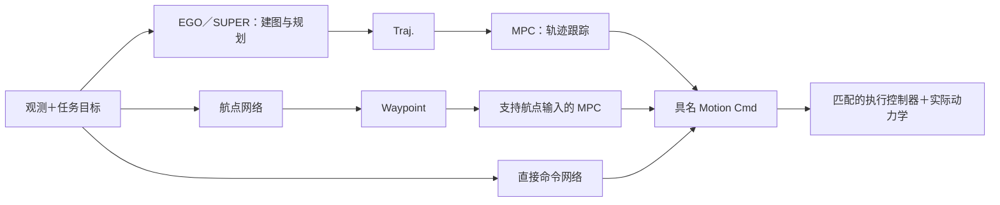

# 第一版交付与组合设计

清理与设计阶段已结束；用户随后授权实现通用gRPC接口、补齐方法并推进首轮训练，进度见[实现计划](implementation-plan.md)和[开发集训练合同](training-pilot.md)。现役机制见[架构](architecture.md)，长期方法覆盖见[方法主表](methods.md)，历史数值见[冻结验收](verification/final-acceptance/README.md)。目标与验收条件不表示已实现或已达标。

## 第一版范围

| 方法 | 轨迹跟踪 | 竞速 | 静态导航 | 动态导航 |
|---|---|---|---|---|
| PPO、SHAC、BPTT（各自独立） | 必达 | 必达 | 后续研究 | 后续研究 |
| AttitudeMPC、SamplingMPC（各自独立） | 必达 | 必达 | — | — |
| 深度可微飞行、点云可微飞行（各自独立） | 非首版要求 | 非首版要求 | 必达 | 必达 |
| SUPER、EGO-Planner（各自独立） | 非首版要求 | 非首版要求 | 必达 | 必达 |

合计18格。悬停用于基础检查。“BPTT X”中的 X 表示算法与任务组合，并非新算法。深度可微飞行指《Learning vision-based agile flight via differentiable physics》，与已有 LOTF 独立；点云方法保持[公开信息重建身份](research/pointcloud.md)。

### 最低质量证据

- 学习方法至少3个训练种子；每个冻结策略、每个任务至少100个留出回合。逐种子报告，不能只公布最好的种子。
- 跟踪完成率至少95%，位置 RMSE 不超过0.25米。成功回合误差和全部回合的失败、有效轨迹误差分别报告，失败不能从分母排除。
- 竞速和静态／动态导航各自成功率至少90%；逐场景报告完成、碰撞、越界、数值失败、超时和耗时。竞速以合法依次过门及完成赛道判定，轨迹误差不能替代完成事件。
- 非学习方法没有训练种子要求，但仍须每任务至少100个冻结配置的留出回合；采样规划器保存随机种子。
- 开始训练前冻结速度档位、赛道／场景、初态和扰动分布、时间预算、训练预算、选模规则及指标聚合方式。20米/秒名义上限不能代替相应速度下的成功证据。
- 冻结后达不到标准的格保持未通过；改变条件、热启动来源或预算建立新结果身份。历史工程短训练、单种子或小样本结果继续按原条件报告。

上述最低要求已由用户确认。具体训练条件在后续阶段另行冻结，当前不生成伪装为最终训练合同的默认预算。训练曲线与预算完成提供过程证据，任务质量仍由独立留出评测决定。

## 两类研究结果

**原方法复现**保存论文对应的输入、网络、求解器、动力学、损失和控制链，逐项说明补充假设及原作差异。

**统一条件下的组件对照**固定任务、场景、观测信息、实际动力学、时钟、延迟、预算和下游执行，只改变被研究模块。采用不同传感器或动作接口的组合分组报告；更换动作接口可能同时改变下游控制器，不能称为只换网络的对照。

第一版矩阵按明确登记的项目评测配方验收。原方法环境中的成功不能自动填入统一评测格；移植后的结果也不能反称论文原版复现。固定八张导航几何上的随机重置不构成未见场景泛化证据。

## 公共组合接口

沿用 FlightBench 表Ⅲ与图4的处理区段组织方式，公共接口固定为 **Traj.／Waypoint／Motion Cmd**。覆盖范围描述模块承担哪些环节；接口描述它实际交付什么。网络覆盖轨迹层并不等于产生可读取的轨迹。

| 接口 | 数据含义 | 必须显式的条件 |
|---|---|---|
| Traj. | 带时间参数的参考运动；可保留 B-spline／多项式或显式采样 | 坐标系、时间起点、有效区间、位置及所提供导数、采样／插值规则、批量形状与掩码 |
| Waypoint | 空间目标或有序目标序列 | 坐标系、次序、容差、可选速度／偏航要求；转成轨迹或控制命令的组件必须显式 |
| Motion Cmd | 执行系统实际接收的控制目标 | 速度、加速度、姿态＋推力、总推力＋机体系角速度等具体类型；单位、重力约定、限幅、频率及有效期 |

网络隐层是内部特征数值，不是这三个公共接口。感知编码器、地图、优化器中的变量及代价网络的参数可作为方法内部组件；只有在真实研究需求及合同明确后才开放其交换边界。

示例组合：

此图是目标组合，当前并未全部可运行。执行器只接受匹配的命令类型；加速度不能直接接到只接受姿态／推力的控制器，必须选择明确适配组件。

### 网络、优化规划与 MPC 的覆盖范围

方法配方拥有决策模块的连接关系；环境拥有任务、传感事实和实际执行系统。训练算法是独立更新规则，PPO／SHAC／BPTT 不决定网络输出层级。

每个可替换模块声明输入、输出、支持的覆盖区段、实例状态、运行后端和求导能力。组装时检查兼容性、每段职责的唯一归属、时钟转换及状态重置；不支持的连接在启动前失败。优先让真实配方共用这些合同，不建设任意计算图插件系统。

MPC 可以是 Traj. 到 Motion Cmd 的跟踪器，也可以在其优化问题确实包含相应决策变量与约束时覆盖更上游的区段。AttitudeMPC／SamplingMPC 当前的参考跟踪问题不能仅靠配置标签变成避障规划器；新增覆盖范围必须有实现和验证。优化器内部预测轨迹也不会自动成为对外 Traj. 接口。

每个模块保留自己的记忆、优化热启动及地图状态。重置清理对应实例；过期轨迹、无解和规划超时均有明确状态。失败后的保持、制动或备用轨迹策略属于可见配方，并记入耗时和结果。

### JAX 与求导边界

JAX 负责已有可微仿真、批量执行、网络与训练。第一版允许 C++ 规划器接入，同一时刻的前向执行事实与导数规则分别登记。

原生 C++ 黑盒可以参加前向评测和 PPO；BPTT／SHAC 的策略梯度若需要穿过它，则必须已有正确的导数实现或明确登记的替代模型。截断导数后不存在有效训练路径的组合应拒绝训练。Python 绑定、外部函数调用及设备加速均不自动提供可微性。

已确认：第一版继续使用原 ROS 容器完成 SUPER／EGO 基线，去 ROS 核心抽取列为后续优化。容器是部署方式，与三类公共接口合同分开。

## SUPER／EGO 的集成选择

固定参考源码为 SUPER `2ad3419c127a617c6d7df6925e81a14175a9c096` 与 EGO-Planner `bfda51284c8c1b476043255a8145ef925a3778a5`，与 `native_planners/versions.env` 一致。两者已在外部参考目录以 GitNexus 建立索引并核对到当前提交；调用图用于定位，结论同时核查了实际源码。

- EGO 的 [BsplineOptimizer](https://github.com/ZJU-FAST-Lab/ego-planner/blob/bfda51284c8c1b476043255a8145ef925a3778a5/src/planner/bspline_opt/include/bspline_opt/bspline_optimizer.h)直接引用 ROS、GridMap 和 A*；[规划管理器](https://github.com/ZJU-FAST-Lab/ego-planner/blob/bfda51284c8c1b476043255a8145ef925a3778a5/src/planner/plan_manage/src/planner_manager.cpp)通过 ROS 参数初始化，在重规划中使用 ROS 时间及静态状态。
- SUPER 的 [SuperPlanner](https://github.com/hku-mars/SUPER/blob/2ad3419c127a617c6d7df6925e81a14175a9c096/super_planner/include/super_core/super_planner.h)持有 ROGMapROS、RosInterface、路径搜索、探索与备用轨迹优化器。数值模块有可辨认的边界，完整规划器仍有 ROS 依赖。

| 方式 | 优点 | 代价及用途 |
|---|---|---|
| 固定版本 ROS 容器 | 保留已运行的完整上游链，环境易隔离 | 首版行为参照；组件复用仍需接口抽取 |
| 本地 ROS 的独立环境 | 可直接调试原节点，避免 Docker 传输层 | 仍依赖 ROS；依赖安装方式不能解决模块耦合 |
| C++ 核心库＋薄适配器／本地子进程 | 保留求解器并逐步隔离 ROS，便于固定输入进行组件对照 | 需抽出参数、时钟、地图查询、可视化及实例状态，先验证原版行为 |
| 进程内 Python 绑定 | 核心稳定后减少边界传输，方便数组传递 | 不会自行消除 ROS 依赖或产生梯度；崩溃和线程状态进入宿主 |
| 独立 JAX 重实现 | 可针对批量运行及导数设计 | 算法身份、数值与性能须重新验证，按移植版或新方法报告 |

后续目标后端采用 C++ 核心库及本地子进程；确认性能瓶颈后才增加进程内绑定。抽取时用相同地图、初态、目标与求解设置比较轨迹、约束、无解及重规划行为，再接回闭环。此前不承诺去 ROS 后更快或已可构建。

### 通用原生方法接口（首版要求）

用户进一步明确：后续 MIGHTY 等 C++ 方法应复用同一套宿主接口。**公共接口的实现纳入第一版阶段 B，去 ROS 核心抽取仍在第一版之后。** 这两项工作有独立的完成条件；保留容器不妨碍先统一接口。协议、客户端与真实ROS适配已实现；三类接口的通用组合执行和质量验收仍未完成。

当前实现与缺口以[架构说明](architecture.md)和[组合验收](implementation-plan.md#三类物理接口的组合验收)为准。完整未来轨迹已暴露给宿主，通用服务评测目前只接受Trajectory，不能把三类协议消息等同所有组合均已完成。

目标分工如下；实际协议字段与序列化格式在首批适配实现时冻结：

| 部分 | 统一职责 | 算法特有内容 |
|---|---|---|
| 宿主接口 | 启动、一步请求、关闭；检查回合／请求身份、协议版本、时钟、单位、有效期及失败状态 | 通过配置选择一个已登记的适配器及其能力 |
| 进程启动与通信 | 使用Protobuf/gRPC；容器命令和本地可执行命令使用同一消息合同 | 镜像、可执行文件、ROS 环境及依赖可分别固定，无需把所有 C++ 方法装入同一容器 |
| 方法适配器 | 把公共数据转成原方法输入，再把原方法输出转成物理接口 | ROS 消息、参数、地图状态、轨迹解码、求解器及其约束 |
| 下游执行 | 根据 Traj.／Waypoint／具体 Motion Cmd 选择匹配的跟踪器和控制器 | 跟踪器的预测模型、控制参数和求导规则独立声明 |

首版接口至少具备以下能力：

- **输入能力声明**：明确所需本体状态、深度／点云及标定、目标、仿真时刻和求解限制。额外地图、走廊或动态障碍预测输入在适配器中登记类型和来源；不满足条件的组合在启动前拒绝。共用调用接口不表示所有算法拥有相同输入，也不允许隐含传入仿真真值。
- **真实输出**：Traj. 提供明确起点和有效时域，并能在下游请求的时刻求值；可以保留具名原生表示，或显式声明采样与插值规则。MPC 所需未来参考必须来自实际规划结果，不能用当前单点参考冒充轨迹。Waypoint 和 Motion Cmd 同样声明类型和单位。
- **实例与失败语义**：每个回合拥有独立原生状态；首版可沿用每回合重建 worker 的方式。区分尚无计划、有效计划、无解、超时、进程失败和过期结果。继续旧轨迹、保持或制动由具名配方决定，并记录实际执行。
- **时序与证据**：区分测量时间、计划生成时间、仿真执行时间及墙钟求解耗时；记录通信耗时、计划身份、输入来源及二进制摘要。切换算法不能隐式改变延迟或将旧计划当作新结果。
- **求导能力**：外部状态化 C++ 方法首版按前向宿主执行登记；接入同一接口不自动获得 JAX 批量化或梯度。需要穿过它求导的组合须另有验证。JAX 的[外部回调说明](https://docs.jax.dev/en/latest/external-callbacks.html)也要求单独处理纯度、状态和导数。

第一版用真实 SUPER、EGO 两个适配器证明接口复用，并保持原配方行为有可比证据；用本地测试 worker 验证相同消息合同不依赖 Docker。测试 worker 只证明通信和生命周期，不计作第三个算法实现。随后验证完整 Traj. 到现有跟踪器、AttitudeMPC／SamplingMPC 的适配及明确的不兼容拒绝。新增算法的改动应集中于其适配器、配置和合同测试，宿主闭环与评测逻辑继续复用。

MIGHTY 是后续接入的目标，不因此加入首版18格，也不宣称已有适配器；接入前按固定源码核查其输入、轨迹表示和状态。整体规划器接入也不自动完成内部模块抽取：复用某个优化器或地图模块时，仍需单独明确它的输入和职责。

## 现状差距与实施顺序

| 阶段 | 工作 | 完成证据 |
|---|---|---|
| A：清理与规格（本轮） | 单一现役源码位置；清除重复版本；统一方法表、术语、18格目标与设计 | 场景字节一致、配置与回归验证、文档链接与来源检查 |
| B：公共接口 | 保留 method／env入口；完成通用原生宿主接口和 SUPER／EGO 适配器；补齐 Waypoint 和完整时标 Traj.；分离跟踪组件，显式选择 MPC | 两个真实适配器共用协议；本地 worker 验证部署独立性；完整未来参考可接匹配 MPC；不兼容单位／时钟／梯度组合被拒绝；原配方前向有对照 |
| C：首版方法补齐 | 深度可微飞行独立移植；点云与 EGO 导航诊断；两个 MPC 的任务评测 | 真实实现、来源、对应任务与独立评测；实验性变化不覆盖原配方 |
| D：收敛与18格验收 | 训练前冻结条件；多种子、开发选模与留出评测 | 满足本页阈值的逐回合数据、曲线、冻结权重、回放、运行与源码摘要 |
| E：开源材料 | 从确认源码快照制作发布包，含安装与最小运行、证据入口、贡献与来源界线 | 新位置安装和必要复现验证；对外文字仅声明已达到的能力 |

公共物理合同现在包括完整多项式 Trajectory、Waypoint 和具名 MotionCommand；Python客户端及C++服务SDK使用同一gRPC协议。SUPER／EGO适配器保留ROS1容器，执行层已可配置原轨迹跟踪器或两个MPC。通用 `method=native` 评测入口当前执行Trajectory；其余物理输出可通过SDK使用，不能默认视作已完成所有任务中的任意组合。每个组合仍须实际闭环和质量验收，见[原生SDK](../native/README.md)。

下一阶段先完成 B 的最小闭环，再按方法补齐 C。每组在接口稳定、短程闭环及指标检查通过后冻结训练和评测条件，进入 D；成熟的跟踪／竞速组可以先开展多种子训练，无需等待全部方法补齐。SUPER、EGO 和两种 MPC 主要需要调试、开发集调参与冻结评测，不存在统一的“继续训练到收敛”步骤。点云已有45000次检查点可作为有来源的候选或热启动，先检查输入、动力学、执行链和导航失败原因，再决定新预算；原50000次任务保持已结束状态。

历史控制学习结果有32回合样本，但种子、热启动与新验收条件仍需补齐；点云与 EGO 的历史正式导航未通过。两个 MPC 有真实代码，但不在历史六方法正式矩阵内。深度可微飞行已有独立JAX导航适配及梯度检查，上游全配方复现和收敛仍未完成。这些事实决定后续工作顺序，不能用旧“工程验收完成”替代第一版质量交付。

长期范围仍是[主表](methods.md)的全部方法，包括 D.VA、NavRL、Fast-Planner、SANDO、MIGHTY、AllocNet、ABPT、MPCC、AC-MPC、AERO-MPPI、LOONG 等；超出首版者逐项建立真实组件与评测。

## 清理与工作树处置

现役 `main` 位于 `simulation_dev/drone_playground`，已拥有独立 `.git` 公共管理目录和在本地重建的 acados。旧 `mujoco/drone_playground` 是同一仓库的原主工作树，已移入项目外离线归档，旧路径不再存在。迁移保留所有分支、标签和未提交内容，详见[生命周期](research/branch-lifecycle.md)。

用户在本轮明确结束原点云长训练。45000次完整状态经摘要核验、独立备份及现役解释器读回；训练与协调器已停止，未继续最终评测，也未将原50000次预算记为完成。冻结点云工作树只用于保存既有源码与证据。

本轮移除 Navigation v1 协议及入口，把仍有效的几何证据与划分说明移到 v2；移除旧场景 v1–v4 及专属测试；场景构建器保留现役 S06／D06并显式校验 SANDO 来源。重复奖励配方合并后保留最新参数。原临时设计表并入方法主表，清理前源码、原表与旧工作树未提交补丁已在项目外备份。

以下版本标识属于不同语义，继续保留：

- 40秒点云论文迁移与300秒 Navigation 是不同评测条件；历史结果不改标，旧条件用于来源恢复与回归。
- 配置格式 v2／v3 夹具检验旧检查点迁移，不能按文件名当作重复方法删除。
- 冻结运行、原始来源摘要和旧验收 JSON 是历史证据，不能为匹配当前源码而改写。

公开材料采用当前确认提交的源码快照；本轮不重写 Git 历史、不推送、不发布。旧历史含本机路径，发布与训练完成分别验收。
