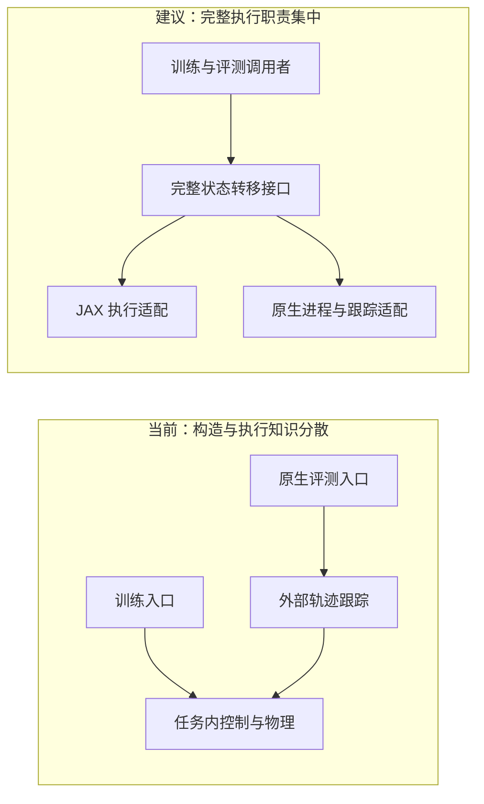
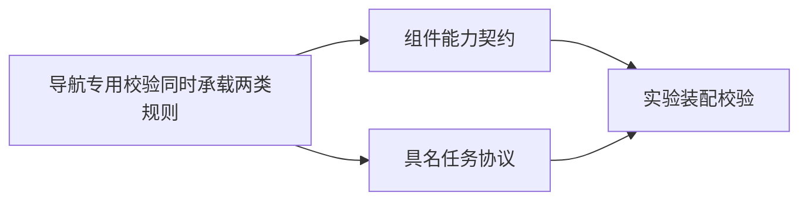

# 可组合槽位设计：来源、事实与提案

核对日期：2026-09-28。当前代码依据：本地 `31129a8` 及工作树读取快照。
本次范围是文档与 Archify 图示；下列实施建议独立于当前运行代码。

## 三流水线讨论的确认与澄清

2026-09-28 追加，当前配置复核于 `55a3f4b`。用户采纳后续临时三流水线评审中的
候选 1（决策方法）、2（执行状态转移）、4（协议与能力）；本文件后面的原始三个候选
保留原编号和来源。已确认的下一版设计以 [ADR-0007](../adr/0007-method-execution-protocol.md) 为准。

决策方法描述执行时如何从输入产生轨迹或命令，容纳学习、在线优化及其混合。
PPO 等训练算法负责更新策略参数；MPC 在平台中归在线决策，其控制理论名称保留。
本轮只修改设计文件，配置迁移由用户要求在讨论清楚后执行。

训练奖励与训练损失可统一在“训练目标”概念下组织。奖励是环境转移或任务表现的信号，
损失是直接用于参数更新的函数。直接可微训练可以最小化负累计奖励；PPO 根据采样奖励
估计优势并优化剪裁代理目标，还可以同时包含价值和熵相关项。因此共享奖励的不同算法
可以使用各自的损失构造。建议保留一个使用入口，并分别记录任务信号和算法损失的来源。
[PPO 原论文](https://arxiv.org/abs/1707.06347)

“在线优化目标”指 MPC、轨迹规划等方法每次求解的代价，连同约束和预测模型归决策方法。
它可复用任务误差项，具体权重、时域、硬约束与训练损失分别记载。

导数选择按用户建议放入算法子配置，推荐入口为 `algorithm.gradient`。例如 LOTF 训练
选择高保真前向与解析代理反向，D.VA 选择停止观测的状态导数并保留后续动作路径导数。
算法配置选择规则，各模块提供并校验规则；已有 `dynamics.backward` 仍是实际入口。
PPO 的网络参数梯度由更新算法计算。额外环境/求解器导数配置按方法实际需要提供。
[JAX 自定义导数](https://docs.jax.dev/en/latest/notebooks/Custom_derivative_rules_for_Python_code.html)

当前十组组件配置是 `policy/controller/dynamics/task/scene/observation/algorithm/network/objective/training`。
`experiment` 组合这些组；`evaluation/replay` 是根配置里的运行设置。两个当前工作树的
`configs/config.yaml` 一致采用这一组织。传感器是 `observation.sensor` 子槽位；
一级传感器只曾作为方案讨论，当前 D435/MID-360 的独立模块可从该子槽位替换。

建议场景保存几何与运动、任务保存目标和完成规则；在使用端通过一个环境预设组合两者。
例如同一 Navigation8 森林几何可以用于点到点避障、航点巡检或给定参考的跟踪，后两者
在这里是设计示例。相同点到点目标可研究状态、深度、点云等输入，观测差异进入实验协议。
观测还可按接收者分组，例如部署策略使用传感器数据、训练价值网络使用声明的特权信息。
这些复用关系支持职责分离，具体配置层级继续由用户讨论确定。

Isaac Lab 的管理器式环境用 `InteractiveSceneCfg` 管理机器人、物体和传感器实体，
在 `ManagerBasedRLEnvCfg` 中组合场景、观测、动作、奖励、终止、命令和课程等配置。
`ObservationManager` 按用途管理多个组，组内由观测项配置来源、噪声、缩放和历史。
这提供“同一物理世界、不同任务规则、不同接收者观测”的组织参考；Drone Playground
可采用这些职责关系，并保留适合 JAX 可微展开的执行实现。
[场景定义](https://isaac-sim.github.io/IsaacLab/main/source/api/lab/isaaclab.scene.html)
· [任务环境教程](https://isaac-sim.github.io/IsaacLab/main/source/tutorials/03_envs/create_manager_rl_env.html)
· [观测管理器](https://isaac-sim.github.io/IsaacLab/main/source/api/lab/isaaclab.managers.html#observation-manager)

## 采用的参考

Isaac Lab 官方工作流将观测、动作、奖励、事件/随机化等职责按配置协调，支持管理器式与
直接式环境。这里采用职责划分与显式配置的思想；JAX 环境继续保留可追踪的函数式状态推进。
[官方工作流](https://isaac-sim.github.io/IsaacLab/main/source/overview/core-concepts/task_workflows.html)

Eric Evans 的《Domain-Driven Design》用于领域语言与模型适用范围设计。
本轮具体阅读依据是作者公开的 DDD Reference：定义、限界上下文、通用语言、模块、上下文映射
和防腐层；该参考是原书模式摘要，原书完整案例未作为本轮证据。
应用到本项目：执行模型、预测模型、反向模型分别命名；外部原生状态经翻译接口接入；
两条执行通道共用领域术语，继续保留根 CONTEXT.md。
[作者参考页](https://www.domainlanguage.com/ddd/reference/)
· [公开参考文档](https://www.domainlanguage.com/wp-content/uploads/2016/05/DDD_Reference_2015-03.pdf)

已阅读 Matt Pocock 的 improve-codebase-architecture、codebase-design 与 domain-modeling。
采用小接口封装复杂行为、删除测试、调用者接口即测试面、真实多实现支撑替换点的原则。
术语、决策和实现分别维护。以下候选以当前装配中实际分散的职责为依据。
[架构改进技能](https://github.com/mattpocock/skills/blob/main/skills/engineering/improve-codebase-architecture/SKILL.md)
· [模块设计技能](https://github.com/mattpocock/skills/blob/main/skills/engineering/codebase-design/SKILL.md)
· [领域建模技能](https://github.com/mattpocock/skills/blob/main/skills/engineering/domain-modeling/SKILL.md)

Hydra 的对象构造与配置组用于现有装配。
[官方构造说明](https://hydra.cc/docs/advanced/instantiate_objects/overview/)

Archify 用于独立、可交互的架构图；图源使用 architecture 类型，交付通过其校验命令。
[Archify](https://github.com/tt-a1i/archify)

上述资料提供设计原则；“配置驱动的可组合组件架构”及以下具体槽位组织是本项目的应用设计。

## 候选一：深化完整状态转移的装配接口

建议强度：优先实施。涉及 composition.py、controllers/factory.py、tasks/navigation.py、
evaluation/native_planners.py、evaluation/optimization.py、contracts.py。

当前事实：导航装配直接构造 AttitudeControl；原生评测另外构造 TrajectoryTracking；
MPC 经独立控制器工厂创建；不同入口分别理解前置命令转换与环境推进。
阅读一次“如何执行命令”需要跨越这些调用位置，命令选择与真实调用的知识较分散。

建议：在既有完整步进职责处形成小接口，集中契约匹配、控制预设构造和执行顺序。
JAX 纯函数与 ROS 工作进程分别作为真实适配；状态仍保留各自原生布局。
当前阶段记录接口应承担的职责，具体函数签名在实施规格中结合两个真实调用者决定。

删除测试：将完整执行职责散回评测器与任务，会把控制顺序知识复制到多个调用者，
因此保留并深化该模块有价值。收益是一次修正覆盖训练与评测，测试可直接验证完整命令转移。

验证重点：两条 P5 通道只执行一次姿态内环；命令单位、偏航角语义、时钟和终止行为一致；
LOTF 原生控制器保持具名整体调用；能力不兼容时在装配阶段给出具体原因。

## 候选二：明确传感测量、观测表示与学习编码器的替换点

建议强度：随点云论文复现实施。涉及 tasks/sensors/、tasks/observations.py、
learning/perception.py、composition.py 中 build_observer 与 sensor_layout。

当前事实：D435/MID-360 是两种真实测量实现；P5 原始测量和压缩策略历史分别用于两类方法；
学习编码器位于网络。配置中传感器参数仍嵌在 observation.sensor。

建议：文档与图示将三项职责分别命名，配置继续用现有所属层级。帧结构、坐标、有效性和时间
由测量契约约束；抽样、历史与归一化由观测表示约束；可训练特征属于网络。
添加论文式均匀扫描时，复用传感测量接口，以第二种扫描模式验证真实替换能力。

验证重点：同一几何输入的测量正确性、抽样索引与历史时间戳、策略实际接收的信息；
状态到观测的导数和编码器参数导数分别检查。配置维数一致与信息预算一致分别记录。

## 候选三：把协议限制与组件能力检查分开管理

建议强度：随首个新论文协议实施。涉及 composition.py::validate_config、tasks/navigation.py、
evaluation/navigation.py 与 configs/experiment。

当前事实：navigation 分支将 50 Hz、40 秒、0.5 米到达、唯一导航奖励、直接反向模型
与具体组合校验写在一起。新论文使用另一组时钟、动作和目标时，需要修改同一处逻辑。

建议：组件能力负责命令、状态及导数兼容；任务协议负责冻结的频率、事件与评价条件。
由具名实验预设绑定协议；公共装配层处理兼容性。已有 P5 数字保留在其协议身份中。

验证重点：P5 与论文协议各自保留规则；不兼容组合可定位具体字段；相同物理状态能经两种
协议产生各自正确的任务事件。成功率、失败率和完整分母继续由独立评测接口产出。

## 选择与后续论文槽位

三个候选共同支持“保留十个一级配置组，深化内部接口”的设计。优先处理候选一，再随真实
复现需求实施候选二、三。泛化管理器体系与全量槽位平铺会扩大调用者需要理解的配置面，
本轮采用层级化组合。

点云论文的后续增量映射如下；命名用于设计，不表示当前配置已经可执行。

| 所属槽位 | 建议新增实现 | 验证依据 |
|---|---|---|
| policy / controller | 三维加速度策略与兼容执行预设 | 动作单位、重力约定、延迟与偏航语义 |
| dynamics.forward | 质点与一阶滞后 | 单步/多步数值与作者实现对照 |
| dynamics.backward | 具名作者导数或论文式雅可比衰减 | 分量导数、衰减位置、状态/动作处理范围 |
| observation.sensor | 论文式均匀角度扫描及深度反投影 | 射线方向、视场、点数、帧率 |
| observation / network | 作者状态输入、PointNet 类编码器与 GRU | 输入排列、时序状态、参数映射与输出 |
| algorithm / objective | 长时域直接训练与作者损失 | 损失分量、时间缩放、参数更新 |
| scene / task / training | 作者场景、任务与完整训练配方 | 论文已给参数、源码参数和待确认参数分开记录 |
| evaluation | 作者评测条件及平台迁移评测 | 各自协议下的完整结果；来源条件明确 |

论文可微传感器链、未披露的损失权重及随机化细节需要额外证据；本文将其保留为复现核对项。
当前加速度契约、PointNet/GRU 和作者导数规则属于建议扩展。
