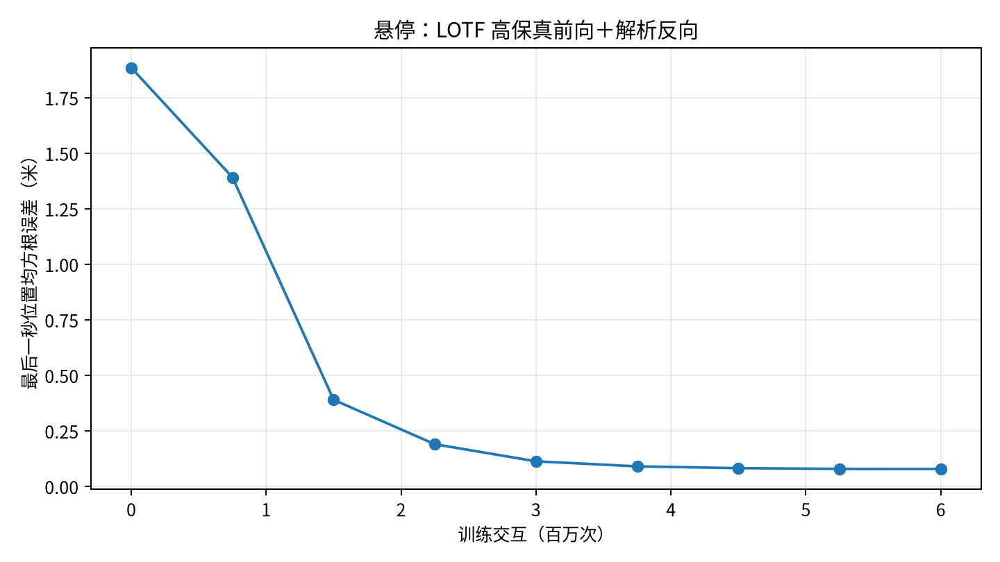
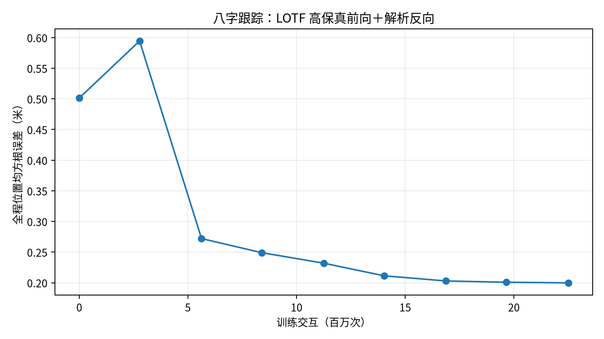

# 可组合模块与 LOTF 共同交付

2026-09-26。用户确认规格后完成五个模块的整体实现，并实际训练状态悬停和八字跟踪。
源代码分支 `implementation/composable-lotf`，基准 `bd14468`。

## 两项正式训练

| 任务 | 实际更新 | 实际交互 | 开发集完整回合 | 留出集完整回合 | 留出全程位置RMSE | 留出最后一秒RMSE |
|---|---:|---:|---:|---:|---:|---:|
| 悬停 | 200 | 6,000,000 | 32/32 | 128/128 | 0.424420 m | 0.076966 m |
| 八字跟踪 | 300 | 22,500,000 | 32/32 | 128/128 | 0.184752 m | 0.164008 m |

悬停从随机位置进入目标，3秒全程误差包含收敛过程；最后一秒衡量到达后的控制效果。
八字使用作者CSV、随机参考相位与初态，单回合5秒。两项分别完成101.44秒和159.47秒的完整作业，
含初始化、编译、周期评估及写盘；净更新时间分别37.60秒、75.86秒。时间来自本次共享服务器，
跨框架性能比较需要另做相同硬件负载与口径的实验。

参数变化L2为20.67185和9.66395。两任务各保存9个训练时间点，开发集选中的最佳检查点均为最终模型。
每个最佳模型在独立CPU进程分别评估32个开发试次和128个留出试次，共320个独立评测回合；
每个种子和失败回合均保留，参数内容校验值在读取和评测后保持一致。
机器可读事实见[结果JSON](composable-lotf-results.json)。

最终全套79项测试、2个子测试通过，377.10秒；格式、依赖锁定安装和Hydra配置展开通过。
五个模块工作单均附有决定、实现与证据，具体记录见[最终检查](composable-lotf-final-checks.json)。

收尾修复后另起独立进程复评每项128留出，数值失败均0，参数摘要和逐回合RMSE与原记录完全相同；
这些256回合是重复验证，不作为新增留出样本混入主表。证据见[最终复评](composable-lotf-review-evaluation.json)。

## 结果位置

```text
experiments/lotf-hybrid-hover-seed0-v1/
  checkpoints/step-0006000000.pkl
  training-state/update-000200.pkl
  independent-dev/report.json
  independent-heldout/report.json
  independent-heldout/rollouts/

experiments/lotf-hybrid-tracking-seed0-v1/
  checkpoints/step-0022500000.pkl
  training-state/update-000300.pkl
  independent-dev/report.json
  independent-heldout/report.json
  independent-heldout/rollouts/
```

训练初始/中间/最终轨迹在各运行的`rollouts/step-*`。查看器读回22份回放、103条保存轨迹，
逐帧位置及参考与保存数组一致，最大位置误差为0。每文件保存4–5条实际试次；128是完整评测分母。
证据见[回放验证](composable-lotf-replays.json)。

额外三份复评/续训回放共14条保存轨迹也逐帧读回通过，实际位置最大误差为0，
见[补充回放验证](composable-lotf-review-replays.json)。






## 模块实际落点

| 模块 | 交付内容 | 直接证据 |
|---|---|---|
| 组合入口 | Hydra分组、对象构造、兼容检查、训练/评测/仿真/重放入口 | 配置覆盖测试、真实PPO/APG/SHAC更新、Hydra两任务批量执行 |
| 策略与统一控制 | 固定/随机轨迹、冻结网络、MPC及原生飞控合并预设 | 两MPC从同一入口实际在线求解和完成原门序 |
| 前向与反向 | 原四动力学；LOTF原高保真/简化；解析代理/直接导数 | 原生多步状态、完整p/R/v及命令雅可比对照 |
| 算法/网络/目标/运行 | 原Brax训练器、SHAC、LOTF原生BPTT数学和优化器 | 同种子单次loss/参数/随机数与上游一致；精确续训测试 |
| 任务/观测/评测 | 原LOTF初态、奖励、延迟、参考；共同独立评测与回放 | 上表320个新进程试次、完整分母和模型读回 |

三个原任务×四动力学的12组迁移前固定输入输出已逐步回归。原P2 PPO/APG检查点新进程重评各32/32，
逐回合RMSE与原记录最大差异分别1.93e-9m和2.18e-9m；原检查点字节保持一致。
证据见[旧检查点验证](composable-legacy-checkpoints.json)。

## 原论文和本轮范围

原LOTF仓库固定 `cba6e5370773ace8a08107f02810eecabf16c793`，GPLv3子模块保留完整来源。
原机型`example_quad`的实际质量0.192kg、电机时间常数0.0245秒，保持作者飞控1000Hz、策略50Hz、40ms命令延迟。
模型参数来自作者YAML，区别于当前Crazyflow实验的Crazyflie预置机型。

本轮采用作者Notebook网络512×512、初始参数、确定性动作、奖励、随机数和余弦Adam配方。
Notebook默认简化前向；本轮按照已批准规格启用高保真前向，反向保留解析代理，学习残差关闭。
悬停预算采用Notebook的600万、八字2250万，与论文其它名义预算及在线适应实验分别记录。

原自定义JVP对随机键使用旧版切向量规则，现代JAX适配为float0；p/R/v的代理公式保持原样。
固定经验气动项保留。直接高保真导数在零水平速度受原`sqrt(vx²+vy²)`奇异点影响，
本次采用解析代理，且明确把前向一致性与代理导数一致性分别验证。

本轮交付为LOTF混合梯度离线训练子系统。在线数据缓冲、残差网络训练、策略交替适应、视觉和实机部署属后续范围。
所报告质量门槛属于本项目预先声明的验收标准；没有将本次误差对应到原论文“5秒在线适应”的结果。

完整数值续训已经实际从第175次更新继续至200次，只追加75万次交互并保留恢复时刻以前的开发最佳模型。
CPU小规模续训逐元素一致，归档GPU快照跨进程续训最大参数差4.59e-6，开发32/32仍完成，
逐回合RMSE最大差约3.95e-7米。严格GPU逐元素确定性作为单列边界，
证据见[完整恢复报告](composable-lotf-resume-check.json)。

## 复算与查看

操作与可用命令见[运行手册](../runbook.md)。

```bash
pixi run experiment --cfg job experiment=lotf_hybrid_hover
pixi run train experiment=lotf_hybrid_hover run_id=my-new-hover
pixi run train experiment=lotf_hybrid_tracking run_id=my-new-tracking
pixi run python scripts/summarize_composable_lotf.py
```

重放不需要重新训练；直接在RScope Viewer点击独立留出目录的`.mj_unroll`。
显示模型为按原质量/惯量/电机坐标构建的示意几何，状态来自LOTF物理，MuJoCo仅用于渲染。

完整工程检查、依赖、配置迁移和测试证据见[工程记录](composable-lotf-engineering.md)。
