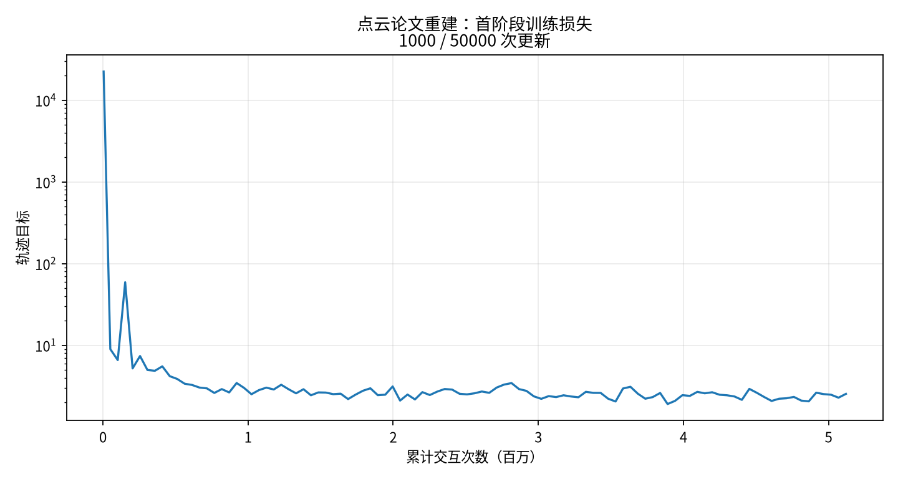
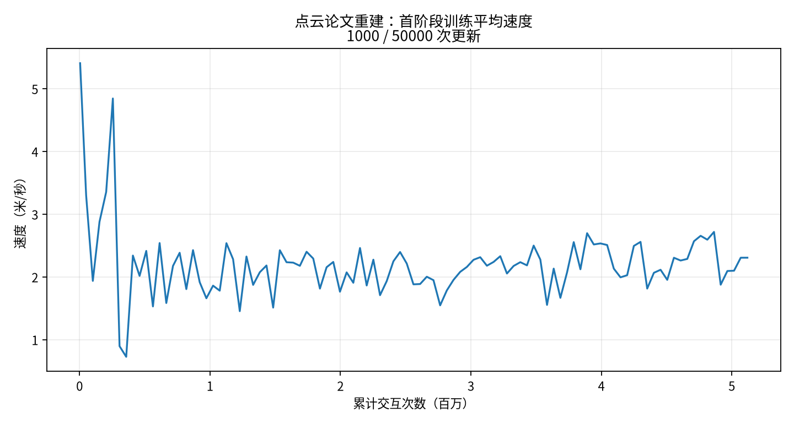

# 点云论文复刻：首阶段结果与完整训练状态

该交付是基于论文公开信息的方法重建，配置身份为`paper-public-information-reconstruction-v1`。
方法、已披露参数和重建假设见[槽位配方](../../research/pointcloud-paper-module-map.md)。

## 已完成的首阶段

| 项目 | 实际结果 |
|---|---|
| 训练运行 | `paper-pointcloud-seed0-stage1-v1` |
| 预算 | 1000/50000更新；5,120,000/256,000,000交互 |
| 训练耗时 | 1890.31秒；稳定1.837秒/更新 |
| 开发集总损失 | 初始22337.33594；首阶段末2.3229413 |
| 所选检查点 | `training-state/update-0001000.pkl` |
| 测试运行 | `paper-pointcloud-navigation8-stage1-v1` |
| 测试内容 | S01/S02/S03/S06、D01/D02/D03/D06 × 4/6/8米每秒；每格一次确定性试次 |
| 结果 | 到达0/24、碰撞0、越界24、超时0、数值失败0 |
| 失败行为 | 24格均触发6米高度上界，时间2.058–2.872秒 |
| 轨迹证据 | 3个速度归档、24份逐场景RScope回放，均有读取核验 |

参数摘要：`2fafd2c04579afc5bc6cab0026820496b64708a39d38dabe3551127d3ff3ad7b`。
[阶段数值证据](evidence.json)保留来源路径、摘要、开发分量与24个终止状态。
原始运行位于本工作树`experiments/`；完整报告在测试运行的`eval/report.md`、
`eval/report.json`和`eval/episodes.csv`。

[交付核验](delivery-verification.json)在2026-09-28 10:38 UTC重新认证了训练/评测来源、
三份轨迹归档、24份回放及55项测试证据；当时完整训练实际进度为1600/50000更新、819.2万交互。
该进度是一份检查时快照，实时步数继续由训练运行的`state.json`记录。

曲线来自首阶段实际训练标量。随机批次训练目标与固定开发目标分别记录；
训练损失下降与Navigation8跨场景表现各有独立结果。

## 仍在执行的完整预算

完整运行`paper-pointcloud-seed0-full-v1`从首阶段1000更新的完整状态接续，目标50000更新。
实际进度读取`experiments/paper-pointcloud-seed0-full-v1/state.json`；编排状态读取
`experiments/paper-pointcloud-seed0-pipeline-v1/state.json`。
按已测约1.83秒/更新估计，完整训练总计算时间约25.4小时，编译、评测和机器负载会影响实际耗时。

最终自动评测目标运行名为`paper-pointcloud-navigation8-full-v1`，由完整训练的独立开发集选择参数。
最终结果只有在该运行生成并验证`eval/report.json`之后才能登记。

## 代码与运行恢复证据

核心模块提交211e333，协议校验382ea9d，完整管线72f8ffb，报告/回放与进程接管2cd0d40。
55项方法/协议/恢复/回放测试通过；另有92项共享模块回归通过，两组覆盖范围存在重叠，分别报告。
直接状态导数、论文式缩放导数、空点集、点排列不变、循环记忆、真实参数更新、CPU完整恢复、
高速薄障碍碰撞、首步数值失败、评测身份与已有训练接管均有独立测试。

完整训练启动后的修复仅涉及回放初态、评测来源绑定与协调器恢复。
[源码范围核对](supervisor-source-audit.json)和[协调器对账记录](coordinator-recovery.json)
分别保存修改边界及实际接管事实；原训练进程3956802保持同一启动标记。
首阶段回放保留原始记录格式，后续新回放增加真实初始帧；物理状态转移与评价结论保持同一数值规则。
